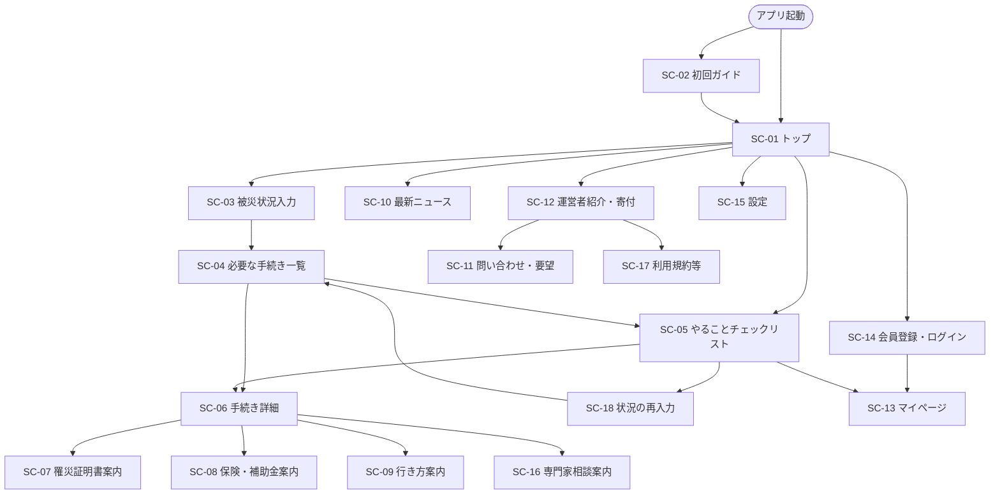
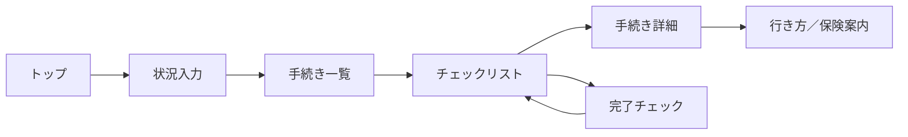
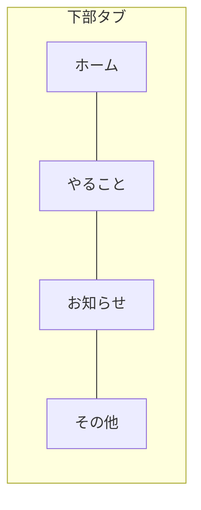
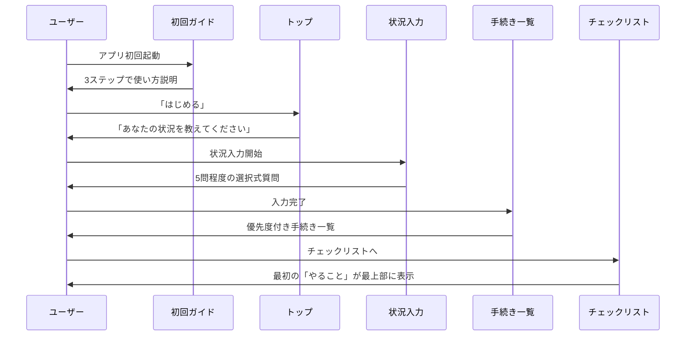
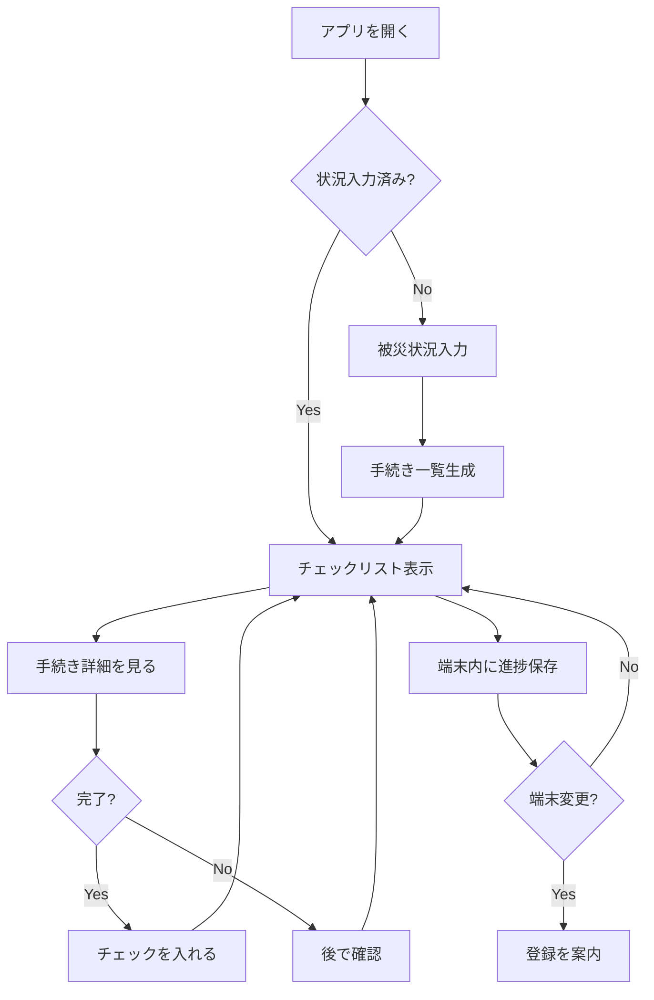
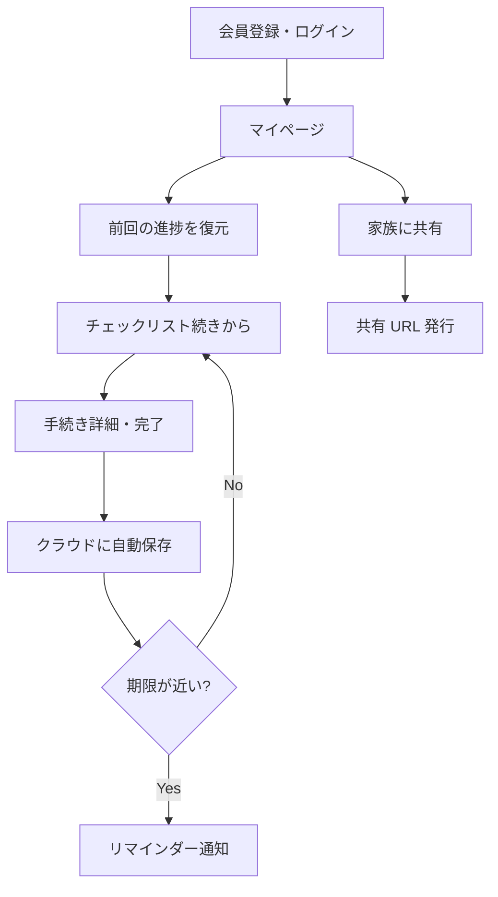

# 03 画面設計書

| 項目 | 内容 |
|------|------|
| ドキュメント名 | 画面設計書 |
| サービス名 | 生活再建ナビ（仮） |
| 版 | 0.1（ドラフト） |
| ステータス | 設計・企画フェーズ |
| 最終更新 | 2026-08-05 |
| 関連ドキュメント | [02_要件定義書.md](./02_要件定義書.md) |

---

## 設計の基本方針

本画面設計は、以下の原則をすべての画面に共通適用する。

| 原則 | 具体的内容 |
|------|-----------|
| 災害直後でも迷わない UI | 1 画面 1 目的。大きなボタン、短い文言、戻る操作を常に明示 |
| 高齢者でも理解できる表現 | 専門用語を避け、平易な日本語＋補足説明。アイコンは文字ラベルとセット |
| スマートフォン縦画面中心 | 375px 幅を基準。親指で届く下部に主要操作を配置 |
| 登録を強制しない | 未登録でもコア機能（状況入力〜チェックリスト）をすべて利用可能 |
| 登録のメリットを明確化 | 登録しなくても使えることを先に伝え、登録すると何が便利かを具体的に提示 |

### UI 共通仕様（案）

| 項目 | 仕様 |
|------|------|
| 画面幅 | スマートフォン縦画面（375px 基準、最大 480px） |
| 文字サイズ | 本文 16px 以上、見出し 20px 以上（拡大対応） |
| タップ領域 | 最小 48×48px |
| 配色 | 高コントラスト（背景：白／薄グレー、文字：黒、重要：濃紺・オレンジ） |
| ナビゲーション | 下部固定タブ（ホーム／やること／お知らせ／その他） |
| 戻る操作 | 画面上部左に「← 戻る」を常設 |

---

## 1. 画面一覧

### 1.1 画面 ID 一覧

| ID | 画面名 | 種別 | MVP | 備考 |
|----|--------|------|-----|------|
| SC-01 | トップ（ホーム） | コア | ○ | サービスの入口 |
| SC-02 | 初回ガイド | コア | ○ | 初回のみ表示 |
| SC-03 | 被災状況入力 | コア | ○ | ステップ形式 |
| SC-04 | 必要な手続き一覧 | コア | ○ | 状況入力後の結果画面 |
| SC-05 | やることチェックリスト | コア | ○ | 進捗管理の中心 |
| SC-06 | 手続き詳細（共通） | コア | ○ | 各手続きの詳細 |
| SC-07 | 罹災証明書案内 | コンテンツ | ○ | 手続き詳細の一種 |
| SC-08 | 保険・補助金案内 | コンテンツ | ○ | 支援制度の案内 |
| SC-09 | 市役所などへの行き方案内 | コンテンツ | ○ | 訪問先ナビ |
| SC-10 | 最新ニュース | 情報 | ○ | お知らせ・更新情報 |
| SC-11 | 問い合わせ・要望送信 | サポート | ○ | フォーム |
| SC-12 | 運営者紹介・寄付 | サポート | ○ | 運営情報・寄付 |
| SC-13 | マイページ（登録ユーザー） | アカウント | △ | Phase 2（設計先行） |
| SC-14 | 会員登録・ログイン | アカウント | △ | Phase 2（設計先行） |
| SC-15 | 設定 | 共通 | ○ | 文字サイズ等 |
| SC-16 | 専門家相談案内 | コンテンツ | ○ | 静的案内 |
| SC-17 | 利用規約・プライバシー | 共通 | ○ | 法務系 |
| SC-18 | 状況の再入力 | コア | ○ | 状況変更時 |

**凡例:** MVP ○＝MVP で実装　△＝Phase 2 以降（本設計書で先行定義）

### 1.2 下部タブ構成

| タブ | 遷移先 | アイコン＋ラベル |
|------|--------|----------------|
| ホーム | SC-01 トップ | 🏠 ホーム |
| やること | SC-05 チェックリスト | ✓ やること |
| お知らせ | SC-10 最新ニュース | 📢 お知らせ |
| その他 | SC-12 運営者紹介等 | ☰ その他 |

※ 状況未入力の場合、「やること」タブは SC-03 被災状況入力へ誘導

---

## 2. 各画面の目的

| ID | 画面名 | 目的 | 主要アクション |
|----|--------|------|---------------|
| SC-01 | トップ | 今すぐ取るべき行動を一目で把握する入口 | 状況入力開始、チェックリストへ、お知らせ確認 |
| SC-02 | 初回ガイド | サービスの使い方を 30 秒で理解させる | スキップ、次へ、はじめる |
| SC-03 | 被災状況入力 | 被災者の状況を選択式で把握し、最適な案内を生成 | 選択、次へ、戻る |
| SC-04 | 必要な手続き一覧 | 状況に応じた手続きを優先度順に一覧表示 | 詳細を見る、チェックリストへ |
| SC-05 | やることチェックリスト | 進捗を管理し、次にやることを明確化 | チェック、詳細、状況変更 |
| SC-06 | 手続き詳細 | 個別手続きの概要・必要書類・期限を案内 | 行き方を見る、完了チェック |
| SC-07 | 罹災証明書案内 | 罹災証明の取得方法を具体的に案内 | 市役所行き方、必要書類確認 |
| SC-08 | 保険・補助金案内 | 利用できる可能性のある支援制度を案内 | 詳細確認、専門家相談案内 |
| SC-09 | 市役所などへの行き方案内 | 訪問先の場所・持ち物・注意点を案内 | 地図アプリ連携、電話 |
| SC-10 | 最新ニュース | 制度変更・被災地情報・サービス更新を通知 | 記事詳細、外部リンク |
| SC-11 | 問い合わせ・要望送信 | サービスへの問い合わせ・改善要望を受付 | 送信 |
| SC-12 | 運営者紹介・寄付 | 運営情報の透明性と寄付の受付 | 寄付する、問い合わせ |
| SC-13 | マイページ | 登録ユーザーの進捗・設定の一元管理 | 進捗確認、共有、リマインダー |
| SC-14 | 会員登録・ログイン | 任意の会員登録・ログイン | 登録、ログイン、スキップ |
| SC-15 | 設定 | 文字サイズ・通知等のカスタマイズ | 設定変更 |
| SC-16 | 専門家相談案内 | 専門家相談が必要なケースの案内 | 相談先リスト確認 |
| SC-17 | 利用規約・プライバシー | 法的情報の表示 | 閲覧 |
| SC-18 | 状況の再入力 | 被災状況の変更に応じた案内の更新 | 再入力、結果更新 |

---

## 3. 画面遷移図

### 3.1 全体遷移図



### 3.2 コア導線（被災者の主経路）



### 3.3 タブ間遷移



---

## 4. 初回利用時の流れ

被災直後、初めてアプリを開いたユーザー向けの導線。

### 4.1 フロー概要



### 4.2 初回ガイド（SC-02）の内容

| ステップ | 見出し | 説明文案 |
|---------|--------|---------|
| 1 | 生活再建ナビへようこそ | 被災後に必要な手続きや支援を、わかりやすく案内するサービスです |
| 2 | 3 つだけ教えてください | 被災の状況を選ぶと、あなたに必要な「やること」が自動で整理されます |
| 3 | 登録は不要です | アカウントを作らなくても、すぐに使えます。よろしければ「はじめる」を押してください |

**操作:** 「スキップ」ボタン常設（いつでも SC-01 へ）

### 4.3 初回利用時の UX 配慮

- 初回ガイドは**最大 3 画面**に抑える
- 「登録は不要です」を初回ガイドで明示し、不安を減らす
- 状況入力は**5 問以内**（1 問 1 画面）
- 状況入力完了後、**即座にチェックリスト**を見せる（一覧画面をスキップ可能な導線も設ける）

---

## 5. 未登録ユーザーの利用フロー

登録なし（匿名）で利用する場合のフロー。MVP の基本利用形態。

### 5.1 フロー図



### 5.2 未登録で利用できる機能

| 機能 | 利用可否 | データ保存先 |
|------|---------|-------------|
| 被災状況入力 | ○ | 端末内（ローカル） |
| 手続き一覧・詳細閲覧 | ○ | — |
| チェックリスト | ○ | 端末内（ローカル） |
| 最新ニュース閲覧 | ○ | — |
| 問い合わせ送信 | ○ | — |
| 進捗の端末間同期 | × | — |
| 期限リマインダー | × | — |
| 家族への進捗共有 | × | — |

### 5.3 未登録時のデータ保存

- チェックリストの進捗・状況入力結果は**端末のブラウザ内**に保存
- サーバーへの個人情報送信は行わない
- 端末変更・ブラウザデータ削除で進捗が消える可能性があることを、チェックリスト画面下部に**やさしい文言**で告知

**告知文案（例）:**
> チェックの記録は、このスマートフォン内に保存されています。機種変更の際は、マイページ登録（無料）で記録を引き継げます。

### 5.4 登録案内のタイミング（強制しない）

| タイミング | 案内方法 | 文案の方向性 |
|-----------|---------|-------------|
| チェックリスト初回完了時 | バナー（閉じられる） | 「記録を残したい方は、無料登録がおすすめです」 |
| 3 日後の再訪時 | トップに小さな案内 | 「前回の続きから再開できます（登録すると端末を変えても安心）」 |
| 状況再入力時 | 確認ダイアログ内 | 「登録すると、以前の記録も残せます」 |

**禁止:** 登録しないと先に進めない設計、登録を促すポップアップの連続表示

---

## 6. 登録ユーザー（マイページ利用）の利用フロー

Phase 2 で実装予定。本設計書で先行定義し、未登録との差別化を明確にする。

### 6.1 登録のメリット（ユーザーへの訴求）

| メリット | 説明 | 未登録との差 |
|---------|------|-------------|
| 進捗の引き継ぎ | 機種変更・ブラウザ変更後もチェックリストを復元 | 端末内のみ → クラウド保存 |
| 期限リマインダー | 申請期限が近い手続きをメール等で通知 | なし → 通知あり |
| 家族との共有 | 進捗状況を URL で家族に共有 | 不可 → 共有可能 |
| 状況変更の履歴 | 被災状況の変更履歴を保持 | 上書き → 履歴保持 |
| 複数端末同期 | スマホ・タブレットで同じ進捗を確認 | 不可 → 同期可能 |

### 6.2 登録ユーザーフロー



### 6.3 マイページ（SC-13）の構成

| セクション | 内容 |
|-----------|------|
| 進捗サマリー | 完了数／全体数、進捗バー |
| 次にやること | 未完了の最優先アクション 1 件を大きく表示 |
| 期限が近い手続き | 7 日以内の期限があるものを一覧 |
| 共有 | 家族向け共有リンクの発行 |
| アカウント設定 | メール、通知 ON/OFF、ログアウト |

### 6.4 会員登録（SC-14）の設計方針

| 項目 | 方針 |
|------|------|
| 必須入力 | メールアドレス、パスワードのみ |
| 任意入力 | ニックネーム（表示名） |
| 収集しない | 氏名、住所、被災の詳細 |
| スキップ | 「あとで登録する」ボタンを常設 |
| 登録完了後 | 端末内の進捗をクラウドに移行するか確認 |

**登録画面の訴求文案（例）:**
> **登録しなくても使えます。**  
> 登録すると、機種変更後もチェックリストを残せます。申請期限の通知も受け取れます（無料）。

---

## 7. 被災状況入力画面（SC-03）

### 7.1 目的

被災者の状況を**選択式**で把握し、パーソナライズされた手続き一覧を生成する。

### 7.2 画面構成

```
┌─────────────────────────┐
│ ← 戻る    状況入力 1/5  │
├─────────────────────────┤
│                         │
│  どんな災害で          │
│  被害を受けましたか？    │
│                         │
│  ┌─────────────────┐   │
│  │  地震            │   │
│  └─────────────────┘   │
│  ┌─────────────────┐   │
│  │  水害・洪水       │   │
│  └─────────────────┘   │
│  ┌─────────────────┐   │
│  │  火災            │   │
│  └─────────────────┘   │
│  ┌─────────────────┐   │
│  │  土砂災害         │   │
│  └─────────────────┘   │
│  ┌─────────────────┐   │
│  │  その他・わからない│   │
│  └─────────────────┘   │
│                         │
│  ●○○○○  （進捗ドット）  │
│                         │
│  ┌─────────────────┐   │
│  │      次 へ        │   │
│  └─────────────────┘   │
└─────────────────────────┘
```

### 7.3 入力項目（全 5 ステップ）

| ステップ | 質問 | 選択肢（例） |
|---------|------|-------------|
| 1/5 | どんな災害で被害を受けましたか？ | 地震／水害・洪水／火災／土砂災害／その他 |
| 2/5 | お住まいの状態は？ | 全壊（住めない）／半壊（一部住める）／浸水／損傷なし／わからない |
| 3/5 | 今、どこに住んでいますか？ | 自宅／避難所／親戚・知人の家／ホテル等／わからない |
| 4/5 | 一緒に暮らしている方は？ | 一人／配偶者と／子どもと／親と／その他 |
| 5/5 | お住まいの市町村は？ | 都道府県 → 市町村（選択式、スキップ可） |

### 7.4 UX 配慮

| 配慮 | 内容 |
|------|------|
| 1 問 1 画面 | 情報過多を避け、1 画面に 1 つの質問のみ |
| 大きな選択ボタン | タップしやすいカード型ボタン（高さ 56px 以上） |
| 「わからない」選択肢 | すべての質問に「わからない」を用意 |
| 進捗表示 | ドットまたは「1/5」で進捗を可視化 |
| 戻る操作 | 前の質問に戻って変更可能 |
| スキップ | 5 問目（市町村）はスキップ可能 |
| 平易な言葉 | 「罹災」→「被害を受けた」、「世帯」→「一緒に暮らしている方」 |

### 7.5 完了後の遷移

- 入力完了 → SC-04 必要な手続き一覧
- 「結果を見る」ボタンで SC-05 チェックリストへ直行も可能

---

## 8. 必要な手続き一覧画面（SC-04）

### 8.1 目的

状況入力結果に基づき、必要な手続きを**優先度順**に一覧表示する。

### 8.2 画面構成

```
┌─────────────────────────┐
│ ← 戻る   必要な手続き     │
├─────────────────────────┤
│ あなたの状況：           │
│ 地震・半壊・避難所       │
│         [状況を変更]     │
├─────────────────────────┤
│ 🔴 今すぐ（3件）         │
│ ┌───────────────────┐   │
│ │ 罹災証明の取得      →│   │
│ └───────────────────┘   │
│ ┌───────────────────┐   │
│ │ 避難所生活の確認    →│   │
│ └───────────────────┘   │
│ ...                     │
├─────────────────────────┤
│ 🟡 1週間以内（4件）      │
│ ...                     │
├─────────────────────────┤
│ 🟢 後で確認（5件）       │
│ ...                     │
├─────────────────────────┤
│ ┌─────────────────┐     │
│ │ チェックリストへ  │     │
│ └─────────────────┘     │
└─────────────────────────┘
```

### 8.3 優先度区分

| 区分 | ラベル | 色 | 意味 |
|------|--------|-----|------|
| 最優先 | 今すぐ | 赤 | 被災後 72 時間以内に必要 |
| 高 | 1 週間以内 | 黄 | 1 週間以内の対応が望ましい |
| 中 | 1 ヶ月以内 | 青 | 1 ヶ月以内に検討 |
| 低 | 後で確認 | 緑 | 余裕がある時に確認 |

### 8.4 各項目の表示内容

| 要素 | 内容 |
|------|------|
| 手続き名 | 平易な名称（例：「罹災証明の取得」） |
| 概要 | 1 行説明（例：「市役所で被災を証明する書類をもらいます」） |
| 期限 | あれば表示（例：「発行から 2 週間以内が目安」） |
| タップ | SC-06 手続き詳細へ遷移 |

### 8.5 UX 配慮

- 状況サマリーを上部に常時表示（「状況を変更」リンク付き）
- 折りたたみ可能（「後で確認」は初期状態で折りたたみ）
- 件数を各セクション見出しに表示

---

## 9. やることチェックリスト画面（SC-05）

### 9.1 目的

生活再建に必要なアクションの**進捗管理**を行い、「次に何をすればよいか」を常に明示する。本サービスの中心画面。

### 9.2 画面構成

```
┌─────────────────────────┐
│      やることリスト       │
├─────────────────────────┤
│ 進捗：2 / 12 完了        │
│ ████░░░░░░░░ 17%        │
├─────────────────────────┤
│ 📌 次にやること          │
│ ┌───────────────────┐   │
│ │ ☐ 罹災証明の取得    →│   │
│ │   市役所で手続き      │   │
│ └───────────────────┘   │
├─────────────────────────┤
│ 🔴 今すぐ               │
│ ☑ 避難所の確認      ✓  │
│ ☐ 罹災証明の取得      → │
│ ☐ 生活必需品の確保    → │
├─────────────────────────┤
│ 🟡 1週間以内            │
│ ☐ 火災保険の連絡      → │
│ ☐ 仮設住宅の申請      → │
├─────────────────────────┤
│ 🟢 後で確認             │
│ ☐ ...                  │
├─────────────────────────┤
│ 💡 記録はこの端末に保存  │
│    されています         │
│    [登録して引き継ぐ]    │
└─────────────────────────┘
```

### 9.3 機能要素

| 要素 | 説明 |
|------|------|
| 進捗バー | 完了数／全体数、視覚的プログレスバー |
| 次にやること | 未完了の最優先 1 件を強調表示 |
| チェックボックス | タップで完了／未完了を切り替え |
| 詳細リンク | 各項目タップで SC-06 手続き詳細へ |
| 優先度セクション | SC-04 と同じ 4 区分 |
| 保存告知 | 未登録時、端末内保存の説明と登録案内 |

### 9.4 インタラクション

| 操作 | 動作 |
|------|------|
| チェックボックスタップ | 完了状態を切り替え、進捗バー更新 |
| 項目タップ（チェック以外） | 手続き詳細画面へ |
| 完了時 | 軽いフィードバック（「お疲れさまです」等、短いメッセージ） |
| 全部完了 | 「生活再建の第一歩、完了です」等の祝福メッセージ |

### 9.5 UX 配慮

- **「次にやること」を 1 件だけ**大きく表示（選択肢を絞る）
- 完了済み項目は薄く表示（削除はしない＝達成感）
- チェックボタンは 48px 以上の大きさ
- 下部タブの「やること」から常時アクセス可能

---

## 10. 罹災証明書案内画面（SC-07）

### 10.1 目的

罹災証明書（罹災証明）の**取得方法**を、初めて手続きする方にもわかるよう案内する。

### 10.2 画面構成

```
┌─────────────────────────┐
│ ← 戻る  罹災証明の取得    │
├─────────────────────────┤
│ 罹災証明とは？           │
│ 市役所が発行する、        │
│ あなたの家が被災した      │
│ ことを証明する書類です。  │
│ 支援の申請などに必要      │
│ になります。             │
├─────────────────────────┤
│ 📋 必要なもの            │
│ ・本人確認書類           │
│   （免許証、マイナンバーカード等）│
│ ・印鑑（なくても可）      │
├─────────────────────────┤
│ 📍 どこで取得？          │
│ お住まいの市役所          │
│ または窓口               │
│                         │
│ [市役所への行き方を見る]  │
├─────────────────────────┤
│ ⏰ いつから？             │
│ 被災後、市役所が          │
│ 対応を開始してから        │
│ （通常 1〜2 週間以内）    │
├─────────────────────────┤
│ 💡 ポイント              │
│ ・早めの取得がおすすめ    │
│ ・全壊・半壊など、        │
│   損害の程度が記載されます│
├─────────────────────────┤
│ [完了した ☐]             │
│ [市役所の電話番号を確認]  │
└─────────────────────────┘
```

### 10.3 コンテンツ項目

| セクション | 内容 |
|-----------|------|
| 罹災証明とは | 平易な説明＋用途 |
| 必要なもの | 持参書類リスト |
| どこで取得 | 申請先（市役所等） |
| いつから | 受付開始時期の目安 |
| ポイント | 注意事項・Tips |
| 関連リンク | 行き方案内、電話番号 |

### 10.4 UX 配慮

- 「罹災証明」→ 初出時に「（被災を証明する書類）」と補足
- 専門用語はすべて平易語に置き換え
- 「完了した」チェックで SC-05 のチェックリストと連動
- 情報の出典・更新日を画面下部に表示

---

## 11. 保険・補助金案内画面（SC-08）

### 11.1 目的

被災者が利用**できる可能性がある**支援制度・保険・補助金を案内する。

### 11.2 画面構成

```
┌─────────────────────────┐
│ ← 戻る  保険・補助金       │
├─────────────────────────┤
│ あなたの状況で、         │
│ 使える可能性がある        │
│ 支援の一覧です。         │
│ ※必ずしもすべてが        │
│   対象とは限りません     │
├─────────────────────────┤
│ 🏠 住まいについて         │
│ ┌───────────────────┐   │
│ │ 災害復興住宅金融      →│   │
│ │ 被災者向けの低利ローン  │   │
│ └───────────────────┘   │
│ ┌───────────────────┐   │
│ │ 仮設住宅の提供        →│   │
│ └───────────────────┘   │
├─────────────────────────┤
│ 💰 生活費について         │
│ ┌───────────────────┐   │
│ │ 被災者生活再建支援制度 →│   │
│ └───────────────────┘   │
│ ┌───────────────────┐   │
│ │ 災害援護資金          →│   │
│ └───────────────────┘   │
├─────────────────────────┤
│ 🛡️ 保険について          │
│ ┌───────────────────┐   │
│ │ 火災保険              →│   │
│ └───────────────────┘   │
│ ┌───────────────────┐   │
│ │ 地震保険              →│   │
│ └───────────────────┘   │
├─────────────────────────┤
│ ⚠️ 複雑な手続きの場合     │
│ [専門家に相談する]        │
└─────────────────────────┘
```

### 11.3 カテゴリ構成

| カテゴリ | 含まれる制度（例） |
|---------|------------------|
| 住まい | 災害復興住宅金融、仮設住宅、公営住宅 |
| 生活費 | 被災者生活再建支援制度、災害援護資金、支援金 |
| 保険 | 火災保険、地震保険 |
| 税金 | 固定資産税の減免等 |
| その他 | 被災地の独自支援 |

### 11.4 各制度の詳細表示

| 要素 | 内容 |
|------|------|
| 制度名 | 正式名称＋わかりやすい別名 |
| 概要 | 2〜3 行の説明 |
| 対象の目安 | 「こんな方が対象のことが多いです」 |
| 申請先 | どこに申請するか |
| 期限 | 申請期限（あれば） |
| 公式リンク | 詳細は公式サイトで確認 |

### 11.5 UX 配慮

- **「必ず受けられる」とは書かない**（「可能性がある」「対象の目安」）
- 状況入力結果に応じて、該当しそうな制度を上部に表示
- 複数制度の併用等、複雑なケースは SC-16 専門家相談案内へ誘導
- 更新日・出典を各項目に表示

---

## 12. 市役所などへの行き方案内画面（SC-09）

### 12.1 目的

手続きのために**どこへ行けばよいか**、**何を持っていけばよいか**を案内する。

### 12.2 画面構成

```
┌─────────────────────────┐
│ ← 戻る  市役所への行き方   │
├─────────────────────────┤
│ 📍 〇〇市役所            │
│ 〒000-0000              │
│ 〇〇県〇〇市...          │
│                         │
│ [地図アプリで開く]       │
│ [電話する 📞]            │
├─────────────────────────┤
│ 🕐 受付時間              │
│ 平日 8:30〜17:15        │
│ ※災害時は変更の          │
│   場合があります         │
├─────────────────────────┤
│ 📋 持っていくもの         │
│ ☑ 本人確認書類          │
│ ☑ 印鑑                  │
│ ☐ 被災の写真（あれば）   │
├─────────────────────────┤
│ 💡 行く前に               │
│ ・電話で混雑状況を        │
│   確認するとスムーズです  │
│ ・避難所からの送迎が      │
│   ある場合があります      │
├─────────────────────────┤
│ ⚠️ 最新情報              │
│ 災害時は窓口が変更に      │
│ なる場合があります。      │
│ 事前に電話確認を          │
│ おすすめします。         │
└─────────────────────────┘
```

### 12.3 表示対象

| 訪問先 | 用途 |
|--------|------|
| 市役所・区役所 | 罹災証明、各種申請 |
| 保険会社支店 | 保険請求 |
| ハローワーク | 失業給付等 |
| 法務局 | 登記関連 |
| その他 | 手続きに応じて |

### 12.4 機能

| 機能 | 説明 |
|------|------|
| 地図連携 | Google Maps / Apple Maps 等の外部地図アプリを起動 |
| 電話 | タップで電話発信（`tel:` リンク） |
| 持ち物チェック | 出発前の確認用チェックリスト |
| 受付時間 | 通常時間＋災害時の注意書き |

### 12.5 UX 配慮

- 地図・電話ボタンは**大きく、下部に配置**（親指で届く）
- 被災地の市町村情報は状況入力（5 問目）から取得
- 未入力の場合は「市町村を選んでください」→ 選択 UI
- 災害時は情報が変わる旨を必ず明記

---

## 13. 最新ニュース表示画面（SC-10）

### 13.1 目的

制度変更、被災地関連情報、サービス更新などの**最新情報**を被災者に届ける。

### 13.2 画面構成

```
┌─────────────────────────┐
│       お知らせ           │
├─────────────────────────┤
│ 📌 重要                  │
│ ┌───────────────────┐   │
│ │ 〇〇市：罹災証明の    │   │
│ │ 受付を開始しました    │   │
│ │ 2026/08/05         │   │
│ └───────────────────┘   │
├─────────────────────────┤
│ 📢 お知らせ              │
│ ┌───────────────────┐   │
│ │ 被災者生活再建支援    │   │
│ │ 制度の申請期限について │   │
│ │ 2026/08/03         │   │
│ └───────────────────┘   │
│ ┌───────────────────┐   │
│ │ サービス更新：        │   │
│ │ チェックリスト機能    │   │
│ │ 2026/08/01         │   │
│ └───────────────────┘   │
├─────────────────────────┤
│ 🔗 役立つリンク          │
│ ・〇〇市公式サイト       │
│ ・内閣府：被災者支援     │
└─────────────────────────┘
```

### 13.3 記事カテゴリ

| カテゴリ | 内容 | 表示 |
|---------|------|------|
| 重要 | 被災者が今すぐ知るべき情報 | 上部固定、目立つ表示 |
| お知らせ | 制度変更、期限、サービス更新 | 日付順 |
| 役立つリンク | 公式サイト等へのリンク集 | 下部 |

### 13.4 記事詳細

- タップで記事詳細（同一画面内展開または別画面）
- 外部リンクは「外部サイトで開きます」の確認後に遷移
- 出典・更新日を必ず表示

### 13.5 UX 配慮

- 重要情報は**赤またはオレンジ**のラベルで区別
- 日付は「2026年8月5日」形式（読みやすく）
- 被災地フィルタ（Phase 2）：状況入力の市町村に関連するお知らせを優先表示

---

## 14. 問い合わせ・要望送信画面（SC-11）

### 14.1 目的

サービスに関する**問い合わせ・改善要望・情報の誤り指摘**を受け付ける。

### 14.2 画面構成

```
┌─────────────────────────┐
│ ← 戻る   お問い合わせ     │
├─────────────────────────┤
│ サービスに関する          │
│ お問い合わせ・ご要望を     │
│ お送りください。         │
│                         │
│ ⚠️ 個別の被災相談や        │
│ 手続きの代行は            │
│ お受けできません。        │
├─────────────────────────┤
│ 種類                     │
│ ○ 使い方について          │
│ ○ 情報の誤りを報告        │
│ ○ 改善の提案             │
│ ○ その他                 │
├─────────────────────────┤
│ メールアドレス（任意）    │
│ ┌─────────────────┐     │
│ │                   │     │
│ └─────────────────┘     │
│ 返信が必要な場合のみ      │
├─────────────────────────┤
│ 内容                     │
│ ┌─────────────────┐     │
│ │                   │     │
│ │                   │     │
│ └─────────────────┘     │
├─────────────────────────┤
│ ┌─────────────────┐     │
│ │      送 信        │     │
│ └─────────────────┘     │
└─────────────────────────┘
```

### 14.3 フォーム項目

| 項目 | 必須 | 説明 |
|------|------|------|
| 種類 | ○ | ラジオボタン選択 |
| メールアドレス | × | 返信希望時のみ |
| 内容 | ○ | テキストエリア |

### 14.4 対応範囲の明示

**受付する内容:**
- サービスの使い方
- 掲載情報の誤り
- 機能改善の提案

**受付しない内容（画面に明記）:**
- 個別の被災相談
- 手続きの代行依頼
- 法的助言

### 14.5 送信後

- 「お問い合わせを受け付けました」確認画面
- 返信目安：「3〜5 営業日以内にご返信します（返信先を入力した場合）」
- 個別被災相談の場合は、専門家相談案内（SC-16）への誘導を表示

---

## 15. 運営者紹介・寄付ページ（SC-12）

### 15.1 目的

運営の透明性を確保し、サービス継続のための**寄付**を受け付ける。

### 15.2 画面構成

```
┌─────────────────────────┐
│      運営・寄付          │
├─────────────────────────┤
│ 生活再建ナビについて     │
│                         │
│ 被災後の生活再建を        │
│ 支援する非営利サービス    │
│ です。                   │
├─────────────────────────┤
│ 運営者                   │
│ 〇〇（運営主体名）        │
│ 設立：20XX年            │
├─────────────────────────┤
│ 寄付のお願い             │
│                         │
│ サーバー費用や            │
│ 情報更新のために          │
│ ご支援をお願いしています。│
│                         │
│ 使途：                   │
│ ・サーバー・運営費        │
│ ・コンテンツ更新          │
│ ・情報の正確性維持        │
│                         │
│ ┌─────────────────┐     │
│ │   寄付する        │     │
│ └─────────────────┘     │
├─────────────────────────┤
│ リンク                   │
│ ・お問い合わせ           │
│ ・利用規約               │
│ ・プライバシーポリシー    │
│ ・免責事項               │
└─────────────────────────┘
```

### 15.3 セクション構成

| セクション | 内容 |
|-----------|------|
| サービス概要 | 生活再建ナビの目的・提供価値 |
| 運営者情報 | 運営主体名、設立、連絡先 |
| 寄付のお願い | 使途の明示、寄付ボタン |
| 関連リンク | 問い合わせ、利用規約、プライバシー、免責 |

### 15.4 寄付機能

| 項目 | 内容 |
|------|------|
| 寄付ボタン | 外部決済サービス（Stripe 等）へ遷移 |
| 金額 | 任意入力または選択式（500 円／1,000 円／3,000 円／その他） |
| 使途明示 | サーバー費、コンテンツ更新、運営費 |
| 領収書 | 運営主体の法人格に応じて対応 |

### 15.5 UX 配慮

- 寄付は**任意**であることを明記
- 未登録ユーザーでも寄付可能
- 寄付ページへのアクセスは「その他」タブから（押し付けがましくない）
- 免責事項・利用規約へのリンクを必ず設置

---

## 付録

### A. ワイヤーフレーム共通ルール

| ルール | 内容 |
|--------|------|
| 余白 | 画面左右 16px、セクション間 24px |
| ボタン | 高さ 48px 以上、角丸 8px、幅は画面幅 − 32px |
| 見出し | 1 画面 1 見出し（h1 相当） |
| リスト | カード型、タップ領域全体がリンク |
| フッター | 下部タブ 56px、セーフエリア対応 |

### B. 文言ガイドライン

| NG 例 | OK 例 |
|-------|-------|
| 罹災証明を取得せよ | 罹災証明をもらいましょう |
| 被災者生活再建支援制度 | 生活再建のための支援制度 |
| 申請期限を遵守してください | 申請期限があります。お早めにご確認ください |
| 対象者 | こんな方が対象のことが多いです |
| 必須 | 必要なもの |

### C. MVP と Phase 2 の画面対応

| 画面 | MVP | Phase 2 |
|------|-----|---------|
| SC-01〜12, 15〜18 | ○ | — |
| SC-13 マイページ | — | ○ |
| SC-14 会員登録 | 案内のみ | ○ 実装 |
| 期限リマインダー | — | ○ |
| 家族共有 | — | ○ |
| 被災地フィルタ（ニュース） | — | ○ |

### D. 関連ドキュメント

| ドキュメント | 状態 |
|-------------|------|
| 02_要件定義書 | 作成済 |
| 04_情報設計書 | 未作成 |
| 05_UI デザインガイド | 未作成 |

### E. 改訂履歴

| 版 | 日付 | 変更内容 | 担当 |
|----|------|---------|------|
| 0.1 | 2026-08-05 | 初版ドラフト作成 | — |
