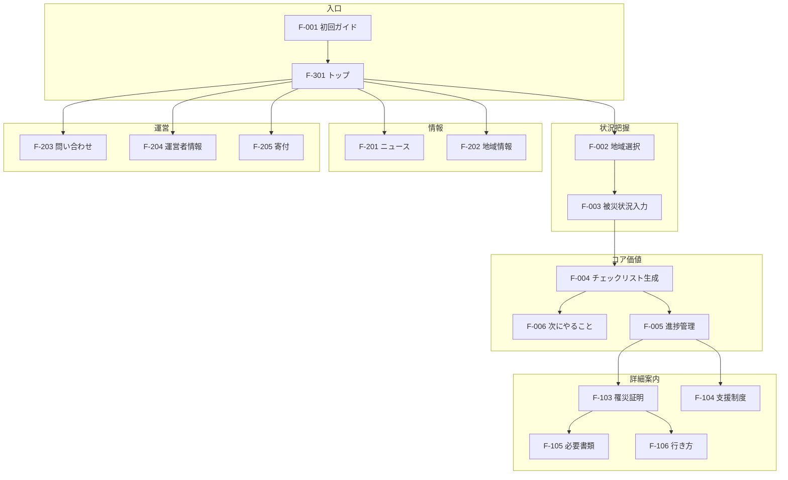

# 04 機能一覧

| 項目 | 内容 |
|------|------|
| ドキュメント名 | 機能一覧 |
| サービス名 | 生活再建ナビ（仮） |
| 版 | 0.1（ドラフト） |
| ステータス | 設計・企画フェーズ |
| 最終更新 | 2026-08-05 |
| 関連ドキュメント | [02_要件定義書.md](./02_要件定義書.md) / [03_画面設計書.md](./03_画面設計書.md) |

---

## 設計の最優先事項

> **災害直後の利用者が迷わないこと**

すべての機能設計・優先度判断は、この原則を最上位とする。被災直後は心身の余裕がなく、情報過多・操作複雑・登録強制は利用者を離脱させる。MVP では「状況を選ぶ → 次にやることがわかる → 詳細を確認できる → 進捗を記録できる」という最短導線を最優先で実装する。

---

## 1. 機能一覧表

### 1.1 凡例

| 記号 | 意味 |
|------|------|
| 優先度 MVP | 初回リリースで必須 |
| 優先度 Phase 2 | MVP 検証後、早期拡張 |
| 優先度 Phase 3 | 中長期の拡張 |
| 実装難易度 低 | 静的コンテンツ中心、既存技術で 1〜2 週間程度 |
| 実装難易度 中 | ロジック・連携・運用設計が必要、数週間〜 |
| 実装難易度 高 | AI・外部連携・法務検討が必要、数ヶ月規模 |

---

### 1.2 コア機能（ナビゲーション）

| 機能ID | 機能名 | 概要 | 対象ユーザー | 優先度 | 関連画面 |
|--------|--------|------|-------------|--------|---------|
| F-001 | 初回ガイド | 初回起動時にサービスの使い方を 3 ステップで案内 | 被災者、支援者 | MVP | SC-02 |
| F-002 | 地域選択 | 都道府県・市町村を選択し、地域固有の案内の基礎とする | 被災者 | MVP | SC-03 |
| F-003 | 被災状況入力 | 被災種別・住居状態・避難状況等を選択式で入力 | 被災者 | MVP | SC-03, SC-18 |
| F-004 | 生活再建チェックリスト生成 | 状況入力結果から優先度付きのやることリストを自動生成 | 被災者 | MVP | SC-04, SC-05 |
| F-005 | やること進捗管理 | チェックリストの完了／未完了を記録し、進捗を可視化 | 被災者 | MVP | SC-05 |
| F-006 | 次にやること提示 | 未完了の最優先アクション 1 件を強調表示 | 被災者 | MVP | SC-05 |
| F-007 | 状況の再入力 | 被災状況の変化に応じてチェックリストを再生成 | 被災者 | MVP | SC-18, SC-04 |

---

### 1.3 案内・コンテンツ機能

| 機能ID | 機能名 | 概要 | 対象ユーザー | 優先度 | 関連画面 |
|--------|--------|------|-------------|--------|---------|
| F-101 | 必要な手続き一覧 | 状況に応じた手続きを優先度別に一覧表示 | 被災者、支援者 | MVP | SC-04 |
| F-102 | 手続き詳細表示 | 各手続きの概要・流れ・期限・参考リンクを表示 | 被災者、支援者 | MVP | SC-06 |
| F-103 | 罹災証明書案内 | 罹災証明の取得方法・必要書類・注意点を案内 | 被災者 | MVP | SC-07, SC-06 |
| F-104 | 支援金・補助制度案内 | 利用可能性のある支援制度・保険をカテゴリ別に案内 | 被災者 | MVP | SC-08, SC-06 |
| F-105 | 必要書類案内 | 手続きごとに必要な書類・持ち物をリスト表示 | 被災者 | MVP | SC-06, SC-07, SC-09 |
| F-106 | 市役所等への行き方案内 | 訪問先の住所・地図・電話・受付時間・持ち物を案内 | 被災者 | MVP | SC-09, SC-07 |
| F-107 | 専門家相談案内（静的） | 複雑な手続きで専門家相談が必要なケースを案内 | 被災者 | MVP | SC-16, SC-08 |

---

### 1.4 情報・コミュニケーション機能

| 機能ID | 機能名 | 概要 | 対象ユーザー | 優先度 | 関連画面 |
|--------|--------|------|-------------|--------|---------|
| F-201 | 災害関連ニュース | 制度変更・被災地情報・サービス更新を掲載 | 被災者、支援者 | MVP | SC-10 |
| F-202 | 地域情報 | 選択した市町村の窓口・避難所・支援情報への入口 | 被災者 | MVP | SC-01, SC-10, SC-09 |
| F-203 | お問い合わせ・要望送信 | サービスに関する問い合わせ・誤り報告・改善提案を受付 | 被災者、支援者 | MVP | SC-11 |
| F-204 | 運営者情報 | 運営主体・サービス概要・免責・法務情報を表示 | 全ユーザー | MVP | SC-12, SC-17 |
| F-205 | 寄付案内 | 運営支援のための寄付受付（外部決済連携） | 支援者、一般 | MVP | SC-12 |

---

### 1.5 共通・基盤機能

| 機能ID | 機能名 | 概要 | 対象ユーザー | 優先度 | 関連画面 |
|--------|--------|------|-------------|--------|---------|
| F-301 | トップ（ホーム） | サービスの入口。次のアクションを一目で把握 | 全ユーザー | MVP | SC-01 |
| F-302 | 設定 | 文字サイズ変更等のアクセシビリティ設定 | 全ユーザー | MVP | SC-15 |
| F-303 | 静的コンテンツ管理 | 運営者が手続き・制度情報を更新する仕組み | 運営者 | MVP | （管理画面） |
| F-304 | 端末内進捗保存 | 未登録ユーザーのチェックリストを端末内に保存 | 被災者 | MVP | SC-05 |
| F-305 | 下部タブナビゲーション | ホーム／やること／お知らせ／その他の固定ナビ | 全ユーザー | MVP | 全画面 |

---

### 1.6 Phase 2 機能

| 機能ID | 機能名 | 概要 | 対象ユーザー | 優先度 | 関連画面 |
|--------|--------|------|-------------|--------|---------|
| F-401 | 会員登録・ログイン | 任意のメールアドレスによるアカウント作成 | 被災者 | Phase 2 | SC-14 |
| F-402 | マイページ | 進捗・設定・期限の一元管理 | 被災者 | Phase 2 | SC-13 |
| F-403 | 進捗のクラウド保存 | 登録ユーザーのチェックリストをサーバーに保存 | 被災者 | Phase 2 | SC-13, SC-05 |
| F-404 | 家族共有 | 進捗状況を URL で家族・支援者と共有 | 被災者、家族 | Phase 2 | SC-13 |
| F-405 | 個別支援制度推薦 | 状況入力＋追加情報から該当可能性の高い制度を推薦 | 被災者 | Phase 2 | SC-08 |
| F-406 | LINE 通知 | 申請期限・重要お知らせを LINE で通知 | 被災者 | Phase 2 | — |
| F-407 | 専門家相談（予約連携） | 行政書士等への相談予約・紹介 | 被災者 | Phase 2 | SC-16 |
| F-408 | 申請書作成支援 | 必要書類のテンプレート・記入ガイド提供 | 被災者 | Phase 2 | SC-06 |
| F-409 | 期限リマインダー（メール） | 申請期限が近い手続きをメール通知 | 被災者 | Phase 2 | SC-13 |
| F-410 | FAQ | 被災種別・手続き別のよくある質問 | 被災者 | Phase 2 | SC-06 |
| F-411 | 被災地フィルタ（ニュース） | 選択地域に関連するお知らせを優先表示 | 被災者 | Phase 2 | SC-10 |

---

### 1.7 Phase 3 機能

| 機能ID | 機能名 | 概要 | 対象ユーザー | 優先度 | 関連画面 |
|--------|--------|------|-------------|--------|---------|
| F-501 | AI 相談 | 自然言語で被災状況を入力し、案内を生成 | 被災者 | Phase 3 | （新規） |
| F-502 | 行政機関連携 | 自治体システムとの情報連携・公式情報の自動取得 | 被災者、自治体 | Phase 3 | SC-10, SC-09 |
| F-503 | 多言語対応 | 英語・中国語等での案内表示 | 外国籍被災者 | Phase 3 | 全画面 |
| F-504 | 音声読み上げ | 画面内容の音声読み上げ | 高齢者、視覚障害者 | Phase 3 | 全画面 |
| F-505 | オフライン対応 | 主要コンテンツのオフライン閲覧 | 被災者 | Phase 3 | SC-05, SC-06 |
| F-506 | 自治体向け管理画面 | 自治体による地域情報・お知らせの更新 | 自治体 | Phase 3 | （管理画面） |
| F-507 | 匿名利用分析 | 閲覧傾向の匿名分析によるコンテンツ改善 | 運営者 | Phase 3 | — |

---

## 2. MVP で必ず実装する機能

MVP のゴールは以下の一文で表す。

> **被災者が地域と状況を選ぶと、「今すぐやること」が整理され、詳細を確認しながら進捗を記録できる。**

### 2.1 MVP 必須機能一覧

| # | 機能ID | 機能名 | MVP での位置付け |
|---|--------|--------|----------------|
| 1 | F-002 | 地域選択 | 地域固有案内の前提。状況入力の一部として実装 |
| 2 | F-003 | 被災状況入力 | パーソナライズの起点。災害直後の最重要導線 |
| 3 | F-004 | 生活再建チェックリスト生成 | サービスのコア価値 |
| 4 | F-005 | やること進捗管理 | 継続利用の要。端末内保存 |
| 5 | F-103 | 罹災証明書案内 | 被災後最優先手続きの一つ |
| 6 | F-104 | 支援金・補助制度案内 | 生活再建の経済面支援 |
| 7 | F-105 | 必要書類案内 | 手続き実行前の不安を軽減 |
| 8 | F-106 | 市役所等への行き方案内 | 「どこへ行けばいいか」を解決 |
| 9 | F-201 | 災害関連ニュース | 最新情報の入口 |
| 10 | F-202 | 地域情報 | 選択地域の窓口・支援情報 |
| 11 | F-203 | お問い合わせ・要望送信 | フィードバックループ |
| 12 | F-204 | 運営者情報 | 信頼性・法務要件 |
| 13 | F-205 | 寄付案内 | サービス継続の基盤 |

### 2.2 MVP 必須機能の詳細

---

#### F-002 地域選択

| 項目 | 内容 |
|------|------|
| **なぜ必要か** | 手続きの窓口・支援制度・お知らせは市町村ごとに異なる。地域を特定しないと「どこの市役所へ行けばよいか」が案内できない |
| **ユーザー価値** | 自分の地域に合った情報だけが表示され、 irrelevant な情報に惑わされない |
| **実装難易度** | **中** — 都道府県・市町村マスタ、地域別コンテンツの紐付けが必要 |

**MVP での実装範囲:** 被災状況入力の最終ステップで都道府県→市町村を選択。スキップ可（スキップ時は全国共通情報のみ表示）

---

#### F-003 被災状況入力

| 項目 | 内容 |
|------|------|
| **なぜ必要か** | 被災者ごとに必要な手続きが異なる。一律の情報羅列では「自分ごと化」できず、災害直後の混乱が増す |
| **ユーザー価値** | 5 問程度の選択だけで、自分専用のやることリストが自動生成される |
| **実装難易度** | **中** — 状況×手続きのルール定義、選択肢設計、分岐ロジックが必要 |

**MVP での実装範囲:** 災害種別／住居状態／避難状況／家族構成／地域の 5 ステップ。1 問 1 画面、すべて選択式

---

#### F-004 生活再建チェックリスト生成

| 項目 | 内容 |
|------|------|
| **なぜ必要か** | 被災者最大の課題は「何から手をつけるべきかわからない」こと。優先度付きリストがなければ情報過多で paralysis する |
| **ユーザー価値** | 「今すぐ」「1 週間以内」「後で確認」の 3 段階で、次の一歩が明確になる |
| **実装難易度** | **中** — 状況×手続きマトリクス、優先度ルール、コンテンツ整備が必要 |

**MVP での実装範囲:** 状況入力完了後に自動生成。10〜15 件程度の手続きを優先度 4 区分で表示

---

#### F-005 やること進捗管理

| 項目 | 内容 |
|------|------|
| **なぜ必要か** | 生活再建は数週間〜数ヶ月続く。進捗が見えないと「何も進んでいない」という無力感が増す |
| **ユーザー価値** | 完了チェックで達成感を得られ、「次にやること」が常に 1 件提示される |
| **実装難易度** | **低** — チェックボックス UI、端末内保存（localStorage 等） |

**MVP での実装範囲:** チェック ON/OFF、進捗バー、「次にやること」1 件強調。サーバー保存なし

---

#### F-103 罹災証明書案内

| 項目 | 内容 |
|------|------|
| **なぜ必要か** | 罹災証明は多くの支援制度・保険請求の前提。取得方法を知らない被災者が後続手続きで止まる |
| **ユーザー価値** | 「罹災証明とは何か」「どこで・何を持って行けばよいか」が一画面でわかる |
| **実装難易度** | **低** — 静的コンテンツ。地域別の窓口情報を F-202 と連携 |

**MVP での実装範囲:** 平易な説明、必要書類、取得先、注意点。チェックリストと連動

---

#### F-104 支援金・補助制度案内

| 項目 | 内容 |
|------|------|
| **なぜ必要か** | 利用できる支援制度を知らない被災者が多く、期限を過ぎて受給機会を失う |
| **ユーザー価値** | 住まい・生活費・保険のカテゴリ別に、使える可能性のある制度が一覧できる |
| **実装難易度** | **中** — 制度情報の整備・更新、状況との紐付け、出典管理が必要 |

**MVP での実装範囲:** 主要制度 10〜15 件の概要。該当可能性の目安表示。「必ず受けられる」とは書かない

---

#### F-105 必要書類案内

| 項目 | 内容 |
|------|------|
| **なぜ必要か** | 「持ち物不足で市役所を二度出し」は被災者にとって大きな負担。事前に書類を把握できることが重要 |
| **ユーザー価値** | 手続きごとに「持っていくもの」がリストで確認でき、出発前の不安が減る |
| **実装難易度** | **低** — 手続き詳細の一部として静的コンテンツで実装 |

**MVP での実装範囲:** 各手続き詳細に「必要なもの」セクション。行き方案内画面にも持ち物チェックリスト

---

#### F-106 市役所等への行き方案内

| 項目 | 内容 |
|------|------|
| **なぜ必要か** | 手続きの「中身」がわかっても「どこへ行けばよいか」がわからなければ行動に移せない |
| **ユーザー価値** | 住所・地図・電話・受付時間・持ち物が一画面でわかり、すぐに行動できる |
| **実装難易度** | **中** — 地域別窓口データ、地図アプリ連携、災害時の窓口変更への対応 |

**MVP での実装範囲:** 市役所・区役所の基本情報。地図・電話リンク。災害時は変更ありの注意書き

---

#### F-201 災害関連ニュース

| 項目 | 内容 |
|------|------|
| **なぜ必要か** | 制度の期限変更、窓口変更、被災地の新情報は静的コンテンツだけでは追いつかない |
| **ユーザー価値** | 今知っておくべき情報が「お知らせ」タブに集約され、見落としを防げる |
| **実装難易度** | **低〜中** — 運営者による手動更新が MVP。自動取得は Phase 2 以降 |

**MVP での実装範囲:** 重要／お知らせ／リンクの 3 カテゴリ。運営者が手動投稿

---

#### F-202 地域情報

| 項目 | 内容 |
|------|------|
| **なぜ必要か** | 全国共通情報だけでは、避難所・窓口・地域独自支援など地域固有の情報が不足する |
| **ユーザー価値** | 自分の市町村の窓口・避難所・支援情報への入口が一箇所にまとまる |
| **実装難易度** | **中** — 地域別データの整備、更新体制。初期は主要被災想定地域から |

**MVP での実装範囲:** 選択市町村の市役所・主要窓口・公式サイトリンク。避難所情報はリンク誘導

---

#### F-203 お問い合わせ・要望送信

| 項目 | 内容 |
|------|------|
| **なぜ必要か** | 情報の誤り・不足は被災者に直接被害する。利用者からのフィードバックで品質を維持する |
| **ユーザー価値** | 使い方の疑問、情報の誤り、改善提案を気軽に送れる |
| **実装難易度** | **低** — フォーム＋メール送信または外部フォーム連携 |

**MVP での実装範囲:** 種類選択＋内容入力。個別被災相談は受付しない旨を明記

---

#### F-204 運営者情報

| 項目 | 内容 |
|------|------|
| **なぜ必要か** | 被災者は不安な状況で未知のサービスを使う。運営者の透明性が信頼の前提 |
| **ユーザー価値** | 誰が運営しているか、免責・プライバシーがどうなっているかが確認できる |
| **実装難易度** | **低** — 静的ページ（利用規約、プライバシーポリシー、免責、運営者情報） |

**MVP での実装範囲:** サービス概要、運営者、利用規約、プライバシー、免責事項

---

#### F-205 寄付案内

| 項目 | 内容 |
|------|------|
| **なぜ必要か** | 非営利運営の場合、サーバー費・コンテンツ更新費の継続的な確保が必要 |
| **ユーザー価値** | 支援したい人が、使途を理解した上でサービス継続に貢献できる |
| **実装難易度** | **低〜中** — 寄付ページ＋外部決済（Stripe 等）連携。法人格に応じた領収書対応 |

**MVP での実装範囲:** 使途明示、寄付ボタン、外部決済連携。任意であることを明記

---

### 2.3 MVP に含める補助機能

災害直後の迷いを減らすため、以下も MVP に含める。

| 機能ID | 機能名 | 理由 |
|--------|--------|------|
| F-001 | 初回ガイド | 初回利用者が 30 秒で使い方を理解できる |
| F-006 | 次にやること提示 | チェックリスト内で「今これ」を 1 件に絞る |
| F-101 | 必要な手続き一覧 | チェックリスト生成前の全体像確認 |
| F-102 | 手続き詳細表示 | 各やることの深掘り |
| F-107 | 専門家相談案内（静的） | 複雑案件での誤判断防止 |
| F-301 | トップ（ホーム） | 入口の明確化 |
| F-304 | 端末内進捗保存 | 登録なしで進捗を残す |
| F-305 | 下部タブナビゲーション | 主要機能への常時アクセス |

---

## 3. 将来的な機能

### 3.1 Phase 2 機能

| 機能ID | 機能名 | なぜ必要か | ユーザー価値 | 実装難易度 |
|--------|--------|-----------|-------------|-----------|
| F-405 | 個別支援制度推薦 | 制度数が多く、自分に該当するものを自力で絞るのは困難 | 状況に合いそうな制度が上位表示され、見落としが減る | **中** |
| F-406 | LINE 通知 | 被災者はメールより LINE を日常的に使うことが多い | 申請期限・重要お知らせを見逃さない | **中** |
| F-404 | 家族共有 | 遠方の家族が被災者を支援したいが、進捗がわからない | 共有 URL で進捗を確認でき、支援のすり合わせができる | **中** |
| F-407 | 専門家相談 | 複雑な手続きは自力では限界。適切なタイミングで専門家へ | 相談先がわかり、予約までできる | **高** |
| F-408 | 申請書作成支援 | 書類作成は被災者の大きな負担 | テンプレート・記入例で準備が楽になる | **中** |
| F-401〜403 | 会員登録・マイページ・クラウド保存 | 機種変更で進捗が消える問題 | 端末を変えても記録が残る | **中** |
| F-409 | 期限リマインダー（メール） | 申請期限の見落としは取り返しがつかない | 期限前に通知が届く | **低〜中** |

---

### 3.2 Phase 3 機能

| 機能ID | 機能名 | なぜ必要か | ユーザー価値 | 実装難易度 |
|--------|--------|-----------|-------------|-----------|
| F-501 | AI 相談 | 選択式入力では表現しきれない複雑な状況がある | 自然な言葉で質問し、パーソナライズされた案内が得られる | **高** |
| F-502 | 行政機関連携 | 手動更新では最新性・網羅性に限界 | 公式情報が自動で反映され、信頼性が上がる | **高** |
| F-503 | 多言語対応 | 外国籍被災者も増加 | 母語で案内を受けられる | **中** |
| F-504 | 音声読み上げ | 高齢者・視覚障害者の利用障壁 | 画面を見なくても内容を理解できる | **中** |
| F-505 | オフライン対応 | 被災地は通信障害が起きやすい | 圏外でも主要情報を閲覧できる | **高** |
| F-506 | 自治体向け管理画面 | 自治体が被災者向け情報を直接更新したい | 地域情報の鮮度・正確性が向上 | **高** |

---

### 3.3 将来機能の優先検討順（案）

災害直後の迷いを減らす観点での Phase 2 優先順位。

| 順位 | 機能 | 理由 |
|------|------|------|
| 1 | 個別支援制度推薦（F-405） | MVP の制度案内を「自分ごと」に近づける。登録不要でもルールベースで実現可能 |
| 2 | 家族共有（F-404） | 遠隔支援者のニーズが高い。被災者本人の負担軽減に直結 |
| 3 | LINE 通知（F-406） | 期限見落とし防止。被災者の日常ツールに合わせる |
| 4 | 専門家相談（F-407） | 複雑案件の出口。連携体制構築が必要 |
| 5 | 申請書作成支援（F-408） | 手続き実行段階の支援。コンテンツ整備が必要 |

---

## 4. 機能詳細（全機能）

以下、機能一覧表の全機能について「なぜ必要か」「ユーザー価値」「実装難易度」を記載する。

---

### 4.1 コア機能

#### F-001 初回ガイド

| 項目 | 内容 |
|------|------|
| なぜ必要か | 初めての利用者は「何をすればよいかわからない」状態。説明なしでは離脱する |
| ユーザー価値 | 3 ステップで「登録不要・状況を選ぶだけ」が理解できる |
| 実装難易度 | **低** |

#### F-002 地域選択

（2.2 参照）

#### F-003 被災状況入力

（2.2 参照）

#### F-004 生活再建チェックリスト生成

（2.2 参照）

#### F-005 やること進捗管理

（2.2 参照）

#### F-006 次にやること提示

| 項目 | 内容 |
|------|------|
| なぜ必要か | リストが 10 件以上あると、再び「何から？」と迷う。1 件に絞ることで行動を促す |
| ユーザー価値 | 画面を開いた瞬間に「今これをすればよい」がわかる |
| 実装難易度 | **低** |

#### F-007 状況の再入力

| 項目 | 内容 |
|------|------|
| なぜ必要か | 避難先変更・住居状態の変化等で、必要な手続きが変わる |
| ユーザー価値 | 状況が変わっても、リストを更新して正しい案内を受けられる |
| 実装難易度 | **低〜中** |

---

### 4.2 案内・コンテンツ機能

#### F-101 必要な手続き一覧

| 項目 | 内容 |
|------|------|
| なぜ必要か | チェックリストの前に全体像を把握したいユーザーがいる |
| ユーザー価値 | 優先度別の手続き一覧で、生活再建の見通しが立つ |
| 実装難易度 | **低** — F-004 と同一データ源 |

#### F-102 手続き詳細表示

| 項目 | 内容 |
|------|------|
| なぜ必要か | 一覧だけでは実行に必要な情報が不足する |
| ユーザー価値 | 概要・書類・期限・リンクが一画面で確認できる |
| 実装難易度 | **低〜中** — コンテンツ整備が主 |

#### F-103 罹災証明書案内

（2.2 参照）

#### F-104 支援金・補助制度案内

（2.2 参照）

#### F-105 必要書類案内

（2.2 参照）

#### F-106 市役所等への行き方案内

（2.2 参照）

#### F-107 専門家相談案内（静的）

| 項目 | 内容 |
|------|------|
| なぜ必要か | 複雑な手続きを自力で進めると誤判断・期限切れのリスクがある |
| ユーザー価値 | 「こういう時は専門家に相談」を事前に知れる |
| 実装難易度 | **低** — 静的コンテンツ。予約連携は Phase 2 |

---

### 4.3 情報・コミュニケーション機能

#### F-201 災害関連ニュース

（2.2 参照）

#### F-202 地域情報

（2.2 参照）

#### F-203 お問い合わせ・要望送信

（2.2 参照）

#### F-204 運営者情報

（2.2 参照）

#### F-205 寄付案内

（2.2 参照）

---

### 4.4 共通・基盤機能

#### F-301 トップ（ホーム）

| 項目 | 内容 |
|------|------|
| なぜ必要か | サービスの入口。状況未入力者への誘導、再訪者への「続きから」が必要 |
| ユーザー価値 | 今やるべきことが一目でわかる |
| 実装難易度 | **低** |

#### F-302 設定

| 項目 | 内容 |
|------|------|
| なぜ必要か | 高齢者等は文字サイズの調整が必要 |
| ユーザー価値 | 見やすい表示でストレスなく利用できる |
| 実装難易度 | **低** |

#### F-303 静的コンテンツ管理

| 項目 | 内容 |
|------|------|
| なぜ必要か | 制度・手続き情報は変更が頻繁。運営者が非エンジニアでも更新できる必要がある |
| ユーザー価値 | （間接）最新・正確な情報が維持される |
| 実装難易度 | **中** — CMS または Markdown 等の選定 |

#### F-304 端末内進捗保存

| 項目 | 内容 |
|------|------|
| なぜ必要か | 登録を強制しない設計では、進捗を端末内に残す必要がある |
| ユーザー価値 | 登録なしでもチェックリストの記録が残る |
| 実装難易度 | **低** |

#### F-305 下部タブナビゲーション

| 項目 | 内容 |
|------|------|
| なぜ必要か | 被災直後は迷子になりやすい。主要機能への常時アクセスが必要 |
| ユーザー価値 | ホーム・やること・お知らせ・その他にいつでも移動できる |
| 実装難易度 | **低** |

---

### 4.5 Phase 2 機能

#### F-401 会員登録・ログイン

| 項目 | 内容 |
|------|------|
| なぜ必要か | 端末変更・複数端末利用時に進捗を引き継ぐ必要 |
| ユーザー価値 | 任意登録で、記録の永続化・通知が可能になる |
| 実装難易度 | **中** |

#### F-402 マイページ

| 項目 | 内容 |
|------|------|
| なぜ必要か | 登録ユーザーの進捗・設定・期限を一元管理する場が必要 |
| ユーザー価値 | 進捗サマリー、期限が近い手続き、共有設定が一箇所に |
| 実装難易度 | **中** |

#### F-403 進捗のクラウド保存

| 項目 | 内容 |
|------|------|
| なぜ必要か | 端末内保存のみでは機種変更でデータ消失 |
| ユーザー価値 | 機種変更後もチェックリストを復元できる |
| 実装難易度 | **中** |

#### F-404 家族共有

| 項目 | 内容 |
|------|------|
| なぜ必要か | 遠方の家族が被災者の進捗を把握し、支援したい |
| ユーザー価値 | 共有 URL で進捗を確認。登録不要で家族側も閲覧可能 |
| 実装難易度 | **中** |

#### F-405 個別支援制度推薦

| 項目 | 内容 |
|------|------|
| なぜ必要か | 制度数が多く、一覧だけでは「自分に関係あるもの」がわからない |
| ユーザー価値 | 状況に合いそうな制度が上位に表示され、見落としが減る |
| 実装難易度 | **中** — ルールベースから開始、将来 ML 検討 |

#### F-406 LINE 通知

| 項目 | 内容 |
|------|------|
| なぜ必要か | 被災者はメールより LINE を確認する機会が多い |
| ユーザー価値 | 申請期限・重要お知らせを見逃さない |
| 実装難易度 | **中** — LINE Messaging API、友だち登録フロー |

#### F-407 専門家相談（予約連携）

| 項目 | 内容 |
|------|------|
| なぜ必要か | 複雑な手続きは専門家の助けが必要。案内だけでは不十分 |
| ユーザー価値 | 相談先の紹介から予約まで完結 |
| 実装難易度 | **高** — 専門家ネットワーク、予約システム、法務 |

#### F-408 申請書作成支援

| 項目 | 内容 |
|------|------|
| なぜ必要か | 書類作成は被災者の大きな負担。空欄の多い申請書は不安を増す |
| ユーザー価値 | テンプレート・記入例で準備が楽になる |
| 実装難易度 | **中** — 書類テンプレート整備、法務確認 |

#### F-409 期限リマインダー（メール）

| 項目 | 内容 |
|------|------|
| なぜ必要か | 申請期限の見落としは取り返しがつかない |
| ユーザー価値 | 期限前にメールで通知 |
| 実装難易度 | **低〜中** |

#### F-410 FAQ

| 項目 | 内容 |
|------|------|
| なぜ必要か | 同じ質問が繰り返し寄せられる。個別対応の負荷軽減 |
| ユーザー価値 | 疑問にすぐ答えが見つかる |
| 実装難易度 | **低** |

#### F-411 被災地フィルタ（ニュース）

| 項目 | 内容 |
|------|------|
| なぜ必要か | 全国のお知らせから自分の地域に関係あるものを探すのは負担 |
| ユーザー価値 | 選択地域のお知らせが優先表示される |
| 実装難易度 | **低** |

---

### 4.6 Phase 3 機能

#### F-501 AI 相談

| 項目 | 内容 |
|------|------|
| なぜ必要か | 選択式では表現しきれない複雑・個別の状況がある |
| ユーザー価値 | 自然な言葉で質問し、パーソナライズされた案内が得られる |
| 実装難易度 | **高** — LLM 連携、幻覚対策、法務・免責、コスト |

#### F-502 行政機関連携

| 項目 | 内容 |
|------|------|
| なぜ必要か | 手動更新では最新性・網羅性に限界。自治体公式情報の自動取得が理想 |
| ユーザー価値 | 公式情報がリアルタイムに近い形で反映される |
| 実装難易度 | **高** — API 整備、自治体ごとの差異、更新頻度 |

#### F-503 多言語対応

| 項目 | 内容 |
|------|------|
| なぜ必要か | 外国籍被災者も増加。日本語のみでは支援が届かない |
| ユーザー価値 | 母語で案内を受けられる |
| 実装難易度 | **中** — 翻訳整備、UI 拡張 |

#### F-504 音声読み上げ

| 項目 | 内容 |
|------|------|
| なぜ必要か | 高齢者・視覚障害者は画面読みが困難 |
| ユーザー価値 | 音声で内容を理解できる |
| 実装難易度 | **中** — Web Speech API 等 |

#### F-505 オフライン対応

| 項目 | 内容 |
|------|------|
| なぜ必要か | 被災地は通信障害が起きやすい |
| ユーザー価値 | 圏外でも主要情報を閲覧できる |
| 実装難易度 | **高** — PWA、Service Worker、キャッシュ戦略 |

#### F-506 自治体向け管理画面

| 項目 | 内容 |
|------|------|
| なぜ必要か | 自治体が被災者向け情報を直接・迅速に更新したい |
| ユーザー価値 | 地域情報の鮮度・正確性が向上 |
| 実装難易度 | **高** — 権限管理、自治体ごとのカスタマイズ |

#### F-507 匿名利用分析

| 項目 | 内容 |
|------|------|
| なぜ必要か | どの情報が使われているかわからないと改善できない |
| ユーザー価値 | （間接）よく使われる機能・不足情報が改善される |
| 実装難易度 | **低〜中** — 匿名化、プライバシー配慮 |

---

## 5. MVP 機能マップ

災害直後の利用者が迷わないための、MVP 機能の関係図。

---

## 6. 機能と画面の対応表

| 機能ID | 機能名 | 関連画面 |
|--------|--------|---------|
| F-001 | 初回ガイド | SC-02 |
| F-002 | 地域選択 | SC-03 |
| F-003 | 被災状況入力 | SC-03, SC-18 |
| F-004 | チェックリスト生成 | SC-04, SC-05 |
| F-005 | 進捗管理 | SC-05 |
| F-006 | 次にやること | SC-05 |
| F-101 | 手続き一覧 | SC-04 |
| F-102 | 手続き詳細 | SC-06 |
| F-103 | 罹災証明書案内 | SC-07 |
| F-104 | 支援金・補助制度案内 | SC-08 |
| F-105 | 必要書類案内 | SC-06, SC-07, SC-09 |
| F-106 | 行き方案内 | SC-09 |
| F-107 | 専門家相談案内 | SC-16 |
| F-201 | 災害関連ニュース | SC-10 |
| F-202 | 地域情報 | SC-01, SC-09, SC-10 |
| F-203 | 問い合わせ | SC-11 |
| F-204 | 運営者情報 | SC-12, SC-17 |
| F-205 | 寄付案内 | SC-12 |
| F-301 | トップ | SC-01 |
| F-302 | 設定 | SC-15 |
| F-305 | 下部タブ | 全画面 |

---

## 付録

### A. 実装難易度の判定基準

| 難易度 | 目安 | 主な要因 |
|--------|------|---------|
| 低 | 1〜2 週間 | 静的コンテンツ、既存 UI パターン |
| 中 | 2〜6 週間 | ビジネスロジック、地域データ、外部連携 1 件 |
| 高 | 2 ヶ月〜 | AI、複数外部連携、法務、運用体制 |

### B. 関連ドキュメント

| ドキュメント | 状態 |
|-------------|------|
| 02_要件定義書 | 作成済 |
| 03_画面設計書 | 作成済 |
| 05_情報設計書 | 未作成 |

### C. 改訂履歴

| 版 | 日付 | 変更内容 | 担当 |
|----|------|---------|------|
| 0.1 | 2026-08-05 | 初版ドラフト作成 | — |
