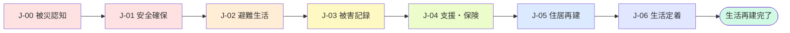
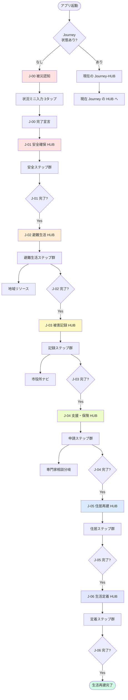
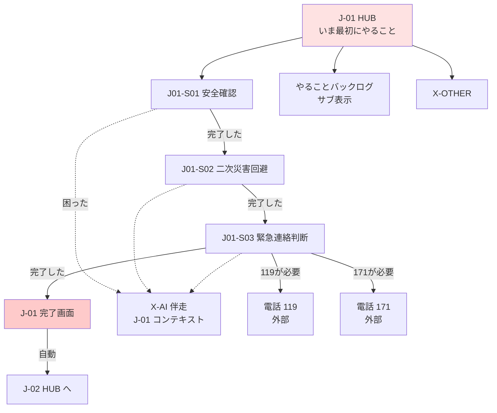
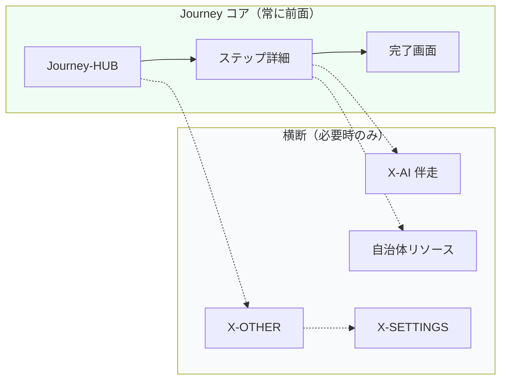
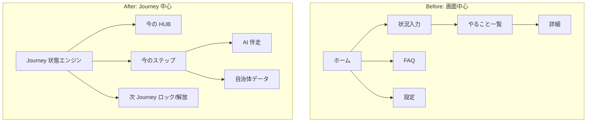

# 05 ジャーニー設計書 — 生活再建ナビ

| 項目 | 内容 |
|------|------|
| ドキュメント名 | ジャーニー設計書 |
| サービス名 | 生活再建ナビ（仮） |
| 版 | 1.0（スパイン定義）→ [06](./06_ジャーニー分岐・ケースワーカー設計書.md) で分岐拡張 |
| ステータス | 設計・企画フェーズ |
| 最終更新 | 2026-08-05 |
| 関連ドキュメント | [02_要件定義書.md](./02_要件定義書.md) / [03_画面設計書.md](./03_画面設計書.md) / [06_ジャーニー分岐・ケースワーカー設計書.md](./06_ジャーニー分岐・ケースワーカー設計書.md) / [08_現実世界接続設計書.md](./08_現実世界接続設計書.md) / [09_地域・制度データ設計書.md](./09_地域・制度データ設計書.md) / [07_UXレビュー_熊本シナリオ.md](./07_UXレビュー_熊本シナリオ.md) |

---

## 設計思想の転換

### Before（画面中心）

```
画面一覧 → 各画面の機能 → ユーザーが画面を回る
```

情報を**見せる**ための画面集合。ユーザーは自分で「次にどの画面へ行くか」を判断する。

### After（Journey 中心）

```
被災 → … → 生活再建完了
         ↑
    各 Journey が「今のフェーズ」を定義
    画面・AI・データは Journey を完了させるための手段
```

**生活再建を最後までナビゲーションする**アプリ。ユーザーは「今どの段階にいるか」「次に何をすればこの段階が終わるか」だけを意識する。

### 設計原則

| # | 原則 | 意味 |
|---|------|------|
| 1 | **Journey First** | 画面 ID より Journey ID を先に定義する |
| 2 | **One Step at a Time** | 常に「今の Journey の次の 1 歩」だけを前面に出す |
| 3 | **Completion Unlocks** | Journey の完了条件を満たすと次 Journey が解放される |
| 4 | **AI as Case Worker** | AI はチャットボットではなく、案件を最後まで見届けるケースワーカー（詳細は [06](./06_ジャーニー分岐・ケースワーカー設計書.md)） |
| 5 | **Data Follows Journey** | 必要データは Journey ごとに最小限だけ聞く |
| 6 | **Municipal Data When Needed** | 自治体データはその Journey で必要になった時点で注入する |
| 7 | **Branch, Then Merge** | 属性で分岐するが、J-00〜J-06 のスパインには必ず合流する |

---

## ① User Journey — 被災から生活再建まで

### 全体像

被災者の生活再建は、おおむね **7 つの Journey（旅）** に分かれる。各 Journey には期間目安・心理状態・ゴールがある。



### Journey 一覧

| Journey ID | 名称 | 期間目安 | ユーザーの心理 | ゴール（この旅の終わり） |
|------------|------|----------|--------------|------------------------|
| **J-00** | 被災認知 | 被災直後〜数時間 | パニック、混乱 | 「このアプリが自分の道しるべになる」と認識する |
| **J-01** | 安全確保 | 0〜72 時間 | 恐怖、判断力低下 | 自分と家族が**今すぐ安全**である |
| **J-02** | 避難生活 | 3 日〜2 週間 | 疲弊、不安 | **今日〜明日**の生活（食・水・睡眠・連絡）が見える |
| **J-03** | 被害記録 | 1 週間〜1 ヶ月 | 落ち着き始める、面倒 | 行政・保険に使える**被害の記録**が揃う |
| **J-04** | 支援・保険 | 2 週間〜6 ヶ月 | 金銭不安、手続き疲れ | 受けられる支援の**申請を開始**し、見通しが立つ |
| **J-05** | 住居再建 | 1 ヶ月〜2 年 | 将来への不安 | **住む場所**の方針と次の一手が決まる |
| **J-06** | 生活定着 | 3 ヶ月〜 | 回復と新日常 | 学校・仕事・地域が**新しい生活**として回り始める |

### 各 Journey の詳細

#### J-00：被災認知

| 項目 | 内容 |
|------|------|
| **トリガー** | 地震・水害等の発生。家族・知人からの紹介。SNS・メディア経由 |
| **ユーザーがやること** | アプリを開く → 最小限の状況を伝える → 最初の 1 歩を受け取る |
| **アプリがやること** |  panic を増やさない。登録不要・操作最小を約束。J-01 へ送る |
| **並行して起きうること** | 余震、停電、避難指示 |

#### J-01：安全確保

| 項目 | 内容 |
|------|------|
| **トリガー** | J-00 完了、または被災直後にアプリ起動 |
| **ユーザーがやること** | 自身・家族の安全確認、二次災害回避、必要なら避難、119/110/171 の判断 |
| **アプリがやること** | 「今すぐやること」を 1 件ずつ提示。緊急連絡先。完了 → 次へ自動遷移 |
| **並行して起きうること** | ライフライン停止、建物倒壊リスク、夜間の寒さ |

#### J-02：避難生活

| 項目 | 内容 |
|------|------|
| **トリガー** | J-01 完了（安全確保済み） |
| **ユーザーがやること** | 避難所/仮住まいの確保、食料・水、家族への安否連絡、子どものケア |
| **アプリがやること** | 24〜48 時間単位の「今日やること」。避難所・給水・充電の自治体情報 |
| **並行して起きうること** | 長期避難、体調不良、情報不足 |

#### J-03：被害記録

| 項目 | 内容 |
|------|------|
| **トリガー** | J-02 完了、または住居に立ち入り可能になったタイミング |
| **ユーザーがやること** | 写真撮影、罹災証明申請、損害状況のメモ、必要書類の把握 |
| **アプリがやること** | 手順ナビ、持ち物リスト、市役所の行き方・受付、期限リマインド |
| **並行して起きうること** | 立入禁止、証明発行の混雑、書類不足 |

#### J-04：支援・保険

| 項目 | 内容 |
|------|------|
| **トリガー** | J-03 完了（罹災証明取得済みまたは申請済み） |
| **ユーザーがやること** | 火災保険・地震保険請求、国・自治体の支援制度申請、金融機関への連絡 |
| **アプリがやること** | 該当制度のフィルタ、申請順序、期限管理、専門家相談の判断基準 |
| **並行して起きうること** | 請求拒否、追加資料要求、生活費ショート |

#### J-05：住居再建

| 項目 | 内容 |
|------|------|
| **トリガー** | J-04 完了（主要支援の申請開始済み） |
| **ユーザーがやること** | 仮設住宅・賃貸・修繕・建替の選択、契約、引越し |
| **アプリがやること** | 選択肢の整理（修繕 vs 建替 vs 移転）、仮設・公営住宅の入口、チェックリスト |
| **並行して起きうること** | 建築確認、地盤調査、入居待ち |

#### J-06：生活定着

| 項目 | 内容 |
|------|------|
| **トリガー** | J-05 完了（住居方針決定・契約または修繕開始） |
| **ユーザーがやること** | 転校・転勤、地域登録、医療・福祉の継続、心のケア |
| **アプリがやること** | 学校・役所・医療の変更手続き、長期フォロー、Journey 完了の祝福 |
| **並行して起きうること** | いじめ・孤立、PTSD、収入減 |

### 熊本シナリオでの Journey マッピング（例）

| 状況 | 最初に入る Journey | 優先ステップ |
|------|-------------------|-------------|
| 震度7・半壊・避難所・停電断水・子ども2人 | J-00 → J-01 | 安全確認 → 避難所生活 → 安否連絡 |
| 全壊・親戚宅 | J-01 → J-02 | 安全確認 → 仮住まい確保 |
| 浸水・自宅一部 | J-01 → J-03 | 安全確認 → 被害写真（立入可能後） |

---

## ② Journey ごとの画面

画面は **Journey のステップ**として定義する。独立した「情報ページ」ではなく、**今の Journey を進める UI** である。

### 画面命名規則

```
[Journey ID]-[Step 番号]-[画面の役割]
例: J01-S01 安全確認ステップ
```

### Journey × 画面マトリクス

| Journey | 画面 ID | 画面名 | 役割 | 表示タイミング |
|---------|---------|--------|------|---------------|
| **J-00** | J00-S01 | 被災認知ゲート | 登録不要・3タップで開始を約束 | 初回起動 |
| **J-00** | J00-S02 | 状況ミニ入力 | 災害種別・被害・避難・タグ（子ども/停電/水） | J-00 中 |
| **J-00** | J00-S03 | Journey 開始宣言 | 「まず安全から始めます」と次 Journey を予告 | J-00 完了直前 |
| **J-01** | J01-HUB | 安全確保ハブ | 現在の Journey 名・進捗・「いまの 1 歩」 | J-01 中は常にホーム |
| **J-01** | J01-S01 | 安全確認ステップ | 自分・家族・周囲の安全チェック | J-01 ステップ 1 |
| **J-01** | J01-S02 | 二次災害回避 | 火・ガス・倒壊物の確認 | J-01 ステップ 2 |
| **J-01** | J01-S03 | 緊急連絡判断 | 119/110/171 をかけるべきか | J-01 ステップ 3 |
| **J-01** | J01-DONE | J-01 完了画面 | 短い休息メッセージ → J-02 解放 | J-01 全ステップ完了 |
| **J-02** | J02-HUB | 避難生活ハブ | 今日のやること・明日の予告 | J-02 中は常にホーム |
| **J-02** | J02-S01 | 避難場所の確認 | 避難所/車/親戚等の状態確認 | J-02 ステップ 1 |
| **J-02** | J02-S02 | 食・水・トイレ | 24h 生活の確保 | J-02 ステップ 2 |
| **J-02** | J02-S03 | 安否連絡 | 家族・学校・職場への連絡 | J-02 ステップ 3 |
| **J-02** | J02-S04 | 子ども・高齢者ケア | 状況タグに応じた追加ステップ | タグ ON 時のみ |
| **J-02** | J02-LOCAL | 地域リソース | 避難所一覧・給水・充電（自治体データ） | ステップ内から |
| **J-02** | J02-DONE | J-02 完了画面 | 「被害の記録に進みましょう」 | J-02 全ステップ完了 |
| **J-03** | J03-HUB | 被害記録ハブ | 記録タスクの進捗 | J-03 中は常にホーム |
| **J-03** | J03-S01 | 写真・メモ記録 | 被害箇所の記録ガイド | J-03 ステップ 1 |
| **J-03** | J03-S02 | 罹災証明申請 | 申請手順・持ち物・行き方 | J-03 ステップ 2 |
| **J-03** | J03-S03 | 損害リスト作成 | 家具・建物・車等のリスト | J-03 ステップ 3 |
| **J-03** | J03-LOCAL | 市役所ナビ | 管轄窓口・受付時間・混雑 | ステップ内から |
| **J-03** | J03-DONE | J-03 完了画面 | 支援・保険 Journey への橋渡し | J-03 完了 |
| **J-04** | J04-HUB | 支援・保険ハブ | 申請キュー・期限一覧 | J-04 中 |
| **J-04** | J04-S01 | 保険請求開始 | 火災・地震保険の第一報 | J-04 ステップ 1 |
| **J-04** | J04-S02 | 自治体支援制度 | 該当制度の確認と申請順 | J-04 ステップ 2 |
| **J-04** | J04-S03 | 金融機関連絡 | ローン・口座・カード | J-04 ステップ 3 |
| **J-04** | J04-EXPERT | 専門家相談分岐 | 複雑案件のエスカレーション | 条件付き |
| **J-04** | J04-DONE | J-04 完了画面 | 住居再建 Journey 解放 | J-04 完了 |
| **J-05** | J05-HUB | 住居再建ハブ | 選択肢比較・進捗 | J-05 中 |
| **J-05** | J05-S01 | 住居方針決定 | 修繕/建替/転居/仮設 | J-05 ステップ 1 |
| **J-05** | J05-S02 | 仮設・賃貸・公営 | 具体的な確保手順 | 方針に応じて |
| **J-05** | J05-S03 | 契約・引越し | 契約チェック・引越し TODO | J-05 後半 |
| **J-05** | J05-DONE | J-05 完了画面 | 生活定着へ | J-05 完了 |
| **J-06** | J06-HUB | 生活定着ハブ | 長期 TODO・フォロー | J-06 中 |
| **J-06** | J06-S01 | 学校・保育 | 転校・復学手続き | 子どもあり |
| **J-06** | J06-S02 | 仕事・収入 | 休職・失業・再就職 | 必要時 |
| **J-06** | J06-S03 | 医療・福祉 | 保険証・介護・心のケア | 必要時 |
| **J-06** | J06-S04 | 地域との接続 | 自治会・ボランティア | J-06 後半 |
| **J-06** | J06-DONE | 生活再建完了 | 祝福・振り返り・共有 | 全 Journey 完了 |
| **横断** | X-SETTINGS | 設定 | 文字サイズ等 | 任意 |
| **横断** | X-AI | AI 伴走 | Journey 文脈付き相談 | 任意（通信安定時） |
| **横断** | X-OTHER | その他 | FAQ・リセット・状況変更 | 任意 |

### 現行画面との対応（移行参考）

| 現行 | Journey 設計での位置づけ |
|------|--------------------------|
| `/` ホーム | **現在の Journey-HUB** に再定義（J01-HUB, J02-HUB…） |
| `/start` | J00-S02 状況ミニ入力 |
| `/actions` | Journey 横断のバックログ表示（サブ） |
| `/actions/[id]` | 各 Journey-Sxx ステップ詳細 |
| `/chat` | X-AI（Journey 文脈付き） |
| `/mypage` | X-OTHER + Journey 全体進捗 |
| `/faq` | X-OTHER 内 |

---

## ③ Journey ごとの AI の役割

> **v1.1 更新:** AI の詳細設計（能動介入・判断・通知・提案）は [06_ジャーニー分岐・ケースワーカー設計書.md](./06_ジャーニー分岐・ケースワーカー設計書.md) を参照。本節は Journey フェーズごとの役割サマリ。

AI は **チャットボットではなくケースワーカー** である。常に「今どの Journey にいるか」と「案件属性」を前提に、**判断・通知・提案** を行う。

| Journey | AI の役割 | 主な振る舞い | やらないこと |
|---------|----------|-------------|-------------|
| **J-00** | **受付係** | 一言で状況を聞き、J-01 へルーティング。専門用語禁止 | 長い制度説明、複数選択肢の提示 |
| **J-01** | **緊急アシスタント** | Yes/No 判断支援（「119 をかけるべき？」）。ステップ順守 | 保険・罹災証明の話（時期尚早） |
| **J-02** | **生活コーディネーター** | 避難所生活の FAQ、子ども向け配慮、今日の優先順位 | 申請書の書き方 |
| **J-03** | **記録コーチ** | 写真の撮り方、罹災証明の Q&A、持ち物確認 | 法的判断（損害認定の可否） |
| **J-04** | **手続きナビゲーター** | 該当制度の絞り込み、申請順序、期限警告 | 代理申請、保険金額の保証 |
| **J-05** | **選択肢整理者** | 修繕/建替/転居の比較表、仮設の流れ | 特定業者の推薦 |
| **J-06** | **フォローアップパートナー** | 長期 TODO、心のケア資源、進捗の振り返り | 新しい Journey の先取り |

### AI 共通ルール

1. **Journey 外の話題は Journey に戻す**（「それは J-04 に進んだらお手伝いします」）
2. **通信不安時は /start（状況選択）を推奨** — ルールベースで完結
3. **回答は「次の 1 アクション」で終える**
4. **自治体公式情報を優先引用**（AI の創作で窓口を作らない）
5. **専門家相談のトリガー**を J-04 以降で明示

### AI プロンプトコンテキスト（設計）

各 Journey で AI に渡すコンテキスト：

```
current_journey: J-02
journey_goal: 今日〜明日の生活が見える
completed_steps: [J01-S01, J01-S02, J01-S03]
current_step: J02-S02
user_profile: { disaster: 地震, damage: 半壊, shelter: 避難所, hasChildren: true, ... }
municipal_context: { city: 熊本市, shelters: [...], water: [...] }
```

---

## ④ Journey ごとの必要データ

### データ取得方針

- **J-00 で最小セット**を取得し、以降は Journey 進行に応じて **追加質問**
- キーボード入力は極力避け、タップ選択中心
- 後から X-OTHER「状況を選び直す」で更新可能

### Journey × 必要データ

| Journey | 必須データ | 任意データ | 取得タイミング | 用途 |
|---------|-----------|-----------|---------------|------|
| **J-00** | 災害種別、被害程度、避難状況 | — | 初回 3 タップ | Journey ルーティング |
| **J-00** | 状況タグ（子ども/停電/断水/高齢者） | — | 初回 3 タップ | ステップ追加・優先度 |
| **J-01** | （J-00 から継承） | けがの有無 | ステップ内 Yes/No | 119 判断 |
| **J-02** | 避難場所の確定 | 学校名、ペット | J02-S01 | 安否連絡・地域リソース |
| **J-02** | 安否連絡先（1 件以上） | — | J02-S03 | 連絡 TODO 生成 |
| **J-03** | 自治体（市町村） | 立入可否 | J03 開始時 | 罹災証明窓口 |
| **J-03** | 被害写真（任意枚数） | 損害メモ | J03-S01 | 記録・保険準備 |
| **J-04** | 罹災証明の有無 | 保険加入状況 | J04 開始時 | 制度フィルタ |
| **J-04** | 世帯構成、収入概算 | 雇用形態 | J04-S02 | 支援制度該当判定 |
| **J-05** | 住居方針（修繕/建替/転居/未定） | ローン残高 | J05-S01 | パス分岐 |
| **J-06** | 新住所（確定後） | 学校・職場名 | J06 各ステップ | 転校・転勤 TODO |

### ユーザープロファイル（統合モデル案）

```typescript
// 設計用モデル（実装前）
interface JourneyState {
  currentJourney: "J-00" | "J-01" | ... | "J-06";
  completedJourneys: string[];
  currentStep: string;
  completedSteps: string[];
}

interface UserProfile {
  // J-00
  disasterType?: string;
  damageLevel?: string;
  shelterStatus?: string;
  hasChildren?: boolean;
  hasElderly?: boolean;
  hasPowerOutage?: boolean;
  hasWaterOutage?: boolean;
  // J-02+
  municipality?: string;
  shelterName?: string;
  emergencyContacts?: string[];
  // J-03+
  disasterCertificateStatus?: "none" | "applied" | "issued";
  damagePhotos?: string[]; // ローカルのみ
  // J-04+
  insuranceStatus?: "unknown" | "reported" | "claimed";
  householdSize?: number;
  // J-05+
  housingPlan?: "repair" | "rebuild" | "relocate" | "temp" | "undecided";
  // J-06+
  newAddress?: string;
}
```

---

## ⑤ Journey ごとの自治体データ

自治体データは **Journey ごとに必要なものだけ** を注入する。全国共通マスタ＋市町村オーバーレイ構造。

| Journey | 必要な自治体データ | データ例 | 更新頻度 | 取得元 |
|---------|-------------------|---------|---------|--------|
| **J-00** | なし（全国共通のみ） | 119/110/171 | 固定 | 国 |
| **J-01** | 避難所開設状況（広域） | 開設一覧 URL、避難所マップ | リアルタイム〜日次 | 自治体 HP、防災アプリ連携 |
| **J-02** | **避難所詳細** | 名称、住所、収容、ペット、給食、充電、Wi-Fi | 日次 | 自治体 |
| **J-02** | **給水・入浴・トイレ** | 給水場所、時間、トイレ設置 | 日次 | 自治体 |
| **J-02** | 安否確認システム | 171、自治体安否 DB | 固定 | 国・自治体 |
| **J-03** | **罹災証明窓口** | 市役所/支所、受付時間、混難情報、必要書類 | 週次〜随時 | 自治体 |
| **J-03** | 損害調査日程 | 調査員訪問の流れ | 随時 | 自治体 |
| **J-04** | **支援制度一覧** | 災害援護資金、仮設住宅、家賃支援、子ども支援 | 随時 | 国・自治体 |
| **J-04** | 申請窓口・オンライン URL | 申請先、電話 | 随時 | 自治体 |
| **J-05** | **仮設住宅・公営住宅** | 募集、空き、申請方法 | 週次 | 自治体 |
| **J-05** | 建築指導・確認申請 | 窓口、必要書類 | 固定 | 自治体 |
| **J-06** | 学校・保育 | 転校先、一時預かり | 随時 | 教育委員会 |
| **J-06** | 福祉・相談窓口 | 保健センター、心理支援 | 固定 | 自治体 |

### 自治体データモデル（設計）

```typescript
interface MunicipalData {
  municipalityCode: string; // 全国地方公共団体コード
  name: string;
  lastUpdated: string;

  // J-01/J-02
  shelters?: Shelter[];
  waterStations?: WaterStation[];
  emergencyInfoUrl?: string;

  // J-03
  disasterCertificateOffices?: Office[];
  damageInspectionInfo?: string;

  // J-04
  supportPrograms?: SupportProgram[];

  // J-05
  temporaryHousing?: TemporaryHousingInfo[];
  publicHousingUrl?: string;

  // J-06
  schoolTransferInfo?: string;
  welfareContacts?: Contact[];
}
```

### MVP での自治体データ範囲

| 優先度 | Journey | 内容 |
|--------|---------|------|
| P0 | J-01/J-02 | 熊本市など **1 自治体** の避難所・給水 URL（外部リンク） |
| P1 | J-03 | 罹災証明窓口（静的） |
| P2 | J-04 | 支援制度一覧（国共通＋自治体差分） |
| P3 | J-05/J-06 | 仮設・学校・福祉 |

---

## ⑥ Journey ごとの完了条件

Journey の完了は **ユーザー宣言＋最小条件** の組み合わせ。完了すると次 Journey が解放され、ホーム（HUB）が切り替わる。

| Journey | 完了条件（すべて） | ユーザーへのメッセージ | 解放される Journey |
|---------|-------------------|----------------------|-------------------|
| **J-00** | 状況ミニ入力 3 タップ完了 | 「状況を把握しました。まず安全から始めましょう」 | J-01 |
| **J-01** | J01-S01〜S03 すべて「完了した」 | 「よくやりました。今夜の生活の準備に進みましょう」 | J-02 |
| **J-02** | J02-S01〜S03 完了 ＋ タグに応じ S04 完了 | 「避難生活の第一歩が整いました。被害の記録に進めます」 | J-03 |
| **J-03** | J03-S02（罹災証明）「申請した」＋ S01 or S03 いずれか完了 | 「記録が整いました。支援と保険の準備に進みましょう」 | J-04 |
| **J-04** | J04-S01（保険第一報）＋ S02（主要支援 1 件申請開始）完了 | 「申請が動き始めました。住まいの再建を考えましょう」 | J-05 |
| **J-05** | J05-S01（住居方針）決定 ＋ S02 or S03 のいずれか 1 ステップ完了 | 「住まいの見通しが立ちました。新しい生活の準備へ」 | J-06 |
| **J-06** | J06 必須ステップ完了（プロファイルに応じた最小セット） | 「生活再建の主要な旅が完了しました」 | — （完了状態） |

### ステップ完了の定義

| 完了タイプ | 説明 | 例 |
|-----------|------|-----|
| **自己申告** | ユーザーが「完了した」をタップ | 安全確認 |
| **申請申告** | 「申請した／電話した」をタップ | 罹災証明、保険第一報 |
| **記録** | 写真 1 枚以上 or メモ保存 | 被害記録 |
| **選択** | 方針を 1 つ選んだ | 修繕/建替/転居 |
| **スキップ許容** | 条件不一致で自動スキップ | 子どもなし → J02-S04 省略 |

### Journey 巻き戻し・分岐

| イベント | 動作 |
|---------|------|
| 状況が大きく変化（全壊→避難所移動等） | X-OTHER「状況を選び直す」→ 該当 Journey から再生成 |
| J-03 前に立入不能 | J-03 をロック、J-02 継続＋「立入可能になったら通知」 |
| J-04 で専門家必要判定 | J04-EXPERT 必須ステップ化（J-04 完了には相談先確認） |

---

## 画面遷移図（Journey 中心）

### 7.1 マクロ遷移 — Journey 間



### 7.2 ミクロ遷移 — Journey 内（J-01 安全確保の例）



### 7.3 横断機能の位置づけ



### 7.4 情報アーキテクチャ — Before / After



---

## 付録 A：Journey 状態エンジン（概念設計）

コード変更前の概念モデル。実装時の核となる。

```
┌─────────────────────────────────────────┐
│           Journey State Engine           │
├─────────────────────────────────────────┤
│  Input:  UserProfile, completedSteps    │
│  Output: currentJourney, currentStep,   │
│          nextAction, unlockedJourneys   │
├─────────────────────────────────────────┤
│  Rules:                                  │
│  1. 常に 1 つの「currentStep」を返す     │
│  2. currentStep 完了 → 次ステップ or    │
│     Journey 完了判定                     │
│  3. Journey 完了 → 次 Journey 解放       │
│  4. 状況変更 → 該当 Journey 以降を再計算 │
└─────────────────────────────────────────┘
```

---

## 付録 B：次のアクション（実装フェーズ用メモ）

本ドキュメントは **設計のみ**。実装時は以下の順序を推奨する。

1. `JourneyState` 型と状態エンジンの導入
2. ホームを「現在 Journey-HUB」に差し替え
3. 既存 `/actions/[id]` を Journey ステップにマッピング
4. 完了条件ロジックの実装
5. AI プロンプトに Journey コンテキスト注入
6. 自治体データの段階的接続

---

## 改訂履歴

| 版 | 日付 | 内容 |
|----|------|------|
| 1.0 | 2026-08-05 | 初版。画面中心から Journey 中心への設計転換 |
| 1.1 | 2026-08-05 | 06 設計書への参照追加。AI をケースワーカーに再定義。分岐原則追加 |
