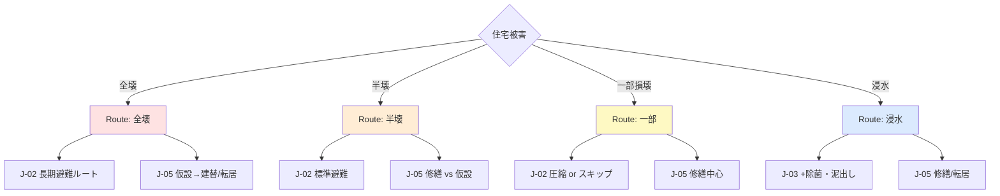
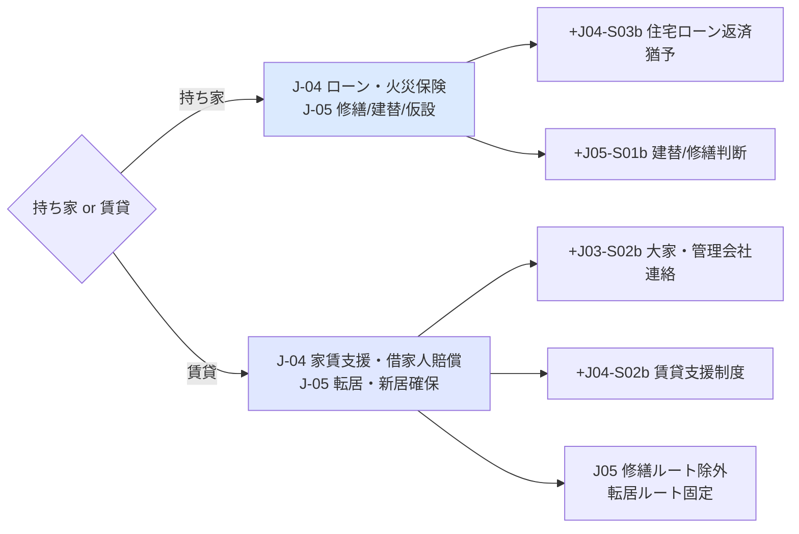
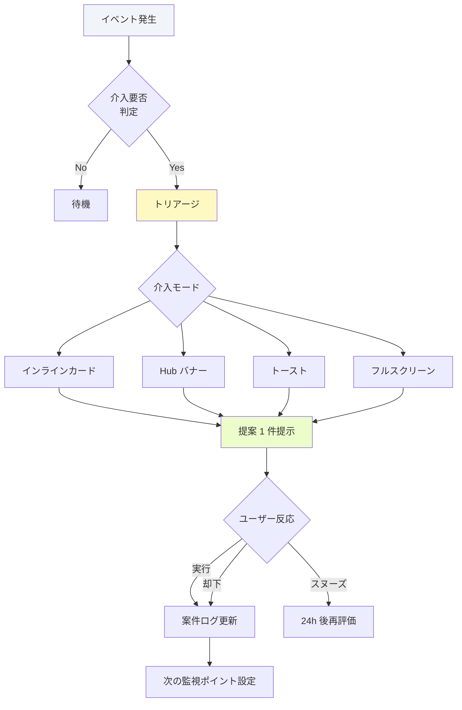
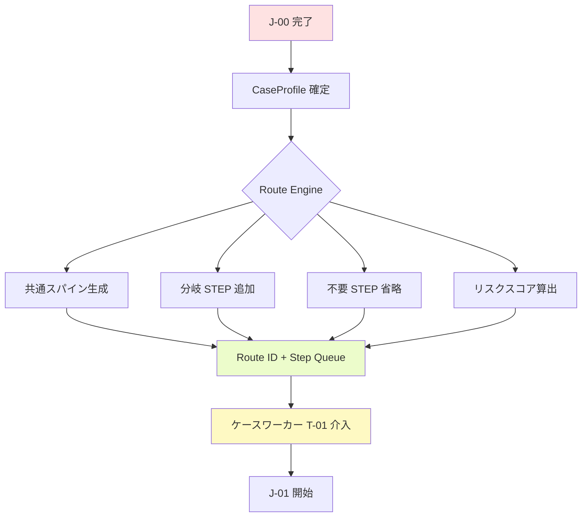
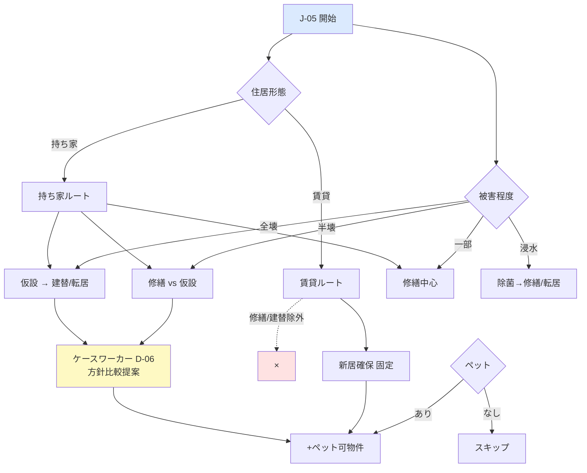
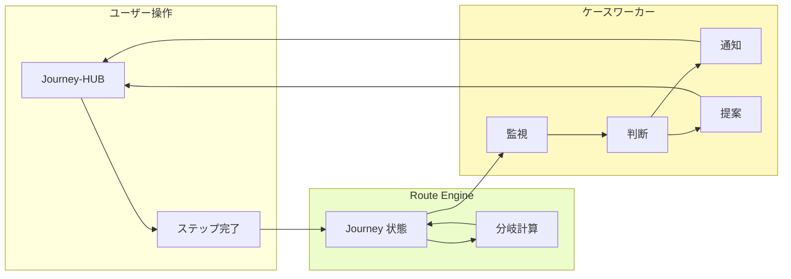

# 06 ジャーニー分岐・ケースワーカー設計書

| 項目 | 内容 |
|------|------|
| ドキュメント名 | ジャーニー分岐・ケースワーカー設計書 |
| サービス名 | 生活再建ナビ（仮） |
| 版 | 1.0 |
| ステータス | 設計・企画フェーズ |
| 最終更新 | 2026-08-05 |
| 関連ドキュメント | [05_ジャーニー設計書.md](./05_ジャーニー設計書.md) / [08_現実世界接続設計書.md](./08_現実世界接続設計書.md) / [09_地域・制度データ設計書.md](./09_地域・制度データ設計書.md) |

---

## 本書の位置づけ

[05_ジャーニー設計書.md](./05_ジャーニー設計書.md) で定義した **7 Journey の骨格（スパイン）** を採用し、本書で以下を追加定義する。

1. **状況属性による Journey 分岐** — 一本道ではなく、ユーザーごとの「個別ルート」
2. **AI ケースワーカー** — チャットボットではなく、案件を管理する伴走者

コード変更は行わない。設計のみ。

---

## 設計思想：スパイン × 分岐

```
                    J-00 ─ J-01 ─ J-02 ─ J-03 ─ J-04 ─ J-05 ─ J-06
                    （全ユーザー共通のマクロ Journey＝スパイン）

各 Journey 内:
  共通ステップ（Core Steps）
       ＋
  属性ステップ（Branch Steps）  ← 条件で追加・省略・順序変更
       ＋
  属性 Journey ショートカット   ← 状況により Journey 自体を圧縮・延期
```

| 概念 | 説明 |
|------|------|
| **スパイン** | J-00〜J-06 の順序。生活再建の時間軸そのもの |
| **分岐** | 属性に応じてステップ集合・優先度・完了条件が変わる |
| **合流** | 分岐後もスパインに戻る。別ルートに永久に迷子にならない |
| **ケースワーカー** | 分岐の判断・介入・通知・提案を担う主体 |

---

## 第1部：状況属性（分岐軸）

### 1.1 属性一覧

| 属性 ID | 属性名 | 取得タイミング | 選択肢 | 分岐への影響度 |
|---------|--------|---------------|--------|--------------|
| **A-DMG** | 住宅被害 | J-00（必須） | 全壊 / 半壊 / 一部損壊 / 浸水 / わからない | ★★★★★ |
| **A-SHL** | 避難状況 | J-00（必須） | 避難所 / 車 / 親戚・知人 / 自宅（一部） | ★★★★ |
| **A-TEN** | 住居形態 | J-00 または J-04 入口 | 持ち家 / 賃貸 / わからない | ★★★★★ |
| **A-CHD** | 子ども | J-00 タグ | あり / なし | ★★★★ |
| **A-ELD** | 高齢者 | J-00 タグ | あり / なし | ★★★★ |
| **A-PET** | ペット | J-02 入口 or J-00 拡張 | あり / なし | ★★★ |
| **A-EMP** | 雇用形態 | J-04 入口 | 会社員 / 自営業 / パート・アルバイト / 無職・不明 | ★★★★ |
| **A-INF** | ライフライン | J-00 タグ | 停電 / 断水 / 両方 / なし | ★★★ |
| **A-MUN** | 自治体 | J-03 入口 | 市町村（タップ選択） | ★★★ |

### 1.2 属性の組み合わせ = ケース

ケースワーカーは属性の組み合わせを **1 つの「案件（Case）」** として保持する。

```
Case ID: 内部生成（ユーザーには見せない）
Case Profile: { A-DMG, A-SHL, A-TEN, A-CHD, A-ELD, A-PET, A-EMP, A-INF, A-MUN }
Case Route:   生成された Branch Route ID（後述）
Case Worker:  担当 AI ペルソナ（常に同一案件を記憶）
```

---

## 第2部：Journey 分岐設計

### 2.1 分岐の 3 パターン

| パターン | 記号 | 説明 | 例 |
|---------|------|------|-----|
| **ステップ追加** | `+STEP` | 共通ステップに属性専用ステップを挿入 | 子ども → J02-S04 |
| **ステップ省略** | `-STEP` | 不要ステップをスキップ（自動） | 一部損壊＋自宅 → J-02 圧縮 |
| **Journey 変形** | `~J` | Journey の順序・長さ・完了条件が変わる | 全壊 → J-05 を最長ルートに |

### 2.2 マクロ分岐 — 住宅被害（A-DMG）



| 被害 | J-01 | J-02 | J-03 | J-05 | 備考 |
|------|------|------|------|------|------|
| **全壊** | 標準＋立入禁止確認 | **必須・長期化**（+仮住まい確保） | 立入不可なら**延期ロック** | **仮設→建替/転居** が主軸 | 持ち家なら J05-S01 で建替 |
| **半壊** | 標準＋倒壊リスク | 標準 | 標準＋構造確認写真 | **修繕 vs 仮設 vs 転居** | ケースワーカーが方針整理 |
| **一部損壊** | 標準 | **圧縮可**（自宅滞在時） | 標準（軽量） | **修繕中心** | 避難所でなければ J-02 短縮 |
| **浸水** | 標準＋感電リスク | 標準 | **+J03-S04 泥出し・除菌** | 修繕/転居（カビリスク説明） | J-04 に家財保険強調 |

### 2.3 マクロ分岐 — 住居形態（A-TEN）



| 住居形態 | 追加ステップ | 省略ステップ | J-05 の主ルート |
|---------|-------------|-------------|----------------|
| **持ち家** | ローン返済猶予、建替/修繕判断、固定資産 | 大家連絡 | 修繕 / 建替 / 仮設 |
| **賃貸** | 大家連絡、賃貸支援、敷金・契約 | 建替 | **転居 / 新居** 固定 |

### 2.4 属性別 — 子ども（A-CHD）

| Journey | 分岐内容 |
|---------|---------|
| J-01 | +J01-S04 子どもの安全確認（A-CHD=あり） |
| J-02 | +J02-S04a 子どもの生活（食・睡眠・不安ケア） |
| J-02 | +J02-S04b 学校・保育園への連絡 |
| J-04 | +J04-S02c 子ども向け支援制度フィルタ |
| J-06 | **J06-S01 必須化**（転校・復学） |

**完了条件への影響:** J-02 完了に J02-S04a, S04b を追加。J-06 完了に J06-S01 必須。

### 2.5 属性別 — 高齢者（A-ELD）

| Journey | 分岐内容 |
|---------|---------|
| J-01 | +J01-S04b 高齢者の安全・服薬確認（A-ELD=あり） |
| J-02 | +J02-S04c 服薬・介護・体調管理 |
| J-02 | +J02-S04d 介護施設・デイサービス連絡（必要時） |
| J-04 | +J04-S02d 介護保険・高齢者支援 |
| J-06 | **J06-S03 必須化**（医療・福祉継続） |

**ケースワーカー介入:** 高齢者のみ世帯 → **リスク: 高**。J-01 完了後に能動的フォロー。

### 2.6 属性別 — ペット（A-PET）

| Journey | 分岐内容 |
|---------|---------|
| J-02 | +J02-S05 ペット同伴避難（ペット可避難所検索） |
| J-02 | +J02-S05b ペットフード・ケージ確保 |
| J-05 | +J05-S02b ペット可物件・一時預かり |
| J-06 | +J06-S04b 新環境でのペット登録（必要地域） |

**取得タイミング:** J-02 開始時に「ペットはいますか？」1 タップ。J-00 では聞かない（初回負担軽減）。

### 2.7 属性別 — 自営業（A-EMP）

| Journey | 分岐内容 |
|---------|---------|
| J-04 | +J04-S02e 事業復旧支援・補助金 |
| J-04 | +J04-S03c 事業用ローン・税務相談 |
| J-04 | +J04-S04 取引先・顧客への連絡 |
| J-06 | +J06-S02b 営業再開・自営業向け支援 |

**取得タイミング:** J-04 入口で「お仕事の形態」1 タップ。

**ケースワーカー介入:** 自営業 → 収入途絶リスク。**J-04 開始時に優先提案**。

### 2.8 複合分岐 — 代表ケース 6 パターン

#### Case A：熊本・半壊・避難所・子ども2・停電断水・持ち家

```
Route ID: R-HALF-SHELTER-CHILD-OWN

J-00 → J-01（+子ども安全）
     → J-02（標準 + J02-S04a/b + 給水充電）
     → J-03（標準）
     → J-04（+ローン猶予 + 子ども支援）
     → J-05（修繕 vs 仮設 → ケースワーカーが比較提案）
     → J-06（J06-S01 転校 必須）
```

#### Case B：全壊・避難所・高齢者・賃貸

```
Route ID: R-TOTAL-SHELTER-ELDER-RENT

J-00 → J-01（+高齢者安全・服薬）
     → J-02（長期 + J02-S04c/d）
     → J-03（立入不可なら LOCK → ケースワーカー通知）
     → J-04（+大家連絡 + 家賃支援 + 介護）
     → J-05（転居固定、公営/賃貸）
     → J-06（J06-S03 必須）
```

#### Case C：一部損壊・自宅滞在・ペット・持ち家

```
Route ID: R-PARTIAL-HOME-PET-OWN

J-00 → J-01（標準）
     → J-02（圧縮: 食水のみ + J02-S05 ペット）
     → J-03（軽量記録）
     → J-04（標準 + ローン）
     → J-05（修繕中心 + ペット可仮設は不要）
     → J-06（標準）
```

#### Case D：浸水・親戚宅・自営業・賃貸

```
Route ID: R-FLOOD-RELATIVE-SELFEMP-RENT

J-00 → J-01 → J-02（標準）
     → J-03（+泥出し除菌 + 大家連絡）
     → J-04（+自営業支援 + 賃貸支援 + 取引先連絡）
     → J-05（転居）
     → J-06（+営業再開）
```

#### Case E：半壊・車中泊・単身・持ち家

```
Route ID: R-HALF-CAR-SINGLE-OWN

J-00 → J-01 → J-02（+車中泊生活 S02 拡張）
     → J-03 → J-04 → J-05（仮設 or 修繕）
     → J-06（圧縮: 必須最小）
```

#### Case F：わからない・避難所・属性未確定

```
Route ID: R-UNKNOWN-SHELTER

J-00 → 保守ルート（全 STEP 標準、属性確定後に Route 再計算）
ケースワーカー: J-02 中に属性を段階的に確認
```

### 2.9 分岐ルート生成ルール（Journey State Engine 拡張）

```
Input:
  spine_position: 現在の Journey (J-00..J-06)
  case_profile: 属性集合
  completed_steps: 完了済み

Process:
  1. BaseSteps = 当該 Journey の共通ステップ
  2. BranchSteps = 属性マッチングで追加ステップを算出
  3. OmitSteps = 条件不一致ステップを除去
  4. Priority = 属性リスクスコアで並べ替え
  5. Route = merge(BaseSteps, BranchSteps) - OmitSteps
  6. 常に 1 つの currentStep を返す

Output:
  currentStep, pendingSteps, routeId, riskFlags
```

### 2.10 リスクスコア（分岐優先度）

ケースワーカーとエンジンが共有する優先度算出。

| フラグ | 条件 | スコア |
|--------|------|--------|
| RISK-01 | 全壊 | +30 |
| RISK-02 | 避難所 AND 停電 | +20 |
| RISK-03 | 高齢者のみ世帯 | +25 |
| RISK-04 | 子ども AND 避難所 | +15 |
| RISK-05 | 自営業 | +15 |
| RISK-06 | 賃貸 AND 全壊/半壊 | +15 |
| RISK-07 | ペット AND 避難所 | +10 |
| RISK-08 | ステップ停滞 48h+ | +20 |

スコア ≥ 40 → **ケースワーカー能動介入（High）**  
スコア 20〜39 → **定期チェックイン（Medium）**  
スコア < 20 → **受動待機（Low）**

---

## 第3部：AI ケースワーカー設計

### 3.1 チャットボットとの決定的な違い

| 項目 | チャットボット | ケースワーカー |
|------|--------------|--------------|
| 起動 | ユーザーが話しかける | **案件に応じて能動的に介入** |
| 記憶 | 会話セッション単位 | **案件（Case）全期間** |
| 出力 | 質問への回答 | **判断・通知・提案・次アクション** |
| 視点 | 汎用 FAQ | **この人の生活再建全体** |
| 成功指標 | 応答率 | **Journey 完了率・停滞解消** |

### 3.2 ケースワーカーのペルソナ

| 項目 | 定義 |
|------|------|
| 名前（UI 表示） | 「生活再建サポーター」（個人名は付けない） |
| 役割 | 被災者の生活再建案件を最後まで見届ける伴走者 |
| トーン | 落ち着いている、押し付けない、1 つずつ |
| 限界 | 法律・医療判断はしない。必要時は専門家・行政へ橋渡し |
| 原則 | **常に「次の 1 つ」だけ提案**。選択肢は最大 2 つ |

### 3.3 ケースファイル（Case File）

ケースワーカーが保持する内部データ。

```typescript
interface CaseFile {
  caseId: string;
  openedAt: string;
  lastInteractionAt: string;

  // 属性
  profile: CaseProfile;

  // Journey 状態
  journeyState: JourneyState;
  routeId: string;
  riskScore: number;
  riskFlags: string[];

  // ケースワーカー判断ログ
  triageDecisions: TriageDecision[];
  notifications: Notification[];
  proposals: Proposal[];

  // 介入履歴
  interventions: Intervention[];
  stallAlerts: StallAlert[];  // 停滞検知
}

interface Intervention {
  id: string;
  type: "proactive" | "reactive" | "scheduled";
  trigger: string;           // 介入理由
  journey: string;
  step?: string;
  message: string;
  proposedAction: string;
  userResponse?: "accepted" | "dismissed" | "snoozed";
  createdAt: string;
}
```

---

## 第4部：ケースワーカー — いつ介入するか

### 4.1 介入トリガー一覧

| トリガー ID | 種別 | 条件 | 介入タイミング | 優先度 |
|------------|------|------|--------------|--------|
| **T-01** | 能動 | J-00 完了・Route 確定 | 即時（J-01 開始前） | High |
| **T-02** | 能動 | リスクスコア ≥ 40 | J-01 完了後 1h 以内 | High |
| **T-03** | 能動 | ステップ停滞 24h | 停滞検知時 | Medium |
| **T-04** | 能動 | ステップ停滞 72h | 再通知 + 状況確認 | High |
| **T-05** | 能動 | Journey 遷移（J→J+1） | 遷移直後 | Medium |
| **T-06** | 能動 | 期限 72h 前 | スケジュール | High |
| **T-07** | 能動 | 期限 24h 前 | スケジュール | Critical |
| **T-08** | 能動 | 必須属性が未入力で次 Journey ブロック | J 開始時 | Medium |
| **T-09** | 能動 | J-03 LOCK（立入不可）解除条件成立 | ユーザー申告 or 自治体更新 | Medium |
| **T-10** | 受動 | ユーザーが「困った」「相談」を送信 | 即時 | High |
| **T-11** | 受動 | ステップ画面で「?」タップ | 即時 | Medium |
| **T-12** | 能動 | 状況変更（再入力） | 即時・Route 再計算後 | High |
| **T-13** | 能動 | J-04 で保険未報告 5 日経過 | スケジュール | Critical |
| **T-14** | 能動 | J-06 完了 | 祝福 + 振り返り | Low |

### 4.2 介入モード

| モード | UI 表現 | 用途 |
|--------|---------|------|
| **インライン** | ステップ画面上部のカード | 今のステップに直結する提案 |
| **Hub バナー** | Journey-HUB の目立つ帯 | Journey 遷移・重要通知 |
| **トースト** | 短い通知 | 完了祝福・軽いリマインド |
| **プッシュ**（将来） | OS 通知 | 期限 Critical・停滞 72h |
| **フルスクリーン**（稀） | モーダル | 119/171 判断、重大リスク |

### 4.3 介入フロー



### 4.4 介入してはいけないとき

| 条件 | 理由 |
|------|------|
| 同一ステップで 24h 以内に 2 回以上能動介入済み | 通知疲れ |
| ユーザーが「今日は通知しない」 | 尊重 |
| J-01 中の Critical 以外 | 安全確保の集中を妨げない |
| 通信オフライン | ルールベース UI のみ。AI 介入は保留 |
| 専門家相談が必要と判断した法的事項 | AI 単独で結論を出さない |

---

## 第5部：ケースワーカー — 何を判断するか

### 5.1 判断カテゴリ

| 判断 ID | 判断内容 | 入力 | 出力 |
|---------|---------|------|------|
| **D-01** | Route 選定 | CaseProfile | routeId, 追加/省略 STEP |
| **D-02** | 緊急度 | 症状・被害・環境 | immediate / today / week |
| **D-03** | 119/171/110 | けが・火・犯罪 | 電話推奨 or 不要 |
| **D-04** | Journey 延期 | 立入不可・安全未確保 | J-03 LOCK 等 |
| **D-05** | 専門家エスカレーション | 複雑保険・建築・法的 | J04-EXPERT 必須化 |
| **D-06** | 優先ステップ順 | 複数 pending | currentStep 1 件 |
| **D-07** | 通知優先度 | 期限・リスク | Critical / High / Medium |
| **D-08** | 属性追加質問 | 未確定属性 | 1 問だけ（Journey 入口） |
| **D-09** | 停滞原因推定 | 未完了期間・Journey | フォロー文面 |
| **D-10** | Journey 完了可否 | 分岐完了条件 | 解放 or 保留 |

### 5.2 判断例 — 属性 × Journey

#### D-01 Route 選定（J-00 完了時）

```
IF A-DMG=全壊 AND A-TEN=賃貸
  → Route: R-TOTAL-*-RENT
  → J-05 から修繕/建替除外
  → リスクスコア +15

IF A-DMG=一部 AND A-SHL=自宅
  → J-02 圧縮モード
  → J02-S01,S03 のみ必須

IF A-CHD=あり AND A-SHL=避難所
  → J-02 に S04a/b 必須
  → リスクスコア +15
```

#### D-05 専門家エスカレーション

```
IF A-DMG=全壊 AND A-TEN=持ち家 AND 火災保険=不明
  → J-04 開始時 J04-EXPERT を必須候補

IF A-EMP=自営業 AND 収入途絞リスク
  → J-04 で税務・金融専門家を提案（任意→推奨）
```

#### D-06 優先ステップ（半壊・子ども・停電）

```
Priority Order:
  1. J01-S01 安全確認
  2. J01-S04  子ども安全（分岐）
  3. J01-S02  二次災害
  4. J02-S02  食水（停電・断水タグ）
  5. J02-S04a 子ども生活
  ...
```

### 5.3 判断の記録（透明性）

ユーザー向け UI には「なぜこれを提案したか」を **1 行** で表示可能にする（任意展開）。

> 例:「お子さまがいらっしゃるため、学校への連絡を優先しています」

---

## 第6部：ケースワーカー — 何を通知するか

### 6.1 通知タイプ

| 通知 ID | 名称 | トリガー | チャネル | 文面例 |
|---------|------|---------|---------|--------|
| **N-01** | Route 確定 | T-01 | Hub バナー | 「半壊・お子さまありの場合のルートを用意しました」 |
| **N-02** | 高リスクフォロー | T-02 | インライン | 「大丈夫ですか。今の避難所は安全ですか？」 |
| **N-03** | 停滞リマインド | T-03 | トースト | 「罹災証明の申請、まだのようです。明日市役所は開いています」 |
| **N-04** | 期限 72h 前 | T-06 | Hub バナー | 「火災保険の第一報は早めが安心です（あと3日）」 |
| **N-05** | 期限 24h 前 | T-07 | インライン+トースト | 「【重要】今日中に保険会社へ連絡を」 |
| **N-06** | Journey 解放 | T-05 | Hub バナー | 「避難生活の第一歩が整いました。被害の記録に進めます」 |
| **N-07** | 属性確認 | T-08 | インライン 1 問 | 「お住まいは持ち家ですか、賃貸ですか？」 |
| **N-08** | LOCK 解除 | T-09 | Hub バナー | 「立入可能になったら、被害記録を始めましょう」 |
| **N-09** | Route 変更 | T-12 | Hub バナー | 「状況の変化に合わせて、やることを更新しました」 |
| **N-10** | 完了祝福 | T-14 | フルスクリーン | 「生活再建の主要な旅が完了しました」 |

### 6.2 通知頻度ルール

| リスク帯 | 能動通知上限 | 停滞フォロー |
|---------|------------|-------------|
| Critical | 1 日 2 回まで | 24h / 72h |
| High | 1 日 1 回まで | 48h / 96h |
| Medium | 2 日 1 回まで | 72h |
| Low | Journey 遷移時のみ | なし |

### 6.3 通知と自治体データの連携

| 通知 | 自治体データ使用 |
|------|----------------|
| N-03 停滞（罹災証明） | 市役所受付時間・混雑 |
| N-04 期限 | なし（全国共通期限ルール） |
| J-02 フォロー | 避難所・給水の更新 |
| ペット関連 | ペット可避難所リスト |

---

## 第7部：ケースワーカー — 何を提案するか

### 7.1 提案の構造

すべての提案は以下の固定フォーマット。

```
┌─────────────────────────────────────┐
│ 【提案】（1 行タイトル）                  │
│ 理由: （なぜ今これか、1 行）              │
│ アクション: （動詞で始める 1 ステップ）    │
│ [ やる ]  [ あとで ]  [ 詳しく ]        │
└─────────────────────────────────────┘
```

- **やる** → 該当ステップへ遷移
- **あとで** → 24h スヌーズ（T-03 再評価）
- **詳しく** → インライン展開（チャットではなく構造化 UI）

### 7.2 Journey × 提案テンプレート

| Journey | 提案タイプ | 例 |
|---------|-----------|-----|
| J-00 | ルート宣言 | 「まず安全確認から。お子さまの確認も含みます」 |
| J-01 | 緊急判断 | 「119 の連絡が必要かもしれません。確認しますか？」 |
| J-02 | 生活確保 | 「給水場所は〇〇です。ペット用の水も確保しましょう」 |
| J-03 | 記録 | 「半壊の場合、外壁の写真を 3 枚撮ると安心です」 |
| J-04 | 手続き | 「持ち家の方は、住宅ローンの返済猶予も確認できます」 |
| J-05 | 方針 | 「修繕と仮設、どちらが先か整理しましょう（2 択）」 |
| J-06 | 定着 | 「転校手続きは〇〇市教育委員会です。来週が期限です」 |

### 7.3 属性別提案マトリクス

| 属性 | J-02 提案 | J-04 提案 | J-05 提案 |
|------|----------|----------|----------|
| 子ども | 学校連絡、不安ケア | 子ども支援金 | 転学区の学校情報 |
| 高齢者 | 服薬、介護 | 介護保険、高齢者支援 | バリアフリー仮設 |
| ペット | ペット可避難所 | — | ペット可賃貸 |
| 自営業 | — | 事業復旧支援、税務 | — |
| 賃貸 | 大家連絡 | 家賃支援、借家人賠償 | 新居探し |
| 持ち家 | — | ローン猶予、火災保険 | 修繕/建替/仮設比較 |
| 全壊 | 長期避難 | 仮設優先 | 建替/転居 |
| 浸水 | 除菌優先 | 家財保険 | カビ対策修繕 |

### 7.4 提案してはいけないもの

| 禁止 | 理由 |
|------|------|
| 同時に 3 件以上の提案 | 選択 paralysis |
| 未確認の自治体窓口 URL | ハルシネーション |
| 保険金額の保証 | 法務リスク |
| 特定業者・士業の推薦 | 利益相反 |
| 次 Journey の先取り | Journey 原則違反 |

---

## 第8部：分岐 Journey 画面遷移図

### 8.1 属性による Route 生成（J-00 完了時）



### 8.2 J-05 住居再建 — 最大分岐点



### 8.3 ケースワーカーと Journey の協調



---

## 第9部：Journey 分岐 × 完了条件（更新）

### 9.1 分岐を反映した完了条件

| Journey | 共通完了条件 | 分岐追加条件 |
|---------|------------|-------------|
| J-01 | S01〜S03 完了 | +S04（子ども）, +S04b（高齢者）該当時 |
| J-02 | S01〜S03 完了 | +S04a/b（子ども）, +S04c/d（高齢者）, +S05（ペット）該当時 |
| J-03 | S02 申告 + S01 or S03 | +S02b（賃貸・大家）, +S04（浸水）該当時 |
| J-04 | S01 + S02 主要 1 件 | +S02b/e/c/d, +S03b/c, +S04（自営業）該当時 |
| J-05 | S01 決定 + S02 or S03 | 賃貸は「転居」選択必須。ペット時 +S02b |
| J-06 | 必須分岐 STEP 完了 | 子ども→S01 必須, 高齢者→S03 必須, 自営業→S02b |

### 9.2 Journey 圧縮（ショートカット）

| 条件 | 効果 |
|------|------|
| 一部損壊 + 自宅滞在 + ライフライン OK | J-02 を **最小 2 STEP** に圧縮 |
| 単身世帯 + 属性タグなし | J-06 を **最小 1 STEP** に圧縮 |
| 賃貸 + 全壊 | J-05 から修繕関連 **全省略** |

---

## 第10部：05 設計書からの更新点

[05_ジャーニー設計書.md](./05_ジャーニー設計書.md) に対する変更サマリ（実装前の設計差分）。

| 項目 | 05 v1.0 | 06 追加 |
|------|---------|---------|
| Journey 構造 | 一本道スパイン | スパイン + 属性分岐 |
| AI 位置づけ | Journey 伴走ガイド | **ケースワーカー**（能動介入） |
| 属性 | J-00 タグ 4 種 | **9 属性** + Route ID |
| 完了条件 | 固定 | **分岐反映で可変** |
| 状態エンジン | 線形 | **Route Engine + リスクスコア** |
| 通知 | なし | **通知体系 N-01〜N-10** |

### 05 設計原則の更新（推奨）

| # | 旧 | 新 |
|---|---|---|
| 4 | AI as Guide, Not Search | **AI as Case Worker, Not Chatbot** |
| 7（新規） | — | **Branch, Then Merge** — 分岐してもスパインに合流 |
| 8（新規） | — | **Proactive, Not Reactive** — 停滞・期限・リスクで能動介入 |

---

## 付録 A：Branch Step ID 一覧（実装参照用）

| Step ID | 名称 | 発動条件 |
|---------|------|---------|
| J01-S04 | 子ども安全確認 | A-CHD=あり |
| J01-S04b | 高齢者・服薬確認 | A-ELD=あり |
| J02-S04a | 子ども生活ケア | A-CHD=あり |
| J02-S04b | 学校・保育連絡 | A-CHD=あり |
| J02-S04c | 高齢者体調・服薬 | A-ELD=あり |
| J02-S04d | 介護・デイ連絡 | A-ELD=あり + 必要判定 |
| J02-S05 | ペット同伴避難 | A-PET=あり |
| J02-S05b | ペット用品確保 | A-PET=あり |
| J03-S02b | 大家・管理会社連絡 | A-TEN=賃貸 |
| J03-S04 | 泥出し・除菌 | A-DMG=浸水 |
| J04-S02b | 賃貸支援制度 | A-TEN=賃貸 |
| J04-S02c | 子ども支援制度 | A-CHD=あり |
| J04-S02d | 高齢者支援 | A-ELD=あり |
| J04-S02e | 事業復旧支援 | A-EMP=自営業 |
| J04-S03b | 住宅ローン猶予 | A-TEN=持ち家 |
| J04-S03c | 事業ローン・税務 | A-EMP=自営業 |
| J04-S04 | 取引先連絡 | A-EMP=自営業 |
| J05-S01b | 建替/修繕判断 | A-TEN=持ち家 |
| J05-S02b | ペット可物件 | A-PET=あり |
| J06-S01 | 転校・復学 | A-CHD=あり（必須） |
| J06-S02b | 営業再開 | A-EMP=自営業 |
| J06-S03 | 医療・福祉 | A-ELD=あり（必須） |
| J06-S04b | ペット登録 | A-PET=あり + 地域 |

---

## 付録 B：実装フェーズ推奨順序

1. CaseProfile 属性モデル拡張
2. Route Engine（分岐 STEP 生成）
3. リスクスコア算出
4. ケースワーカー介入トリガー（T-01, T-03, T-05 から）
5. 提案 UI（インラインカード）
6. 通知体系（N-01, N-06 から）
7. 属性別 Branch Step コンテンツ
8. プッシュ通知（Phase 2）

---

## 改訂履歴

| 版 | 日付 | 内容 |
|----|------|------|
| 1.0 | 2026-08-05 | 初版。Journey 分岐 + ケースワーカー設計 |
