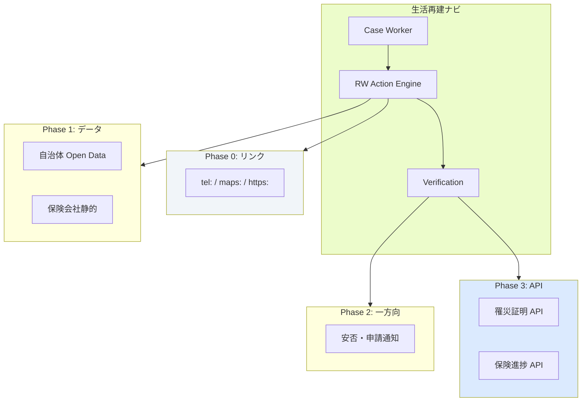

# 08 現実世界接続設計書（Real World Integration）

| 項目 | 内容 |
|------|------|
| ドキュメント名 | 現実世界接続設計書 |
| サービス名 | 生活再建ナビ（仮） |
| 版 | 1.0 |
| ステータス | 設計・企画フェーズ |
| 最終更新 | 2026-08-05 |
| 関連ドキュメント | [05_ジャーニー設計書.md](./05_ジャーニー設計書.md) / [06_ジャーニー分岐・ケースワーカー設計書.md](./06_ジャーニー分岐・ケースワーカー設計書.md) |

---

## 本書の位置づけ

[05](./05_ジャーニー設計書.md)・[06](./06_ジャーニー分岐・ケースワーカー設計書.md) を前提とし、**アプリ内操作と現実世界の行動**を接続する設計を定義する。

### 設計思想

```
アプリの成功 ≠ 画面をタップしたこと
アプリの成功 ＝ 現実世界で必要な行動が完了したこと
```

| レイヤ | 役割 |
|--------|------|
| **Journey** | 生活再建の時間軸（何の段階か） |
| **Real World Action（RW Action）** | 現実でユーザーが実行する具体行動 |
| **App Step** | RW Action を支援する UI・情報・判定 |
| **Case Worker** | RW Action の前後で能動的に伴走 |

### 命名規則

```
RW-[Journey]-[連番]: 現実行動 ID
例: RW-J01-01 = J-01 における第 1 の現実行動
```

---

## 第1部：Journey ごとに必要な現実の行動

### 1.1 全体マップ

```mermaid
flowchart LR
    subgraph J00["J-00 被災認知"]
        RW00[RW-J00-01 状況把握]
    end
    subgraph J01["J-01 安全確保"]
        RW01A[安全確認]
        RW01B[119/171判断]
    end
    subgraph J02["J-02 避難生活"]
        RW02A[避難・給水]
        RW02B[安否連絡]
    end
    subgraph J03["J-03 被害記録"]
        RW03A[写真記録]
        RW03B[市役所申請]
    end
    subgraph J04["J-04 支援・保険"]
        RW04A[保険連絡]
        RW04B[支援申請]
    end
    subgraph J05["J-05 住居再建"]
        RW05A[住居方針]
        RW05B[契約・引越]
    end
    subgraph J06["J-06 生活定着"]
        RW06A[転校・転勤]
        RW06B[地域定着]
    end

    J00 --> J01 --> J02 --> J03 --> J04 --> J05 --> J06
```



---

### 1.2 J-00：被災認知

| RW ID | 現実行動 | 説明 | 必須 |
|-------|---------|------|------|
| RW-J00-01 | **自分と周囲の状況を把握する** | 揺れ・水・火・建物の状態を目視確認 | ○ |
| RW-J00-02 | **状況をアプリに伝える** | 3 タップ選択（災害種別・被害・避難＋タグ） | ○ |

> J-00 の現実行動は最小。被災直後の負担を増やさない。

---

### 1.3 J-01：安全確保（0〜72 時間）

| RW ID | 現実行動 | 説明 | 必須 | 分岐 |
|-------|---------|------|------|------|
| RW-J01-01 | **自身のけが・体調を確認する** | 出血・意識・呼吸・歩行可否 | ○ | — |
| RW-J01-02 | **家族の所在・安全を確認する** | 同一場所 or 連絡 | ○ | — |
| RW-J01-03 | **二次災害リスクを回避する** | 火・ガス・倒壊物・余震対策 | ○ | — |
| RW-J01-04 | **避難の要否を判断し実行する** | 自宅滞在 or 屋外・避難所へ移動 | ○ | A-SHL |
| RW-J01-05 | **119 に電話する** | けが人・火災・建物倒壊等 | 条件付 | けが・火災時 |
| RW-J01-06 | **171 に登録・確認する** | 安否確認システム | 推奨 | — |
| RW-J01-07 | **子どもの安全を確認する** | 所在・けが・精神的状態 | 条件付 | A-CHD |
| RW-J01-08 | **高齢者の安全・服薬を確認する** | 転倒・服薬中断リスク | 条件付 | A-ELD |

---

### 1.4 J-02：避難生活（3 日〜2 週間）

| RW ID | 現実行動 | 説明 | 必須 | 分岐 |
|-------|---------|------|------|------|
| RW-J02-01 | **避難場所を確保する** | 避難所・車・親戚宅等へ移動・滞在 | ○ | A-SHL |
| RW-J02-02 | **飲料水を確保する** | 避難所配給 or 給水所へ | ○ | A-INF 断水 |
| RW-J02-03 | **食事を確保する** | 配給・非常食・買い出し | ○ | — |
| RW-J02-04 | **トイレ・衛生を確保する** | 避難所・公衆トイレ・ウェットティッシュ | ○ | — |
| RW-J02-05 | **睡眠場所を確保する** | 段ボールベッド・毛布・車中泊配慮 | ○ | — |
| RW-J02-06 | **家族・知人に安否を伝える** | 電話・SMS・SNS | ○ | — |
| RW-J02-07 | **学校・保育園に連絡する** | 欠席・避難先の伝達 | 条件付 | A-CHD |
| RW-J02-08 | **職場に連絡する** | 出勤不可・休暇申請 | 推奨 | A-EMP |
| RW-J02-09 | **スマホを充電する** | 避難所充電 or 車載 | 推奨 | A-INF 停電 |
| RW-J02-10 | **ペットの世話・避難を行う** | ペット可避難所・水・餌 | 条件付 | A-PET |
| RW-J02-11 | **高齢者の服薬・体調管理** | 常備薬・血圧等 | 条件付 | A-ELD |
| RW-J02-12 | **避難所へ登録する** | 受付・世帯情報登録 | 推奨 | A-SHL=避難所 |

---

### 1.5 J-03：被害記録（1 週間〜1 ヶ月）

| RW ID | 現実行動 | 説明 | 必須 | 分岐 |
|-------|---------|------|------|------|
| RW-J03-01 | **自宅（被災建物）に立ち入る** | 安全確認後、立入可能な場合 | 条件付 | 立入可 |
| RW-J03-02 | **被害箇所の写真を撮る** | 外観・室内・損傷部位（複数角度） | ○ | — |
| RW-J03-03 | **損害リストを作成する** | 建物・家財・車等の目視記録 | 推奨 | — |
| RW-J03-04 | **市役所へ罹災証明を申請する** | 窓口 or オンライン | ○ | A-MUN |
| RW-J03-05 | **大家・管理会社に連絡する** | 被害報告・立入・契約 | 条件付 | A-TEN=賃貸 |
| RW-J03-06 | **泥出し・除菌を行う** | 浸水時の一次処理 | 条件付 | A-DMG=浸水 |
| RW-J03-07 | **損害調査を受ける** | 自治体・保険会社の現地調査 | 推奨 | — |

---

### 1.6 J-04：支援・保険（2 週間〜6 ヶ月）

| RW ID | 現実行動 | 説明 | 必須 | 分岐 |
|-------|---------|------|------|------|
| RW-J04-01 | **保険会社に第一報する** | 火災・地震保険（電話・Web） | ○ | — |
| RW-J04-02 | **保険会社の指示に従い追加資料を提出** | 写真・罹災証明・請求書類 | 推奨 | — |
| RW-J04-03 | **災害援護資金等を申請する** | 自治体窓口・社会福祉協議会 | ○ | — |
| RW-J04-04 | **住宅ローン返済猶予を申請** | 金融機関へ連絡 | 条件付 | A-TEN=持ち家 |
| RW-J04-05 | **家賃支援・賃貸支援を申請** | 自治体・国の制度 | 条件付 | A-TEN=賃貸 |
| RW-J04-06 | **金融機関（銀行）に連絡** | 口座・カード・ローン | 推奨 | — |
| RW-J04-07 | **子ども向け支援を申請** | 学用品・支援金等 | 条件付 | A-CHD |
| RW-J04-08 | **事業復旧支援を申請** | 自営業向け補助金 | 条件付 | A-EMP=自営業 |
| RW-J04-09 | **取引先・顧客に連絡** | 休業・納期変更 | 条件付 | A-EMP=自営業 |
| RW-J04-10 | **専門家（行政書士等）に相談** | 複雑案件 | 条件付 | エスカレーション |

---

### 1.7 J-05：住居再建（1 ヶ月〜2 年）

| RW ID | 現実行動 | 説明 | 必須 | 分岐 |
|-------|---------|------|------|------|
| RW-J05-01 | **住居方針を決める** | 修繕/建替/転居/仮設 | ○ | A-TEN, A-DMG |
| RW-J05-02 | **仮設住宅に申込む** | 自治体・建設業者 | 条件付 | 仮設選択時 |
| RW-J05-03 | **賃貸・公営住宅を探す** | 不動産・公営住宅 | 条件付 | 転居選択時 |
| RW-J05-04 | **修繕業者に見積依頼** | 工務店・ハウスメーカー | 条件付 | 修繕選択時 |
| RW-J05-05 | **建替の検討・契約** | 設計・建築確認 | 条件付 | 建替選択時 |
| RW-J05-06 | **契約書に署名する** | 賃貸・修繕・建築契約 | 推奨 | — |
| RW-J05-07 | **引越しを実行する** | 新居・仮設へ移動 | 条件付 | 転居・仮設時 |
| RW-J05-08 | **ライフライン開通手続** | 電気・ガス・水道の再開 | 推奨 | — |
| RW-J05-09 | **ペット可住居を確保** | ペット可物件・一時預かり | 条件付 | A-PET |

---

### 1.8 J-06：生活定着（3 ヶ月〜）

| RW ID | 現実行動 | 説明 | 必須 | 分岐 |
|-------|---------|------|------|------|
| RW-J06-01 | **転校・転園手続き** | 教育委員会・学校 | 条件付 | A-CHD |
| RW-J06-02 | **住民票・転入届** | 新住所の市区町村 | ○ | 転居後 |
| RW-J06-03 | **国民健康保険・年金の切替** | 新自治体へ | 推奨 | — |
| RW-J06-04 | **仕事復帰・再就職活動** | 職場・ハローワーク | 推奨 | A-EMP |
| RW-J06-05 | **営業再開** | 店舗・事務所の再開 | 条件付 | A-EMP=自営業 |
| RW-J06-06 | **介護・医療の継続手続** | 保険証・介護サービス | 条件付 | A-ELD |
| RW-J06-07 | **地域コミュニティに接続** | 自治会・ボランティア | 推奨 | — |
| RW-J06-08 | **心のケア相談** | 保健センター・相談窓口 | 推奨 | — |

---

## 第2部：各行動に必要なもの

### 2.1 記載形式

各行動について以下を定義する。

| 項目 | 説明 |
|------|------|
| **持ち物** | 現場で必要な物理的アイテム |
| **書類** | 事前準備・提出が必要な書類 |
| **所要時間** | 目安（移動除く / 含む） |
| **注意点** | 安全・期限・よくある失敗 |

---

### 2.2 J-01：安全確保

#### RW-J01-01 自身のけが・体調確認

| 項目 | 内容 |
|------|------|
| 持ち物 | 特になし（スマホのライト） |
| 書類 | — |
| 所要時間 | 5〜10 分 |
| 注意点 | 無理に動かない。首・背中の痛みは静止 |

#### RW-J01-04 避難の要否判断・実行

| 項目 | 内容 |
|------|------|
| 持ち物 | スマホ、財布、常備薬、身分証、飲み水、モバイルバッテリー |
| 書類 | — |
| 所要時間 | 30 分〜数時間（避難所まで含む） |
| 注意点 | 火・ガスを閉める（可能なら）。エレベーター使用禁止。ペット同行可否を確認 |

#### RW-J01-05 119 に電話

| 項目 | 内容 |
|------|------|
| 持ち物 | スマホ（電波の届く場所へ） |
| 書類 | — |
| 所要時間 | 5〜15 分（待ち時間除く） |
| 注意点 | 落ち着いて「場所・状態・人数」を伝える。二次災害区域から離れる |

#### RW-J01-06 171 安否確認

| 項目 | 内容 |
|------|------|
| 持ち物 | スマホ |
| 書類 | — |
| 所要時間 | 5 分 |
| 注意点 | 混雑時はつながりにくい。テキスト/SNS も併用 |

---

### 2.3 J-02：避難生活

#### RW-J02-01 避難場所確保

| 項目 | 内容 |
|------|------|
| 持ち物 | RW-J01-04 同様 ＋ 毛布・着替え・子ども用品・ペット用品 |
| 書類 | — |
| 所要時間 | 1〜3 時間 |
| 注意点 | 避難所は満杯の可能性。複数候補を。車中泊は換気・一氧化碳に注意 |

#### RW-J02-02 飲料水確保

| 項目 | 内容 |
|------|------|
| 持ち物 | 容器（ペットボトル等）、キャップ |
| 書類 | — |
| 所要時間 | 30 分〜1 時間（給水所まで） |
| 注意点 | 1 人 3 リットル/日が目安。子ども・高齢者は優先 |

#### RW-J02-06 安否連絡

| 項目 | 内容 |
|------|------|
| 持ち物 | スマホ、連絡先リスト |
| 書類 | — |
| 所要時間 | 15〜30 分 |
| 注意点 | 短文で「安全・場所・今後の連絡方法」。通信混雑時は非同期 |

#### RW-J02-12 避難所登録

| 項目 | 内容 |
|------|------|
| 持ち物 | 身分証、筆記用具 |
| 書類 | — |
| 所要時間 | 15〜30 分 |
| 注意点 | 世帯全員分を登録。配給・連絡に必要 |

---

### 2.4 J-03：被害記録

#### RW-J03-02 被害写真撮影

| 項目 | 内容 |
|------|------|
| 持ち物 | スマホ、モバイルバッテリー、軍手、懐中電灯、マスク |
| 書類 | — |
| 所要時間 | 30 分〜1 時間 |
| 注意点 | **撤去・清掃前に撮る**。全体→部分→損傷の順。日付入り。危険区域は入らない |

#### RW-J03-04 罹災証明申請（市役所）

| 項目 | 内容 |
|------|------|
| 持ち物 | 身分証、筆記用具、印鑑（要確認）、スマホ |
| 書類 | 住民票（コピー可の自治体あり）、委任状（代理の場合） |
| 所要時間 | 窓口 30 分〜2 時間（混雑時半日） |
| 注意点 | 被災地の自治体。オンライン申請がある場合あり。代理人可の条件を確認 |

#### RW-J03-05 大家連絡（賃貸）

| 項目 | 内容 |
|------|------|
| 持ち物 | スマホ、写真（送付用） |
| 書類 | 契約書写し（可能なら） |
| 所要時間 | 15 分 |
| 注意点 | 記録を残す（メール・SMS）。立入・修繕の許可を確認 |

#### RW-J03-06 泥出し・除菌（浸水）

| 項目 | 内容 |
|------|------|
| 持ち物 | 軍手、マスク、長靴、除菌スプレー、ゴミ袋 |
| 書類 | — |
| 所要時間 | 半日〜数日 |
| 注意点 | 感電・カビリスク。専門業者が必要な場合あり |

---

### 2.5 J-04：支援・保険

#### RW-J04-01 保険第一報

| 項目 | 内容 |
|------|------|
| 持ち物 | スマホ、保険証券（写真可）、筆記用具 |
| 書類 | 保険証券、契約者情報、罹災証明（取得後） |
| 所要時間 | 20〜40 分 |
| 注意点 | **早めが有利**（5 日ルール等）。事故番号をメモ。通話記録 |

#### RW-J04-03 災害援護資金申請

| 項目 | 内容 |
|------|------|
| 持ち物 | 身分証、印鑑、銀行口座情報 |
| 書類 | 罹災証明、住民票、所得証明（要確認） |
| 所要時間 | 1〜2 時間（窓口） |
| 注意点 | 社会福祉協議会経由の場合あり。期限・要件を自治体で確認 |

#### RW-J04-04 住宅ローン返済猶予

| 項目 | 内容 |
|------|------|
| 持ち物 | スマホ、ローン契約書 |
| 書類 | 罹災証明、返済猶予申請書 |
| 所要時間 | 30 分〜1 時間 |
| 注意点 | 金融機関ごとに条件不同。早めに連絡 |

---

### 2.6 J-05：住居再建

#### RW-J05-02 仮設住宅申込

| 項目 | 内容 |
|------|------|
| 持ち物 | 身分証、印鑑 |
| 書類 | 罹災証明、申込書、世帯情報 |
| 所要時間 | 1〜2 時間（窓口）＋ 入居まで数週〜数ヶ月 |
| 注意点 | 抽選・順番制。ペット可は限られる |

#### RW-J05-07 引越し

| 項目 | 内容 |
|------|------|
| 持ち物 | 梱包材、タッパー、工具 |
| 書類 | 契約書、住民票（転出前後） |
| 所要時間 | 半日〜1 日 |
| 注意点 | ライフライン開通日と合わせる。子ども・高齢者の負担配慮 |

---

### 2.7 J-06：生活定着

#### RW-J06-01 転校手続き

| 項目 | 内容 |
|------|------|
| 持ち物 | 身分証、印鑑 |
| 書類 | 転校証明書、住民票、予防接種証、保健記録 |
| 所要時間 | 半日〜数日 |
| 注意点 | 転出・転入の順序。支援学級・通学路の相談 |

#### RW-J06-02 住民票・転入届

| 項目 | 内容 |
|------|------|
| 持ち物 | 身分証、印鑑 |
| 書類 | 転出証明（旧自治体）、身分証 |
| 所要時間 | 30 分〜1 時間 |
| 注意点 | 14 日以内の届出。保険・年金の切替も連動 |

---

### 2.8 分岐属性別 — 追加要件サマリ

| 属性 | 追加持ち物・書類 | 追加注意 |
|------|----------------|---------|
| 子ども | 母子手帳、通園・通学用品 | 学校連絡を最優先級に |
| 高齢者 | 常備薬リスト、介護保険証 | 服薬中断リスク。転倒 |
| ペット | ケージ、ワクチン証、餌 | ペット可避難所は限られる |
| 自営業 | 事業用口座情報、確定申告書 | 収入途絶。税務相談 |
| 賃貸 | 賃貸契約書 | 大家連絡を J-03 で必須化 |
| 持ち家 | 固定資産税通知、ローン契約 | 修繕/建替判断に時間 |

---

## 第3部：行動完了の判定方法

### 3.1 判定レイヤ（Verification Tier）

現実行動の完了を、信頼度の異なる **4 レイヤ** で判定する。

| Tier | 名称 | 方法 | MVP | 信頼度 |
|------|------|------|-----|--------|
| **V0** | 未着手 | ステップ未表示 | — | — |
| **V1** | 自己申告 | 「完了した」「電話した」「申請した」 | ○ | 低 |
| **V2** | 証拠添付 | 写真・スクリーンショット・メモ | ○（J-03） | 中 |
| **V3** | 位置・時間 | GPS 圏内・滞在時間・チェックイン | △ Phase 2 | 中高 |
| **V4** | 外部確認 | API・QR・窓口連携 | △ Phase 3 | 高 |

**原則:** MVP は V1 中心。J-03 写真は V2 必須。V3/V4 は段階導入。

### 3.2 Journey × 判定方法マトリクス

| RW ID | 現実行動 | 主判定 | 補助判定 | 完了条件 |
|-------|---------|--------|---------|---------|
| RW-J01-01 | けが確認 | V1 自己申告 | V1「けがあり」→ RW-J01-05 分岐 | 「問題なし」or 119 完了 |
| RW-J01-05 | 119 電話 | V1「電話した」 | — | 申告 |
| RW-J01-06 | 171 | V1「登録した」 | V2 スクショ（任意） | 申告 |
| RW-J02-01 | 避難場所 | V1「確保した」 | V3 避難所圏内（将来） | 申告 |
| RW-J02-02 | 水確保 | V1 | — | 申告 |
| RW-J02-06 | 安否連絡 | V1 | V2 送信スクショ（任意） | 申告 |
| RW-J02-12 | 避難所登録 | V1 | V3 チェックイン（将来） | 申告 |
| RW-J03-02 | 写真撮影 | **V2 写真 1 枚以上** | V1 | 写真 or 申告 |
| RW-J03-04 | 罹災証明 | V1「申請した」 | V2 受理票写真（推奨） | 申告 |
| RW-J03-05 | 大家連絡 | V1 | V2 メールスクショ | 申告 |
| RW-J04-01 | 保険第一報 | V1「連絡した」 | V2 事故番号メモ | 申告 ＋ 番号推奨 |
| RW-J04-03 | 援護資金 | V1「申請した」 | V2 受理書 | 申告 |
| RW-J05-01 | 住居方針 | V1 選択 | — | 1 つ選択 |
| RW-J05-06 | 契約署名 | V1 | V2 契約書（個人情報マスク） | 申告 |
| RW-J05-07 | 引越し | V1 | V3 新住所（将来） | 申告 |
| RW-J06-01 | 転校 | V1 | V2 転校証明 | 申告 |
| RW-J06-02 | 転入届 | V1 | V2 住民票 | 申告 |

### 3.3 判定 UI パターン

| パターン | 用途 | UI |
|---------|------|-----|
| **P-A タップ完了** | V1 自己申告 | 「完了した」ボタン |
| **P-B 選択完了** | 方針決定 | 2〜4 択ボタン |
| **P-C 写真提出** | V2 証拠 | カメラ起動 → 1 枚以上 |
| **P-D 番号・メモ** | 保険等 | テキスト 1 行（事故番号） |
| **P-E チェックリスト** | 複数確認 | 3〜5 項目チェック |
| **P-F 外部起動** | 電話・地図 | tel: / maps: リンク → 戻り後 P-A |

### 3.4 判定の信頼度とケースワーカー

| 信頼度 | ケースワーカー動作 |
|--------|------------------|
| V1 のみ | 72h 後フォロー「本当に完了していますか？」 |
| V2 あり | フォロー省略可 |
| V1 ＋ 高リスク属性 | 24h 後フォロー |
| 矛盾（V1 完了だが次 Journey で破綻） | Route 再計算・確認 |

### 3.5 将来判定 — V3/V4 設計（Phase 2/3）

| 方法 | 対象 RW | 技術 |
|------|---------|------|
| 避難所チェックイン | RW-J02-01, J02-12 | Geofence（半径 200m） |
| 市役所到着 | RW-J03-04 | Geofence ＋ 滞在 10 分 |
| 罹災証明 API | RW-J03-04 | 自治体マイナ連携（将来） |
| 保険第一報 API | RW-J04-01 | 保険会社ポータル連携 |
| 写真 EXIF | RW-J03-02 | 撮影日時・位置（同意制） |

---

## 第4部：ケースワーカーの介入タイミング

### 4.1 介入フェーズ

各行動について **行前・行中・行後** の 3 フェーズで介入を設計する。

```
行前（Before）  → 準備・提案・不安軽減
行中（During）  → 困ったとき・判断支援（受動中心）
行後（After）   → 確認・次行動・フォロー
```

### 4.2 Journey 別 — 介入マトリクス（主要 RW）

#### J-01 安全確保

| RW | 行前 | 行中 | 行後 |
|----|------|------|------|
| RW-J01-04 避難 | 「持ち物リストを確認しましょう」 | 「避難所が満杯の場合の代替」 | 「避難先は確保できましたか？」 |
| RW-J01-05 119 | 「119 の判断基準を確認しますか？」 | — （電話中は介入しない） | 「連絡できましたか？次は…」 |
| RW-J01-07 子ども | 「お子さまの居場所を一緒に確認」 | 「落ち着かせる方法」 | 「学校連絡は J-02 で」 |

#### J-02 避難生活

| RW | 行前 | 行中 | 行後 |
|----|------|------|------|
| RW-J02-02 水 | 「最寄り給水所：〇〇（地図）」 | 「容器はありますか？」 | 「確保できましたか？」 |
| RW-J02-06 安否 | 「伝える内容の例文」 | — | 「連絡先に届きましたか？」 |
| RW-J02-10 ペット | 「ペット可避難所リスト」 | 「水・餌の確保」 | 「ペットの状態は？」 |

#### J-03 被害記録

| RW | 行前 | 行中 | 行後 |
|----|------|------|------|
| RW-J03-02 写真 | 「撮る順序：全体→部分→損傷」 | 「危険な場所は無理しないで」 | 「〇枚保存しました。次は罹災証明」 |
| RW-J03-04 市役所 | 「持ち物・受付時間・混雑」 | 「窓口がわからないときは総合受付」 | 「受理されましたか？」 |
| RW-J03-05 大家 | 「報告文の例文テンプレ」 | — | 「返事は来ましたか？」 |

#### J-04 支援・保険

| RW | 行前 | 行中 | 行後 |
|----|------|------|------|
| RW-J04-01 保険 | 「第一報の期限：あと〇日」 | 「事故番号をメモ」 | 「番号を記録しました。次は…」 |
| RW-J04-03 援護資金 | 「必要書類チェック」 | — | 「申請できましたか？」 |
| RW-J04-10 専門家 | 「こういう場合は相談を推奨」 | — | 「相談先は決まりましたか？」 |

#### J-05 住居再建

| RW | 行前 | 行中 | 行後 |
|----|------|------|------|
| RW-J05-01 方針 | 「修繕 vs 仮設 vs 転居の比較」 | 「決めきれないときは相談を」 | 「方針が決まりました」 |
| RW-J05-07 引越し | 「ライフライン開通日と合わせる」 | — | 「無事に移れましたか？」 |

#### J-06 生活定着

| RW | 行前 | 行中 | 行後 |
|----|------|------|------|
| RW-J06-01 転校 | 「必要書類・教育委員会」 | — | 「手続きは進んでいますか？」 |
| RW-J06-08 心のケア | 「無理は禁物です」 | — | 「相談窓口のご案内」 |

### 4.3 介入トリガー × フェーズ（06 設計との統合）

| 06 トリガー | 主フェーズ | 例 |
|------------|-----------|-----|
| T-01 Route 確定 | 行前 | J-01 開始前の準備提案 |
| T-06 期限 72h | 行前 | 保険第一報の準備 |
| T-07 期限 24h | 行前 | Critical 通知 |
| T-03 停滞 24h | 行後 | 「市役所、行けましたか？」 |
| T-10 ユーザー相談 | 行中 | 困ったときの判断 |
| T-05 Journey 遷移 | 行後 | 次 Journey の最初の RW 提案 |

### 4.4 能動介入の優先順位（現実行動単位）

| 優先 | 条件 | 介入 |
|------|------|------|
| 1 | RW-J01-05 要否未判断 | 119 判断フロー（行前） |
| 2 | RW-J04-01 期限 24h 以内 | 保険第一報（行前 Critical） |
| 3 | RW-J03-04 停滞 72h | 市役所フォロー（行後） |
| 4 | RW-J02-02 断水タグ | 給水所案内（行前） |
| 5 | RW-J05-01 未決定 14 日 | 住居方針整理（行前） |

### 4.5 介入してはいけない行中シーン

| 行動 | 理由 |
|------|------|
| 119 通話中 | 集中を妨げる |
| 避難移動中（歩行） | 安全 |
| 市役所窓口前（混雑） | プッシュは「待機中の確認」程度 |
| 就寝中（22〜6 時） | Critical 以外通知禁止 |

---

## 第5部：将来的に連携可能な外部機関

### 5.1 連携の段階

| Phase | 連携深度 | 内容 |
|-------|---------|------|
| **Phase 0（MVP）** | リンク・tel | 公式 URL、電話発信、地図アプリ起動 |
| **Phase 1** | データ参照 | 避難所・給水・窓口の静的/半動的データ |
| **Phase 2** | 一方向通知 | ユーザー行動 → 外部への情報送信（同意制） |
| **Phase 3** | 双方向 API | 申請状態・受理確認の自動取得 |

### 5.2 外部機関一覧

| 機関カテゴリ | 具体例 | 関連 Journey | 連携 RW | Phase |
|-------------|--------|-------------|---------|-------|
| **自治体** | 市町村、都道府県 | J-02〜J-06 | J02 避難所、J03 罹災証明、J04 支援 | 0→3 |
| **社会福祉協議会** | 市区町村社協 | J-04 | J04-03 援護資金 | 0→2 |
| **教育委員会** | 市区町村教委 | J-02, J-06 | J02 学校連絡、J06 転校 | 0→1 |
| **保険会社** | 損保ジャパン、東京海上等 | J-04 | J04-01 第一報、J04-02 請求 | 0→3 |
| **金融機関** | 銀行、信用金庫、JF | J-04, J-05 | J04-04 ローン猶予、J04-06 | 0→2 |
| **ライフライン** | 電力、ガス、水道 | J-02, J-05 | J02 停電、J05-08 開通 | 0→2 |
| **ハローワーク** | 公共職業安定所 | J-06 | J06-04 再就職 | 0→1 |
| **医療・福祉** | 保健センター、介護保険 | J-01, J-06 | J01 けが、J06-06 介護 | 0→1 |
| **不動産・公営** | UR、自治体公営住宅 | J-05 | J05-03 賃貸 | 0→1 |
| **建築・工務** | 建設業者、建築確認 | J-05 | J05-04 修繕、J05-05 建替 | 1→2 |
| **専門家** | 行政書士、司法書士、税理士 | J-04 | J04-10 相談 | 0 |
| **防災・安否** | 171、L アラート、J アラート | J-01, J-02 | J01-06 171 | 0→2 |
| **NPO・ボランティア** | 日本赤十字、地域 NPO | J-02, J-06 | J02 物資、J06-07 | 0→1 |

### 5.3 機関別連携シナリオ

#### 自治体

| 連携内容 | RW | Phase | データ |
|---------|-----|-------|--------|
| 避難所開設状況 | RW-J02-01 | 1 | 名称、住所、収容、ペット可 |
| 給水所 | RW-J02-02 | 1 | 場所、時間 |
| 罹災証明窓口 | RW-J03-04 | 1 | 受付時間、混雑、必要書類 |
| 支援制度一覧 | RW-J04-03 | 1 | 制度名、要件、申請先 |
| 罹災証明受理 API | RW-J03-04 | 3 | 受理番号、発行日 |
| 仮設住宅空き | RW-J05-02 | 2 | 募集状況 |

#### 社会福祉協議会

| 連携内容 | RW | Phase |
|---------|-----|-------|
| 災害援護資金案内 URL | RW-J04-03 | 0 |
| 申請代行・相談予約 | RW-J04-03 | 2 |
| 生活支援・寄付マッチング | RW-J02, J06 | 2 |

#### 保険会社

| 連携内容 | RW | Phase |
|---------|-----|-------|
| 第一報電話番号・Web | RW-J04-01 | 0 |
| 必要書類リスト | RW-J04-02 | 1 |
| 事故番号・進捗 API | RW-J04-01, 02 | 3 |

#### ライフライン事業者

| 連携内容 | RW | Phase |
|---------|-----|-------|
| 停電・復旧見込み | RW-J02-09 | 1 |
| 再開申込 URL | RW-J05-08 | 1 |
| 復旧完了通知 | RW-J05-08 | 2 |

### 5.4 連携アーキテクチャ（概念）



### 5.5 連携時の原則

| # | 原則 |
|---|------|
| 1 | **公式情報優先** — 自治体・国の一次情報を正とする |
| 2 | **同意ベース** — 位置・写真・外部送信は明示同意 |
| 3 | **代替手段** — API 不可時は tel/URL でフォールバック |
| 4 | **個人情報最小** — 連携に必要な最小データのみ |
| 5 | **アプリは窓口ではない** — 最終判断は行政・専門家 |

---

## 第6部：App Step ↔ RW Action マッピング

Journey 設計の App Step と現実行動の対応。

| App Step | RW Action(s) | 備考 |
|----------|-------------|------|
| J01-S01 | RW-J01-01, 02 | 安全確認 |
| J01-S02 | RW-J01-03, 04 | 二次災害・避難 |
| J01-S03 | RW-J01-05, 06 | 緊急連絡 |
| J01-S04 | RW-J01-07 | 子ども |
| J02-S01 | RW-J02-01, 12 | 避難場所 |
| J02-S02 | RW-J02-02, 03, 04, 05 | 生活確保 |
| J02-S03 | RW-J02-06, 08 | 安否 |
| J02-S04a/b | RW-J02-07 | 子ども |
| J02-S05 | RW-J02-10 | ペット |
| J03-S01 | RW-J03-01, 02, 03 | 記録 |
| J03-S02 | RW-J03-04 | 罹災証明 |
| J03-S02b | RW-J03-05 | 大家 |
| J03-S04 | RW-J03-06 | 浸水 |
| J04-S01 | RW-J04-01, 02 | 保険 |
| J04-S02 | RW-J04-03, 05, 07, 08 | 支援 |
| J04-S03 | RW-J04-04, 06 | 金融 |
| J05-S01 | RW-J05-01 | 方針 |
| J05-S02 | RW-J05-02, 03, 04, 05, 09 | 確保 |
| J05-S03 | RW-J05-06, 07, 08 | 契約・引越 |
| J06-S01 | RW-J06-01 | 転校 |
| J06-S02 | RW-J06-04, 05 | 仕事 |
| J06-S03 | RW-J06-06, 08 | 医療・心のケア |
| J06-S04 | RW-J06-07 | 地域 |

---

## 第7部：成功指標（Real World 視点）

アプリ KPI を **現実行動完了** ベースで再定義。

| KPI | 定義 | 計測 |
|-----|------|------|
| **RW 完了率** | 提示 RW Action の V1+ 完了率 | アプリ内 |
| **Journey RW 完了率** | Journey 内必須 RW の完了率 | アプリ内 |
| **証拠付き完了率** | V2 以上の完了率 | J-03 中心 |
| **停滞 RW 数** | 72h 未完了の RW 数 | ケースワーカー |
| **フォロー解消率** | 介入後 24h 以内の完了率 | ケースワーカー |
| **外部起動率** | tel/maps リンクタップ率 | Phase 0 |

---

## 付録 A：RW Action 一覧（全 50 件）

| RW ID | Journey | 現実行動 | 必須 |
|-------|---------|---------|------|
| RW-J00-01 | J-00 | 状況把握 | ○ |
| RW-J00-02 | J-00 | 状況をアプリに伝える | ○ |
| RW-J01-01 〜 08 | J-01 | （§1.3 参照） | — |
| RW-J02-01 〜 12 | J-02 | （§1.4 参照） | — |
| RW-J03-01 〜 07 | J-03 | （§1.5 参照） | — |
| RW-J04-01 〜 10 | J-04 | （§1.6 参照） | — |
| RW-J05-01 〜 09 | J-05 | （§1.7 参照） | — |
| RW-J06-01 〜 08 | J-06 | （§1.8 参照） | — |

---

## 付録 B：05/06 設計書への追加原則

| # | 原則 | 意味 |
|---|------|------|
| 8 | **Real World First** | 成功は現実行動の完了で測る |
| 9 | **Verify, Don't Assume** | 可能な範囲で V2〜V4 判定を段階導入 |
| 10 | **Bridge, Don't Replace** | 外部機関の窓口を置き換えない |

---

## 改訂履歴

| 版 | 日付 | 内容 |
|----|------|------|
| 1.0 | 2026-08-05 | 初版。現実世界接続設計 |
