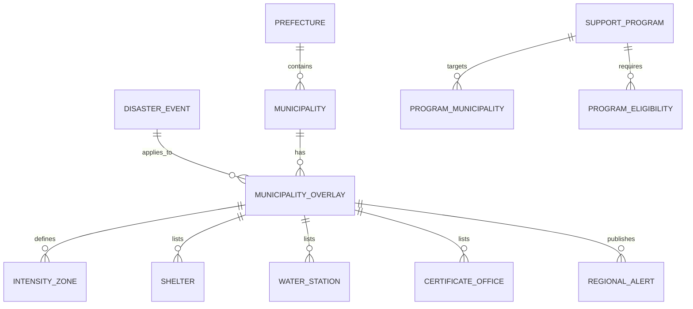
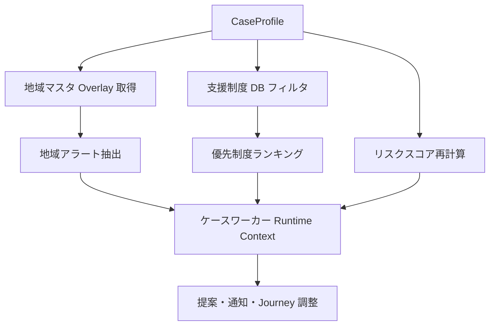
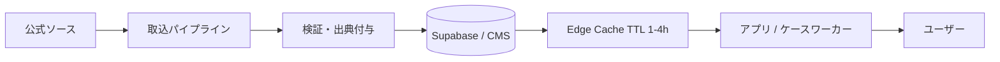

# 09 地域・制度データ設計書 — 令和8年熊本地震対応

| 項目 | 内容 |
|------|------|
| ドキュメント名 | 地域・制度データ設計書 |
| サービス名 | 生活再建ナビ（仮） |
| 版 | 1.0 |
| ステータス | 設計・企画フェーズ |
| 最終更新 | 2026-08-05 |
| 対象災害 | **令和8年（2026年）7月28日 熊本地震** |
| 関連ドキュメント | [05_ジャーニー設計書.md](./05_ジャーニー設計書.md) / [06_ジャーニー分岐・ケースワーカー設計書.md](./06_ジャーニー分岐・ケースワーカー設計書.md) / [08_現実世界接続設計書.md](./08_現実世界接続設計書.md) |

---

## 本書の位置づけ

2026年熊本地震に関する**地域・制度情報**を、アプリが「固定プロンプト」ではなく **DB から動的に取得**し、Journey・ケースワーカー・支援制度提示を変えるためのデータ設計を定義する。

### 設計原則

| # | 原則 |
|---|------|
| 1 | **公式出典必須** — すべての地域・制度データに URL と更新日時・出典を付与 |
| 2 | **災害イベント × 自治体** — 通常マスタに災害オーバーレイを重ねる |
| 3 | **条件でフィルタ** — CaseProfile + 地域マスタ → 該当制度・注意のみ表示 |
| 4 | **DB → ケースワーカー** — AI プロンプトは固定せず、Runtime Context を注入 |
| 5 | **陳腐化を前提** — 給水所・窓口定数・期限は日次更新可能な構造 |

### 情報ソース（設計時点）

| ソース | 用途 | URL |
|--------|------|-----|
| 各自治体公式 | 罹災証明・支援制度・給水 | 市町村 HP |
| くまもと被災者支援ナビ | 21市町村集約・出典付き | https://kumamoto-shien.jp/ |
| 熊本市防災情報ポータル | 避難所・避難情報 | https://city-kumamoto.my.salesforce-sites.com/ |
| デジタル庁 | オンライン罹災証明対応自治体 | https://digital-gov.note.jp/ |
| 熊本県 | 県全体の支援・注意喚起 | 熊本県 HP |

> **注意:** 本書の初期シードデータは 2026-08-05 時点の公開情報に基づく。**実装前に必ず各自治体公式で再確認**すること。

---

## 第1部：地域マスタ設計

### 1.1 階層構造

```
Prefecture（都道府県）
  └── Municipality（市町村）← 全国マスタ
        └── DisasterOverlay（災害イベント別オーバーレイ）
              ├── IntensityZone（震度・被害区域）
              ├── Shelter（避難所）
              ├── WaterStation（給水所）
              ├── CertificateOffice（罹災証明窓口）
              ├── SupportProgramLink（支援制度入口）
              └── Alert（注意喚起・お知らせ）
```

### 1.2 ER 図（概念）



### 1.3 テーブル定義

#### `prefectures`

| カラム | 型 | 説明 |
|--------|-----|------|
| code | char(2) | 都道府県コード（JIS） |
| name | text | 都道府県名 |
| name_kana | text | よみがな |

#### `municipalities`

| カラム | 型 | 説明 |
|--------|-----|------|
| code | char(5) | 全国地方公共団体コード |
| prefecture_code | char(2) | FK |
| name | text | 市町村名 |
| name_kana | text | よみがな |
| type | enum | city / town / village |
| official_url | text | 公式 HP |
| disaster_portal_url | text | 防災・災害情報入口 |
| active | boolean | サービス対象か |

#### `disaster_events`

| カラム | 型 | 説明 |
|--------|-----|------|
| id | text | 例: `DE-R8-KUMAMOTO-20260728` |
| name | text | 令和8年熊本地震 |
| disaster_type | enum | earthquake / flood / ... |
| occurred_at | timestamptz | 2026-07-28 |
| relief_law_applied | boolean | 災害救助法適用 |
| status | enum | active / recovery / closed |

#### `municipality_disaster_overlays`

自治体 × 災害イベントの差分。**被災フラグ・震度・ライフライン状態**をここで管理。

| カラム | 型 | 説明 |
|--------|-----|------|
| id | uuid | PK |
| municipality_code | char(5) | FK |
| disaster_event_id | text | FK |
| is_affected | boolean | **被災フラグ** |
| max_intensity | text | **最大震度**（7 / 6強 / 6弱 …） |
| disaster_types | text[] | **対象災害**（earthquake） |
| water_outage_households | int | 断水世帯数（概数） |
| water_outage_note | text | 断水見通し（例: 半年〜1年） |
| power_outage_status | enum | none / partial / widespread |
| certificate_online_available | boolean | マイナポータル等 |
| certificate_online_url | text | オンライン申請 URL |
| support_hub_url | text | 支援制度まとめ URL |
| last_verified_at | timestamptz | 最終確認日時 |
| source_url | text | 出典 |
| source_label | text | 出典ラベル |

#### `intensity_zones`

| カラム | 型 | 説明 |
|--------|-----|------|
| id | uuid | PK |
| overlay_id | uuid | FK |
| area_name | text | 区域名（町名等） |
| intensity | text | 震度 |
| damage_summary | text | 被害概要 |

#### `shelters`

| カラム | 型 | 説明 |
|--------|-----|------|
| id | uuid | PK |
| overlay_id | uuid | FK |
| name | text | 避難所名 |
| address | text | 住所 |
| lat / lng | float | 座標 |
| status | enum | open / closed / full |
| capacity_note | text | 収容状況 |
| pet_allowed | boolean | ペット可 |
| has_power | boolean | 通電 |
| has_water | boolean | 給水 |
| has_wifi | boolean | Wi-Fi |
| notes | text | 備考 |
| effective_from / to | timestamptz | 有効期間 |
| source_url | text | 出典 |
| updated_at | timestamptz | 更新日時 |

#### `water_stations`

| カラム | 型 | 説明 |
|--------|-----|------|
| id | uuid | PK |
| overlay_id | uuid | FK |
| name | text | 給水所名 |
| address | text | 住所 |
| lat / lng | float | 座標 |
| hours | text | 受付時間 |
| water_type | enum | drinking / general / shower |
| status | enum | active / closed |
| effective_from / to | timestamptz | 有効期間 |
| source_url | text | 出典 |
| updated_at | timestamptz | 更新日時 |

#### `certificate_offices`

| カラム | 型 | 説明 |
|--------|-----|------|
| id | uuid | PK |
| overlay_id | uuid | FK |
| name | text | 窓口名 |
| address | text | 住所 |
| hours | text | 受付時間 |
| daily_limit | int | 1日受付上限（組/人） |
| ticket_system | boolean | 整理券制 |
| online_available | boolean | オンライン可 |
| online_url | text | 申請 URL |
| required_documents | text[] | 必要書類 |
| notes | text | 混雑・注意 |
| effective_from / to | timestamptz | 有効期間 |
| source_url | text | 出典 |
| updated_at | timestamptz | 更新日時 |

#### `regional_alerts`

| カラム | 型 | 説明 |
|--------|-----|------|
| id | uuid | PK |
| overlay_id | uuid | FK |
| alert_type | enum | heat / water / fraud / certificate / housing |
| priority | enum | critical / high / medium |
| title | text | タイトル |
| body | text | 本文 |
| journey_ids | text[] | 関連 Journey |
| effective_from / to | timestamptz | 表示期間 |
| source_url | text | 出典 |
| updated_at | timestamptz | 更新日時 |

### 1.4 初期対象自治体 — オーバーレイシード

災害イベント ID: `DE-R8-KUMAMOTO-20260728`

| コード | 自治体 | 被災 | 最大震度 | 断水規模 | 罹災証明（2026-08-05時点） | 給水所数 |
|--------|--------|------|---------|---------|---------------------------|---------|
| 43100 | **熊本市** | ○ | 6強〜7（区域差） | 広域 | 7/30〜窓口＋マイナポータル | 複数区 |
| 43442 | **宇城市** | ○ | **7** | 広域 | 7/31〜**1日200組制限**・整理券 | **10か所** |
| 43441 | **氷川町** | ○ | **7** | **全域約3200戸**・復旧半年〜1年見込 | 8/6〜全戸調査型・事前申込不要 | **2か所**＋自衛隊給水 |
| 43202 | **八代市** | ○ | 6強 | 約2.5万世帯 | 8/3〜オンライン、**8/10〜窓口** | **23か所** |
| 43445 | **甲佐町** | ○ | 6弱〜（要確認） | あり | オンライン（住家）＋役場窓口（住家以外） | 要確認 |

#### 熊本市（43100）— 詳細シード

```yaml
municipality_code: "43100"
disaster_event_id: DE-R8-KUMAMOTO-20260728
is_affected: true
max_intensity: "7"
certificate_online_available: true
certificate_online_url: "https://www.city.kumamoto.jp/bousai/kiji0032451/index.html"
support_hub_url: "https://www.city.kumamoto.jp/kiji00372248/index.html"
disaster_portal_url: "https://city-kumamoto.my.salesforce-sites.com/"

certificate_offices:
  - name: 各区福祉課（南区・北区・西区・東区・中央区）
    hours: "9:00-16:00（土日臨時あり）"
    daily_limit: null
    online_available: true
    notes: "お住まいの区以外でも申請可。マイナポータル推奨。"
    source_url: "https://www.city.kumamoto.jp/bousai/kiji0032451/index.html"
    updated_at: "2026-08-01"

regional_alerts:
  - alert_type: housing
    priority: critical
    title: "市営住宅一時提供 8/6先着"
    body: "半壊以上で住めない方。日によって会場が変わります。"
    journey_ids: ["J-05"]
    source_url: "https://kumamoto-shien.jp/"
    updated_at: "2026-08-04"
  - alert_type: heat
    priority: critical
    title: "車中泊・猛暑注意"
    body: "2016年震災では関連死の8割超が建物倒壊以外。熱中症・エコノミークラス症候群に注意。"
    journey_ids: ["J-01", "J-02"]
    source_url: "https://kumamoto-shien.jp/"
    updated_at: "2026-08-04"
```

#### 宇城市（43442）— 詳細シード

```yaml
municipality_code: "43442"
max_intensity: "7"
water_outage_note: "広域断水。外の蛇口等で生活水確保している世帯あり。"

certificate_offices:
  - name: 宇城市役所本庁新館
    hours: "9:00開始（整理券）"
    daily_limit: 200
    ticket_system: true
    notes: "上限到達で当日受付終了。早朝行列あり。"
    source_url: "https://www.city.uki.kumamoto.jp/"
    updated_at: "2026-08-01"
  - name: 三角支所
    daily_limit: 60
    updated_at: "2026-08-01"
  - name: 豊野支所
    daily_limit: 60
    updated_at: "2026-08-01"
  - name: 不知火支所 / 小川総合文化センター
    daily_limit: null
    notes: "受付開始未定（2026-08-01時点）"
    updated_at: "2026-08-01"

water_stations:
  count: 10
  source_url: "https://kumamoto-shien.jp/"
  updated_at: "2026-08-03"
  notes: "入浴支援：三角東港海上自衛隊等"

regional_alerts:
  - alert_type: certificate
    priority: critical
    title: "罹災証明は1日200組上限"
    body: "整理券配布。オンライン申請も検討。行く前に市HPで当日状況を確認。"
    journey_ids: ["J-03"]
    updated_at: "2026-08-01"
  - alert_type: water
    priority: critical
    title: "断水続く。給水所10か所"
    body: "子どもがいる世帯は水・ミルク・おむつを最優先確保。"
    journey_ids: ["J-02"]
    updated_at: "2026-08-03"
```

#### 氷川町（43441）— 詳細シード

```yaml
municipality_code: "43441"
max_intensity: "7"
water_outage_households: 3200
water_outage_note: "復旧まで半年〜1年の可能性（八代生活環境事務組合）"
power_outage_status: widespread

shelters:
  notes: "余震のため屋内避難所は未開設。車中泊推奨（役場駐車場・小中学校グラウンド）"
  source_url: "NHK / テレ朝NEWS 2026-08-01"

certificate_offices:
  notes: "8/6より全戸対象の被害認定調査。事前申込不要（マイナポータル申請も可）"
  online_available: true
  source_url: "https://digital-gov.note.jp/"

water_stations:
  count: 2
  notes: "自衛隊給水車、川水ろ過提供、移動式シャワー（氷川中学校等）"
  updated_at: "2026-08-02"

regional_alerts:
  - alert_type: water
    priority: critical
    title: "全域断水・長期化見込"
    body: "給水は2〜3日に1回。高齢者施設へ給水車派遣あり。"
    journey_ids: ["J-02"]
  - alert_type: heat
    priority: critical
    title: "車中泊＋猛暑"
    body: "2016年経験者も再び車中泊。夜も体を動かす等の対策を。"
    journey_ids: ["J-02"]
```

#### 八代市（43202）— 詳細シード

```yaml
municipality_code: "43202"
max_intensity: "6強"
water_outage_households: 25300

certificate_offices:
  - name: オンライン専用フォーム
    online_url: "https://logoform.jp/form/zis6/1724496"
    online_available: true
    notes: "8/3 13:00開始。1時間604件集中の実績。"
    updated_at: "2026-08-03"
  - name: 本庁・5支所・日奈久出張所（窓口）
    notes: "8/10開始予定"
    updated_at: "2026-07-31"

water_stations:
  count: 23
  notes: "八代港船舶給水も"
  updated_at: "2026-08-03"
```

#### 甲佐町（43445）— 詳細シード

```yaml
municipality_code: "43445"
certificate_online_available: true
certificate_online_url: "https://www.town.kosa.lg.jp/q/aview/55/13547.html"

certificate_offices:
  - name: オンライン（住家のり災証明）
    online_available: true
  - name: 甲佐町役場特設窓口
    notes: "住家以外の被災証明は窓口のみ"
    phone: "096-234-1112"
    updated_at: "2026-07-31"
```

### 1.5 自治体差分の設計パターン

| 差分軸 | 熊本市 | 宇城市 | 氷川町 | 八代市 | 甲佐町 |
|--------|--------|--------|--------|--------|--------|
| 罹災証明 | マイナ＋各区窓口 | **定数制・整理券** | 全戸調査型 | オンライン先行→窓口 | オンライン＋特設窓口 |
| 断水 | 区域差 | 広域 | **長期・全域** | 大規模 | 要確認 |
| 避難 | 避難所開設 | 避難所 | **車中泊中心** | 避難所＋給水 | 要確認 |
| J-02 優先 | 給水・入浴 | **水・子ども** | **水・猛暑・車中泊** | 給水23か所 | 標準 |

---

## 第2部：支援制度 DB 設計

### 2.1 テーブル構造

#### `support_programs`

| カラム | 型 | 説明 |
|--------|-----|------|
| id | text | 例: `SP-R8-KUMAMOTO-LIFE-REBUILD` |
| name | text | **制度名** |
| name_plain | text | 平易名称（UI 表示） |
| level | enum | national / prefecture / municipality |
| disaster_event_id | text | 対象災害（null=常設） |
| journey_ids | text[] | **Journey 対応** |
| rw_action_ids | text[] | 関連 RW Action |
| description | text | 概要 |
| required_documents | text[] | **必要書類** |
| application_place | text | **申請先** |
| application_method | text | 申請方法 |
| contact | text | 問い合わせ先 |
| deadline_type | enum | fixed_date / days_from_disaster / rolling / unknown |
| deadline_date | date | 固定期限 |
| deadline_days | int | 発災から N 日 |
| deadline_note | text | 期限補足 |
| url | text | **URL** |
| phone | text | 電話 |
| updated_at | timestamptz | **更新日時** |
| source_url | text | **出典** |
| source_label | text | 出典表示名 |
| status | enum | active / suspended / expired |
| priority | int | 提示優先度 |

#### `support_program_municipalities`

| カラム | 型 | 説明 |
|--------|-----|------|
| program_id | text | FK |
| municipality_code | char(5) | FK（null=県全域） |
| municipality_specific_url | text | 自治体別 URL |
| municipality_specific_note | text | 自治体別補足 |

#### `support_program_eligibility`

**対象条件**を機械可読で保持。

| カラム | 型 | 説明 |
|--------|-----|------|
| id | uuid | PK |
| program_id | text | FK |
| rule_type | enum | profile / damage / housing / income / custom |
| field | text | CaseProfile フィールド名 |
| operator | enum | eq / ne / in / gte / lte / exists |
| value | jsonb | 比較値 |
| required | boolean | 必須条件か |

### 2.2 条件ルール例

```json
{
  "program_id": "SP-R8-KUMAMOTO-HOUSING-TEMP",
  "rules": [
    { "field": "damageLevel", "operator": "in", "value": ["全壊", "半壊"], "required": true },
    { "field": "shelterStatus", "operator": "ne", "value": "自宅（一部）", "required": false },
    { "field": "municipalityCode", "operator": "eq", "value": "43100", "required": true }
  ]
}
```

### 2.3 初期制度シード（令和8年熊本地震）

| ID | 制度名 | レベル | Journey | 主な条件 |
|----|--------|--------|---------|---------|
| SP-R8-CERT | 罹災証明（り災証明書） | 市町村 | J-03 | 住宅被害あり |
| SP-R8-LIFE-REBUILD | 被災者生活再建支援制度 | 国+市 | J-04 | 罹災証明・所得 |
| SP-R8-DISASTER-RELIEF | 災害援護資金 | 市+社協 | J-04 | 生活困窮 |
| SP-R8-FIRE-INS | 火災保険・地震保険請求 | 民間 | J-04 | 保険加入 |
| SP-R8-LOAN-DEFER | 住宅ローン返済猶予 | 金融 | J-04 | 持ち家・ローンあり |
| SP-R8-RENT-SUPPORT | 家賃支援・賃貸支援 | 国+市 | J-04 | 賃貸 |
| SP-R8-HOUSING-TEMP | 市営・県営住宅一時提供 | 市 | J-05 | 半壊以上・住めない |
| SP-R8-TEMP-HOUSING | 仮設住宅・みなし仮設 | 市 | J-05 | 全壊/半壊 |
| SP-R8-CHILD-SUPPORT | 子ども支援（学用品等） | 市 | J-04, J-06 | 子どもあり |
| SP-R8-SELF-EMP | 事業者支援・自営業支援 | 国+市 | J-04, J-06 | 自営業 |
| SP-R8-2016-ADDITIONAL | 2016年震災再被害加算（該当時） | 国 | J-04 | **prior2016Disaster=true** |

#### 制度レコード例 — 熊本市営住宅一時提供

```yaml
id: SP-R8-HOUSING-TEMP-KUMAMOTO
name: 市営住宅の一時提供（熊本市）
name_plain: 住めなくなった方への市営住宅
level: municipality
disaster_event_id: DE-R8-KUMAMOTO-20260728
journey_ids: ["J-05"]
rw_action_ids: ["RW-J05-02", "RW-J05-03"]
required_documents: ["罹災証明", "身分証"]
application_place: "日によって会場変更（先着）"
deadline_type: fixed_date
deadline_date: "2026-08-06"
deadline_note: "8/6（木）から先着順受付開始"
url: "https://www.city.kumamoto.jp/kiji00372248/index.html"
source_url: "https://kumamoto-shien.jp/"
updated_at: "2026-08-04"
eligibility:
  - field: municipalityCode
    operator: eq
    value: "43100"
  - field: damageLevel
    operator: in
    value: ["全壊", "半壊"]
```

#### 制度レコード例 — 被災者生活再建支援制度

```yaml
id: SP-R8-LIFE-REBUILD
name: 被災者生活再建支援制度
level: national
journey_ids: ["J-04"]
required_documents: ["罹災証明", "所得証明", "振込口座"]
deadline_type: days_from_disaster
deadline_days: 180
deadline_note: "罹災日から概ね6か月以内（要確認）"
url: "https://www.mlit.go.jp/（国交省）"
eligibility:
  - field: disasterCertificateStatus
    operator: in
    value: ["applied", "issued"]
  - field: damageLevel
    operator: in
    value: ["全壊", "半壊", "一部損壊"]
```

### 2.4 Journey × 制度マトリクス

| Journey | 自動提示する制度カテゴリ |
|---------|------------------------|
| J-02 | （制度より**地域アラート**優先：給水・猛暑） |
| J-03 | 罹災証明関連 |
| J-04 | 生活再建支援、援護資金、保険、ローン猶予、子ども、自営業 |
| J-05 | 仮設、公営住宅、家賃支援 |
| J-06 | 転校支援、介護、営業再開 |

---

## 第3部：CaseProfile への追加項目

[06_ジャーニー分岐・ケースワーカー設計書.md](./06_ジャーニー分岐・ケースワーカー設計書.md) の CaseProfile を拡張する。

### 3.1 追加フィールド一覧

| フィールド ID | 型 | 取得タイミング | 用途 |
|--------------|-----|---------------|------|
| **municipalityCode** | char(5) | J-00 または J-03 入口 | 地域マスタ参照キー |
| **municipalityName** | text | 同上 | UI 表示 |
| **prior2016Disaster** | boolean | J-00 拡張 or J-04 | 2016年熊本地震被災経験 |
| **isDoubleDisaster** | boolean | 自動算出 | 2016+2026 両方 |
| **hasMortgage** | boolean | J-04 入口 | ローン猶予制度 |
| **hasWaterOutage** | boolean | J-00 タグ | 給水優先・J-02 分岐 |
| **hasPowerOutage** | boolean | J-00 タグ | 充電・停電対応 |
| **photoRecordStatus** | enum | J-03 | none / partial / complete |
| **insuranceStatus** | enum | J-04 入口 | unknown / enrolled / reported / claimed |
| **insuranceTypes** | text[] | J-04 | fire / earthquake |
| **disasterCertificateStatus** | enum | J-03 | none / applied / issued |
| **disasterEventId** | text | J-00 | 対象災害イベント |

### 3.2 統合 CaseProfile モデル

```typescript
interface CaseProfile {
  // --- 既存（06） ---
  disasterType?: string;
  damageLevel?: string;        // 全壊 / 半壊 / 一部損壊 / 浸水
  shelterStatus?: string;
  housingTenure?: string;      // 持ち家 / 賃貸
  hasChildren?: boolean;
  hasElderly?: boolean;
  hasPet?: boolean;
  employmentType?: string;

  // --- 本書追加 ---
  municipalityCode?: string;     // 43100, 43442, ...
  municipalityName?: string;
  disasterEventId?: string;    // DE-R8-KUMAMOTO-20260728
  prior2016Disaster?: boolean;
  isDoubleDisaster?: boolean;  // prior2016 && 今回被災
  hasMortgage?: boolean;
  hasWaterOutage?: boolean;
  hasPowerOutage?: boolean;
  photoRecordStatus?: "none" | "partial" | "complete";
  insuranceStatus?: "unknown" | "enrolled" | "reported" | "claimed";
  insuranceTypes?: string[];
  disasterCertificateStatus?: "none" | "applied" | "issued";
}
```

### 3.3 自動算出ルール

| フィールド | 算出 |
|-----------|------|
| isDoubleDisaster | `prior2016Disaster === true && is_affected === true` |
| photoRecordStatus | J-03 で写真 0/1-2/3+ 枚 |
| municipality overlay | `municipalityCode` + `disasterEventId` → overlay 取得 |

### 3.4 2016年被災経験・二重被災の設計上の意味

| 状態 | Journey への影響 | ケースワーカー |
|------|----------------|--------------|
| prior2016=true | J-05 で「2016年修繕歴」を確認ステップ追加 | 「前回の修繕箇所の写真も」 |
| isDoubleDisaster=true | J-04 で加算支援制度を提示 | 精神的ケア優先度 UP |
| prior2016=true | J-02 車中泊経験者向け注意喚起強化 | 2016年関連死データを引用 |

---

## 第4部：ケースワーカー判断への利用方法

### 4.1 判断パイプライン



### 4.2 Runtime Context（DB 注入・プロンプト非固定）

ケースワーカー API 呼び出し時に **毎回 DB から組み立て**る JSON。

```json
{
  "case_profile": { "...": "..." },
  "municipal_context": {
    "name": "宇城市",
    "max_intensity": "7",
    "water_outage_note": "広域断水",
    "certificate_offices": [{ "name": "本庁", "daily_limit": 200, "ticket_system": true }],
    "water_stations_count": 10,
    "alerts": [{ "title": "罹災証明1日200組上限", "priority": "critical" }]
  },
  "eligible_programs": [
    { "id": "SP-R8-DISASTER-RELIEF", "name_plain": "災害援護資金", "deadline_note": "..." }
  ],
  "priority_journey": "J-02",
  "priority_rw_actions": ["RW-J02-02", "RW-J02-07", "RW-J02-04"],
  "risk_score": 55,
  "risk_flags": ["RISK-02", "RISK-04", "RISK-MUN-UKI-CERT-LIMIT"]
}
```

### 4.3 判断例 — 宇城市 × 半壊 × 断水 × 子どもあり

**入力 CaseProfile:**

```yaml
municipalityCode: "43442"
municipalityName: "宇城市"
damageLevel: "半壊"
hasWaterOutage: true
hasPowerOutage: true  # 想定
hasChildren: true
shelterStatus: "避難所"
disasterEventId: DE-R8-KUMAMOTO-20260728
```

#### Step 1: 地域 Overlay 取得

| 項目 | 値 |
|------|-----|
| 最大震度 | 7 |
| 罹災証明 | 本庁200組/日、整理券、三角・豊野各60 |
| 給水 | 10か所 |
| 特記 | 断水広域、行列・定数制 |

#### Step 2: リスクスコア

| フラグ | 点数 |
|--------|------|
| 半壊 | +15（RISK 半壊相当） |
| 避難所+停電 | +20 |
| 子ども+避難所 | +15 |
| 宇城+断水+定数制窓口 | +15（**RISK-MUN-UKI-CERT-LIMIT**） |
| **合計** | **65 → High/Critical** |

#### Step 3: 優先 Journey

| 順位 | Journey | 理由 |
|------|---------|------|
| 1 | **J-02** | 断水・子ども。給水が生存優先 |
| 2 | J-01（未完了なら） | 震度7区域 |
| 3 | J-03 | 罹災証明は**定数制**のため「準備後・オンライン検討」 |

#### Step 4: 優先 RW Action

| 順位 | RW Action | 内容 |
|------|-----------|------|
| 1 | RW-J02-02 | 飲料水確保（宇城市10か所） |
| 2 | RW-J02-07 | 学校・保育園連絡 |
| 3 | RW-J02-04 | トイレ・衛生（断水） |
| 4 | RW-J02-03 | 食事・ミルク |
| 5 | RW-J03-02 | 写真撮影（片付け前） |

#### Step 5: 優先支援制度（J-04 以降で提示、今は予告のみ）

| 制度 | タイミング |
|------|-----------|
| 災害援護資金 | J-04（罹災証明後） |
| 被災者生活再建支援 | J-04 |
| 子ども支援 | J-04 |
| 市営住宅一時提供（熊本県内） | J-05（宇城市独自要確認） |

#### Step 6: 注意喚起（Regional Alerts）

| 優先 | アラート |
|------|---------|
| Critical | 「罹災証明は1日200組。整理券。市HPで当日確認してから」 |
| Critical | 「断水。子どもがいる方は水・ミルク・おむつを最優先」 |
| High | 「2016年震災同様、車中泊・猛暑に注意」 |
| High | 「保険・修理の勧誘に注意（188）」 |

#### Step 7: ケースワーカー提案文（生成テンプレ）

```
【提案】まず給水所で水を確保しましょう
理由: 宇城市は断水が続いています。お子さまがいらっしゃるため最優先です。
アクション: 最寄りの給水所（市HP・くまもと被災者支援ナビで確認）へ向かう
[ やる ] [ あとで ] [ 給水所を見る ]
```

### 4.4 自治体別 — 同一 Profile での差分

| 属性 | 宇城市 | 氷川町 | 熊本市 |
|------|--------|--------|--------|
| J-02 最優先 | 給水10か所 | **長期断水・車中泊・猛暑** | 給水+入浴（区役所） |
| J-03 戦略 | 整理券・早朝行列 | 8/6全戸調査・事前申込不要 | **マイナポータル推奨** |
| J-05 制度 | 要確認 | 仮設・長期避難 | **市営住宅8/6先着** |
| アラート | 定数制窓口 | 復旧半年〜1年 | 17制度追加 |

### 4.5 判断ルール ID 一覧（地域連動）

| ルール ID | 条件 | アクション |
|-----------|------|-----------|
| **RL-MUN-01** | overlay.certificate_offices[].daily_limit != null | J-03 に「事前HP確認」ステップ挿入 |
| **RL-MUN-02** | overlay.water_outage_households > 1000 | J-02 給水を最優先 |
| **RL-MUN-03** | overlay.water_outage_note に「半年」 | 長期避難モード、J-05 前倒し提案 |
| **RL-MUN-04** | overlay.certificate_online_available | J-03 でオンライン推奨 |
| **RL-MUN-05** | prior2016Disaster | 二重被災フラグ、メンタル・関連死注意 |
| **RL-PRG-01** | damageLevel in 全壊,半壊 | SP-R8-LIFE-REBUILD 候補 |
| **RL-PRG-02** | hasMortgage && 持ち家 | SP-R8-LOAN-DEFER 候補 |
| **RL-PRG-03** | hasChildren | SP-R8-CHILD-SUPPORT 候補 |

---

## 第5部：データ更新方針

### 5.1 固定プロンプト禁止 — DB 駆動設計

```
❌ SYSTEM_PROMPT に「宇城市は200組」と硬编码
✅ ケースワーカー呼び出し時に municipal_context を DB から注入
```

| レイヤ | 内容 | 更新頻度 |
|--------|------|---------|
| **静的** | ケースワーカー人格・原則・禁止事項 | 月次 |
| **半動的** | 支援制度 DB | 日次〜随時 |
| **動的** | 地域 Overlay（給水・窓口・アラート） | **日次 2〜3 回** |
| **セッション** | CaseProfile | ユーザー操作 |

### 5.2 更新ソースと責任

| データ | 一次ソース | 更新方法 | 担当 |
|--------|-----------|---------|------|
| 罹災証明窓口 | 市町村 HP | 手動/CMS or スクレイプ（要検討） | 運営 |
| 給水所 | 市町村 HP、くまもと被災者支援ナビ | 日次同期 | 運営 |
| 支援制度 | 国・県・市 HP | 随時 | 運営＋専門家確認 |
| 避難所 | 防災ポータル | 日次 | 自動/API 将来 |
| アラート | 運営キュレーション | 随時 | 運営 |

### 5.3 更新フロー



### 5.4 鮮度管理

| フィールド | TTL | Stale 時の動作 |
|-----------|-----|---------------|
| water_stations | 4h | 「最新情報は市HPで確認」を表示 |
| certificate_offices | 24h | 定数・時間に「※変更の可能性」 |
| support_programs.deadline | 7d | 期限近接は Critical 通知 |
| regional_alerts | 1h |  Critical は即反映 |

### 5.5 ケースワーカー API コンテキスト組み立て

```typescript
// 設計用疑似コード（実装前）
async function buildCaseWorkerContext(caseProfile: CaseProfile) {
  const overlay = await db.getOverlay(
    caseProfile.municipalityCode,
    caseProfile.disasterEventId
  );
  const programs = await db.filterPrograms(caseProfile, overlay);
  const alerts = await db.getActiveAlerts(overlay.id);
  const route = routeEngine.compute(caseProfile, overlay);

  return {
    system: CASE_WORKER_PERSONA, // 固定：人格のみ
    context: {                    // 可変：DB から毎回
      caseProfile,
      overlay,
      programs,
      alerts,
      route,
      updatedAt: overlay.last_verified_at,
    },
  };
}
```

### 5.6 くまもと被災者支援ナビとの関係

| 役割 | 生活再建ナビ | kumamoto-shien.jp |
|------|-------------|-------------------|
| 定位 | Journey 伴走・案件管理 | 公式情報集約 |
| データ | Overlay の**参照元の一つ** | 一次集約 |
| UI | 該当リンクを「公式で確認」 | 外部打开 |

**設計:** `support_hub_url` または `source_url` 経由でリンク。内容のコピーは出典明示の上、必要最小限。

### 5.7 MVP データ範囲

| Phase | 自治体 | データ |
|-------|--------|--------|
| **MVP** | 宇城市、熊本市 | 罹災証明窓口、給水 URL、アラート 2-3 件 |
| **P1** | +氷川町、八代市、甲佐町 | 同上 |
| **P2** | 熊本県 21 市町村 | 支援制度 DB 全件 |
| **P3** | 全国テンプレ | 災害イベント Overlay 汎用化 |

---

## 付録 A：Supabase テーブル追加案（参考・未実装）

```sql
-- 設計参考。実装フェーズで migration 化。

create table municipalities ( ... );
create table disaster_events ( ... );
create table municipality_disaster_overlays ( ... );
create table certificate_offices ( ... );
create table water_stations ( ... );
create table support_programs ( ... );
create table support_program_eligibility ( ... );
create table regional_alerts ( ... );
```

既存 `user_sessions.profile` jsonb に CaseProfile 拡張フィールドを格納（MVP）。地域マスタは **読み取り専用 public** テーブル。

---

## 付録 B：05/06/08 設計書への追加原則

| # | 原則 |
|---|------|
| 11 | **Region-Aware** — 同じ半壊でも自治体で導線が変わる |
| 12 | **DB-Driven Context** — ケースワーカーへ DB 注入、固定プロンプトに依存しない |
| 13 | **Source Everywhere** — すべての地域・制度情報に出典と更新日時 |

---

## 改訂履歴

| 版 | 日付 | 内容 |
|----|------|------|
| 1.0 | 2026-08-05 | 初版。令和8年熊本地震対応の地域・制度データ設計 |
| 1.1 | 2026-08-05 | Knowledge Base 実装（`app/src/lib/knowledge/`） |
| 1.2 | 2026-08-05 | チャット API へ Runtime Context 接続 |

---

## 付録 C：Knowledge Base 実装（v1.1）

### 実装場所

```
app/src/lib/knowledge/
├── types.ts              # 汎用型（Municipality, DisasterOverlay, SupportProgram 等）
├── municipalities.ts     # 5自治体マスタ
├── disaster-overlays.ts  # 令和8年熊本地震オーバーレイ
├── support-programs.ts   # 支援制度 8 件
├── alerts.ts             # 地域アラート 8 件
├── triggers.ts           # 判断ルール・CaseProfile 変換
└── index.ts              # 公開 API
```

### 公開 API（AI ケースワーカー接続用）

| 関数 | 用途 |
|------|------|
| `getMunicipalityContext(code, profile?)` | 自治体＋オーバーレイ＋アラート＋制度＋トリガー |
| `getRelevantPrograms(profile)` | 条件マッチした支援制度 |
| `evaluateTriggers(profile)` | 判断ルール評価 |
| `buildCaseWorkerKnowledgeContext(profile)` | API 向け Runtime Context 一括生成 |
| `caseProfileFromUserProfile(userProfile)` | 既存 UserProfile → CaseProfile |
| `toCaseProfile(partial)` | 部分プロファイル正規化 |

### SourcedValue パターン

出典 URL がない項目は `{ value: "確認不可", sourceUrl: null }` として格納。推測値は入れない。

### 次段階（AI API 接続）— **実装済（v1.2）**

`app/src/lib/knowledge/prompt.ts` + `app/src/app/api/chat/route.ts`:

```typescript
import { buildCaseWorkerSystemMessage } from "@/lib/knowledge/prompt";

const systemMessage = buildCaseWorkerSystemMessage(profile);
// OpenAI messages: [{ role: "system", content: systemMessage }, ...]
```

Runtime Context 構造:
- `caseProfile` — 正規化済み案件属性
- `municipality` / `disasterOverlay` — 地域・災害オーバーレイ
- `alerts` / `programs` / `triggers` — 該当のみ
- `generatedAt` — 生成日時

UI 変更なし。フォールバック時も `applyKnowledgeToFallbackMessage` で critical トリガーを反映。

